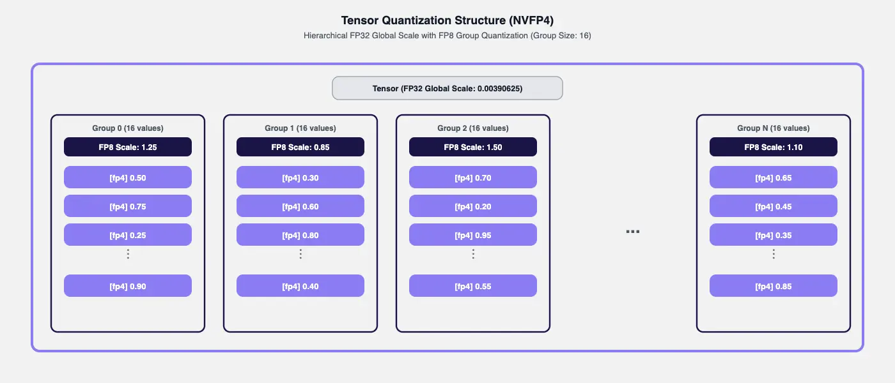
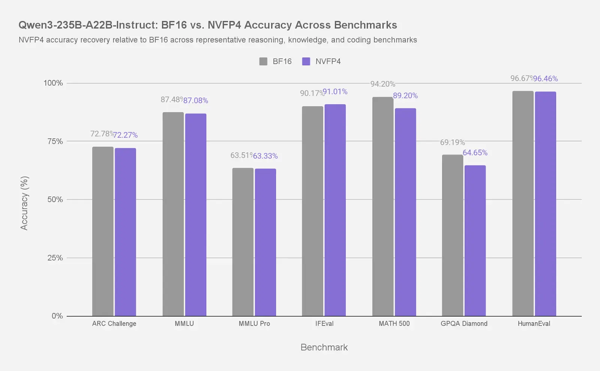
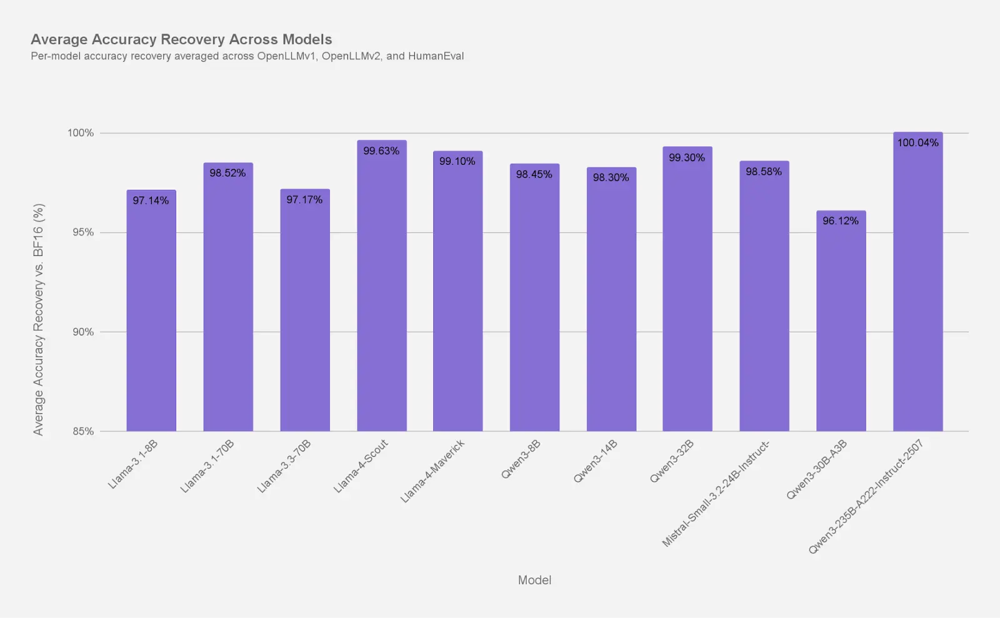
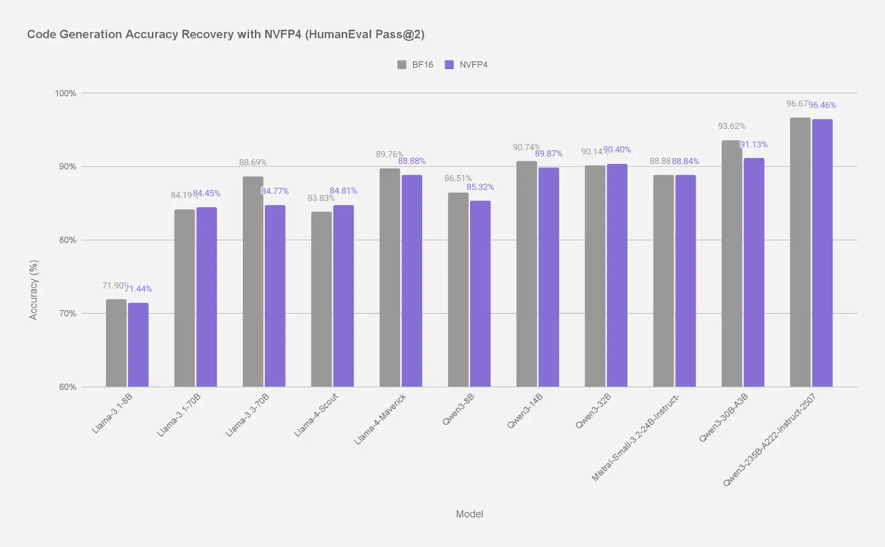

Large language models (LLMs) continue to scale rapidly, unlocking stronger reasoning, better instruction following, and broader domain coverage. At the same time, this growth dramatically increases memory and compute demands—making efficient deployment increasingly challenging for both research and enterprise use.

To address this, we are releasing NVFP4-quantized versions of several widely used large language models, spanning 8B to frontier-scale models exceeding 400B+ parameters. With the introduction of NVIDIA Blackwell (B200) GPUs, NVFP4 benefits from native FP4 tensor cores, enabling true hardware-accelerated FP4 compute. This allows substantial memory reduction while recovering near-baseline accuracy, particularly at larger scales, making state-of-the-art LLMs significantly more practical to deploy.

Across the models evaluated in this release, several clear patterns emerge:

- NVFP4 delivers near-baseline accuracy at large scale, making it well suited for frontier and MoE models.
- Accuracy recovery improves with model size, with the strongest results observed on the largest dense and expert-based architectures.
- Smaller models show more variability, but still retain the majority of BF16 accuracy.
- Overall, NVFP4 shifts the efficiency–accuracy trade-off in favor of deployment at scale.

## What is NVFP4?

NVFP4 is NVIDIA's 4-bit floating-point format designed for high-performance inference on modern GPUs. It combines the compactness of ultra-low-precision quantization with the flexibility of floating-point arithmetic, allowing large language models to be deployed more efficiently without sacrificing numerical expressiveness. See Figure 1.

At a high level, NVFP4 offers:

- Compact 4-bit storage with floating-point semantics.
- Improved handling of outlier values and wide dynamic ranges.
- Strong accuracy recovery relative to BF16 baselines at larger model scales.
- Robust behavior on large decoder-only and mixture-of-experts (MoE) models.

Figure 1: Illustration of NVFP4-style hierarchical quantization. FP4 values are stored as discrete codes in small groups (group size = 16), each scaled by a FP8 group scale, with an additional FP32 tensor-level scale capturing global magnitude.

### Why NVFP4 works: High-precision scaling for wide dynamic range

NVFP4 addresses the dynamic range challenges of ultra-low-precision inference by combining floating-point representation with hierarchical scaling. Per-group scaling preserves local structure within weight groups, while an FP32 global scale restores high dynamic range that would otherwise be constrained by the more limited FP8 (E4M3) local scaling. Together, these mechanisms allow FP4 values to retain more signal and incur less error than integer quantization when weights span wide value distributions.

In practice, NVFP4 achieves roughly **1.5 to 1.8× smaller effective weight storage than FP8** and **~3× smaller than FP16**. These reductions enable higher achievable batch sizes and greater concurrency for large-model inference. Figure 2 illustrates how these storage reductions manifest across two ultra-large models, highlighting how NVFP4 occupies a distinct point in the size–accuracy design space relative to integer and higher-precision floating-point formats.

Figure 2: Model weight storage across precision formats for two representative large models. (Left) Qwen3-235B-A22B, comparing BF16, FP8-dynamic, and NVFP4. NVFP4 reduces weight storage by approximately ~3.3× vs BF16 and ~1.5–1.8× vs FP8. (Right) Llama-4-Maverick-17B-128E-Instruct, comparing BF16, INT4 (W4A16), and NVFP4. While INT4 achieves the smallest raw weight footprint, NVFP4 balances compact storage with floating-point semantics and improved numerical robustness.

## Quantized models released

Using the latest NVFP4 support in [**LLM Compressor**](https://github.com/vllm-project/llm-compressor), we quantized a diverse set of popular open models spanning multiple parameter scales—from compact 8B-class models to ultra-large 400B+ Mixture-of-Experts architectures. These models are immediately deployable with [**vLLM**](https://github.com/vllm-project/vllm) for both production and research use.

This release covers a broad range of model families and architectures, including:

- Large dense and Mixture-of-Experts (MoE) models
- Instruction-tuned and reasoning variants
- Model sizes ranging from single-digit billions to hundreds of billions of parameters.

All NVFP4-quantized models are hosted and continuously updated in our [Hugging Face collection](https://huggingface.co/collections/RedHatAI/nvfp4-models).

To characterize how NVFP4 behaves in practice, we evaluated the quantized models against their BF16 baselines across a range of task-level and aggregate benchmarks.

### Key accuracy findings

- **Large models (70B–235B)** consistently achieve **~99% recovery**.
- **Mid-size models (~30B)** achieve **97–99% recovery**.
- For **7B–14B models**, NVFP4 recovers **~95–98%** of BF16 accuracy across various tasks, with slightly larger degradation on Llama-3.1-8B, while Qwen-8B and Qwen-14B remain closer to **~98%** recovery.
- **MoE models** (Llama-4 Scout & Maverick / Qwen3-235B-A22B) show exceptionally strong robustness due to NVFP4's expressive range.

The following figures illustrate accuracy recovery at multiple levels—from detailed per-task comparisons on individual large models to averaged results across model families and evaluation suites.

Figure 3: Task-level accuracy comparison between BF16 and NVFP4 for Qwen3-235B-A22B-Instruct-2507 across representative benchmarks.

While Figure 3 highlights detailed task-level behavior for the large Qwen3-235B-A222 model, the next figure summarizes aggregate accuracy recovery trends across model sizes and benchmarks.

Figure 4: Average accuracy recovery of NVFP4-quantized models relative to BF16 baselines, aggregated across OpenLLMv1, OpenLLMv2, and HumanEval. Recovery improves consistently with model scale, with large dense and MoE models exceeding 99% recovery.

To further understand how NVFP4 behaves on a specific capability domains, we next examine accuracy recovery on **code generation** using HumanEval, and on broad multi-domain knowledge and reasoning using MMLU.

Figure 5: Code generation accuracy recovery for NVFP4-quantized models relative to BF16 baselines, measured on HumanEval.

Figure 6: MMLU accuracy recovery for NVFP4-quantized models relative to BF16 baselines.

Taken together, the results above highlight where NVFP4 is most effective today. Accuracy recovery improves steadily with scale, making NVFP4 particularly well suited for larger dense and MoE models, where memory pressure is highest and deployment constraints are most acute. At smaller scales, results vary more by task and calibration strategy, suggesting that model-specific tuning may be important rather than a one-size-fits-all approach.

We explore these tuning considerations in more detail below. Overall, the evaluations presented here show that NVFP4 can preserve model behavior across a wide range of benchmarks while enabling significantly more memory-efficient deployment.

### NVFP4 robustness with scale-dependent variability

In developing these NVFP4 models, we generally followed a standard, straightforward quantization workflow that proved effective across model architectures and scales. For a subset of smaller models (approximately 8B–14B parameters), we additionally explored refinements such as different calibration observers and SmoothQuant, which is fully compatible with NVFP4.

We observed that the impact of these techniques at smaller scales can be mixed: some models showed modest accuracy improvements with MSE-based observers or SmoothQuant, while others achieved similar or better results without them. Importantly, larger models achieved strong and stable accuracy recovery using the standard NVFP4 recipe, with additional tuning applied only when it provided clear empirical benefit. Each released model reflects the simplest configuration that met accuracy targets at scale.

## What's next?

This blog focuses on accuracy recovery and making [NVFP4-quantized models](https://huggingface.co/collections/RedHatAI/nvfp4-models) available to the community. Additional models and variants will be added to the collection on an ongoing basis as new models are released and NVFP4 support expands across architectures, tooling, and inference backends. Comprehensive performance analysis—including throughput and latency—are actively being finalized and will be shared in a follow-up blog dedicated to inference performance and deployment trade-offs.

## Driving efficient AI forward

Quantization—especially modern FP4-based formats like NVFP4—is unlocking the next generation of scalable, accessible LLM deployment. Red Hat is committed to open, efficient AI, providing models and tools that reduce cost while maintaining state-of-the-art performance.

Explore the models today and stay tuned for upcoming performance results.
