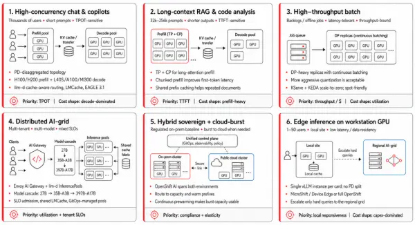
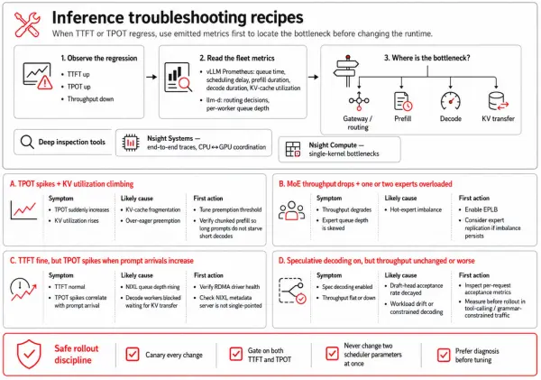
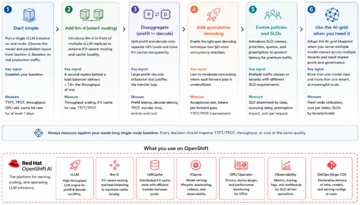

In [Designing distributed AI inference: Core concepts and scaling dimensions](https://developers.redhat.com/articles/2026/06/22/designing-distributed-ai-inference-core-concepts-and-scaling-dimensions), we covered the foundational concepts: the prefill/decode split and the five dimensions of parallelism. In [Optimizing distributed AI inference: Advanced deployment patterns](https://developers.redhat.com/articles/2026/06/23/optimizing-distributed-ai-inference-advanced-deployment-patterns), we went deep on the three optimization levers: prefill/decode disaggregation, KV-cache tiering and sharing, and speculative decoding. The techniques we discussed in parts 1 and 2 are the tools; this post shows how they assemble into deployments.

We start with six deployment blueprints matched to common traffic shapes, from high-concurrency chat to edge inference on a single workstation GPU. Each blueprint follows the same structure: workload signature, KPI priority, topology, the vLLM and llm-d mechanisms it leans on, and a note on cost shape.

From there we move to inference troubleshooting, practical recipes for diagnosing time to first token (TTFT) and time per output token (TPOT) regressions before reaching for configuration changes, and close with a step-by-step growth path for teams starting with a single vLLM instance and scaling up as the workload demands it.

## Deployment blueprints by traffic shape

Each blueprint follows the same structure: workload signature, KPI priority, topology, core vLLM and llm-d mechanisms, and cost shape, as mapped out in Figure 1. Treat these outlines as flexible starting points rather than rigid prescriptions.

Figure 1: Deployment blueprints mapped by traffic shape.

### High-concurrency conversational chat and copilots

Building conversational assistants and digital copilots to handle thousands of concurrent users creates a specific technical profile that directly influences your system layout.

#### Signature

This deployment blueprint handles thousands of concurrent users text-chatting with short prompts and outputs that average a few hundred tokens. Because these workloads reuse system prompts and few-shot exemplars frequently, your key focus centers on keeping the TPOT within your service-level objectives (SLOs).

#### Topology

The deployment uses a disaggregated prefill and decode topology. It pairs a large prefill pool on cost-optimized GPUs, such as H100s, with more HBM-capable hardware, such as H200- or B200-class systems, for the decode pool, especially for long-context workloads. Cache-aware routing via the llm-d scheduler pins each session to the decode worker holding its warm key-value (KV) cache. EAGLE 3.1 runs on the decode workers, and LMCache offloads from HBM to pinned DRAM (and to NVMe for the longest-tail conversations) so that the decode pool's effective cache becomes several times larger than its HBM.

On the prefill side, chunked prefill (stall-free scheduling) prevents a long prompt from blocking the short ones queued behind it. At the front door, prompt compression on system prompts, debouncing and request coalescing for chatty UIs, and output token caps protect the fleet from runaway generation.

#### Cost shape

Because the overall cost shape is decode-dominated, right-sizing the decode pool yields the greatest financial savings per million tokens ($/Mtoken).

### Long-context retrieval-augmented generation and code analysis

Processing large repositories and multi-page documents significantly alters your hardware requirements and system performance metrics.

#### Signature

This workload features lower concurrency than typical chat applications, with prompts ranging from 32,000 to 256,000 tokens, outputs in the hundreds of tokens, and SLOs dominated by TTFT metrics because users are waiting for the first useful token of an answer over a long document.

#### Topology

This layout uses tensor parallelism (TP) within the node and prefill context parallel (PCP) across GPUs for the prefill phase so the O(n²) attention work is split rather than exhausting high-bandwidth memory (HBM) on a single device. The decode pool remains small because prompt length binds this workload more than concurrency does.

Two main mechanisms reduce TTFT metrics in this scenario, and chunked prefill is not one of them. PCP execution distributes the prefill compute across multiple devices, while prefix caching skips the phase entirely if the system has processed the document before. Chunked prefill, which is enabled by default in vLLM v1, earns its keep elsewhere: it prevents a single long prefill from starving the decode steps of other requests sharing the GPU. For long prompts specifically, chunked prefill introduces a little overhead, making prefix caching the primary mechanism; because the warm prefix lives in a shared cache pool that any decode worker can reach, the second pass over a contract never requires a re-prefill.

#### Cost shape

Because the overall cost shape is prefill-dominated, the prefix-cache hit rate is the primary factor influencing your cost per million tokens ($/Mtoken); avoiding the re-prefill of a long document results in direct financial savings.

### High-throughput batch (summarization, labeling, embeddings pipelines)

Running high-throughput batch processes requires an architecture focused heavily on volume and cost efficiency.

#### Signature

These pipelines are latency-tolerant, bound by throughput and budget constraints, and typically run overnight on backlogs.

#### Topology

The pattern relies heavily on data parallelism (DP), using as many model replicas as your budget allows, with each replica running continuous batching at maximum capacity. Prefill-decode (PD) disaggregation provides no benefit in this scenario because individual request processing times do not matter, making the transfer hop unnecessary.

Continuous scheduling is the best policy here; it differs from continuous batching by allowing the engine to reorder requests to keep batches full even when traffic arrives in bursts You can tune dynamic quantization more aggressively here than in interactive workloads because a minor reduction in output quality is more cost effective than expanding your GPU. Scaling to zero between processing waves through the KServe integration with Kubernetes Event-driven Autoscaling (KEDA) keeps the cluster economical. Additionally, this workload is fully compatible with spot or preemptible instances because retrying batch jobs is inexpensive.

#### Cost shape

The cost profile focuses strictly on the cost per token ($/token). Because latency is irrelevant, you can apply multiple optimizations—including maximum batching, aggressive quantization, scaling to zero, and spot capacity—to directly minimize your cost per million tokens.

### Distributed AI-grid: Model-as-a-Service

Transitioning from single-purpose infrastructure pools to a distributed AI grid allows platform teams to serve multiple models and tenants dynamically from a shared environment.

#### Signature

This blueprint is the most architecturally diverse option in this guide. A platform team can support multiple tenants and multiple models (such as Qwen3.6-27B for one product, Qwen3.5-35B-A3B for another, and Qwen3.5-397B-A17B reserved for the hard queries) across varied SLOs and bursty traffic. Under this model, the deployment functions as a distributed grid rather than a collection of single-purpose pools.

#### Topology

Each model class resides behind its own llm-d InferencePool, with KServe LLMInferenceService resources tracked in GitOps. Additionally, [AI gateway implementations such as Envoy AI Gateway](https://developers.redhat.com/articles/2026/05/25/route-external-and-local-llms-models-as-a-service) manage tenant authentication, rate limiting, and request classification at the entry point of the cluster. A shared LMCache fabric across pools lets you reuse system-prompt prefixes across instances of the same model. Meanwhile, KEDA autoscaling runs per request class rather than per pool. This structure means that a gold-tier tenant's bursty traffic can trigger rapid scaling for its specific pool, while a bronze-tier tenant using the same model experiences a more gradual scale-up phase.

Three mechanisms make this work, and all three were absent or limited in the first part of this series.

##### Model cascading

**Model cascading** routes simple queries to the smallest model capable of answering them and escalates to a larger size only when needed. For example, a cascade matching Qwen3.6-27B to Qwen3.5-35B-A3B to Qwen3.5-397B-A17B—where escalation is triggered by a low-cost confidence signal or explicit tenant policy— [can reduce cluster costs by 40 to 60%](https://arxiv.org/abs/2603.04445) on workloads where basic queries dominate. The cascade operates in the gateway layer rather than within an individual InferencePool, allowing you to modify the routing logic without redeploying the underlying model.

##### SLO-aware admission control

**SLO-aware admission control** is operationally healthier than queuing requests that will miss performance deadlines, because long queues create tail-latency anchor under load. The gateway admits gold-tier requests ahead of silver, and silver tiers ahead of bronze. Requests that are likely to exceed token output limits or hit timeouts are rejected at the gateway with a specific error code, preventing these requests from consuming valuable GPU cycles before timing out.

##### Adaptive resource scheduling and hotspot prevention

**Adaptive resource scheduling and hotspot prevention** balances tasks between the llm‑d scheduler's routing layer and cluster-level policy resource allocations. Several advanced methods are currently in early engineering or research phases, including:

- Adaptive parallelism (switching between TP and PP as traffic patterns shift)
- Dynamic precision (modifying floating-point precisions like FP8 and FP4 under load pressure)
- Continuous prewarming of CUDA graphs via traffic-pattern time-series prediction
- Mixture of experts (MoE) expert rebalancing

Building an architecture that accommodates these emerging techniques requires treating per-tenant SLO classes and telemetry-driven configuration as fundamental elements from the beginning, allowing you to swap static variables for adaptive configurations later without re-architecting the environment.

#### Cost shape

The cost shape of this blueprint is the most non-linear of the six. Done well, this design allows a platform team to support numerous tenants at high utilization. Done poorly, the architecture becomes a fragmented zoo of single-tenant pools each running at low utilization; avoiding this outcome depends entirely on your cascading approach, admission control configuration, and shared cache design.

### Hybrid sovereign to cloud-burst

Managing a hybrid sovereign architecture allows you to maintain local data control while expanding resources during high-traffic events.

#### Signature

This model fits a regulated baseline workload that must run on-premises for data residency, sovereignty, or contractual reasons. When traffic spikes exceed your on-premises capacity, the workload bursts to a public cloud region without violating regulatory compliance requirements.

#### Topology

Red Hat OpenShift AI on Red Hat OpenShift provides a single control plane across both environments. Model artifacts reside in a shared registry, and GitOps manages configuration drift so that the on-premises and burst clusters stay aligned.

llm-d's inference gateway fronts both clusters, while congestion-aware and topology-aware scheduling routes individual requests to the cluster that has available capacity and a warm prefix. The burst cluster remains idle most of the time. To make this capacity available immediately during a traffic spike, the system relies on a fast, deterministic warm-up process that uses pre-pulled pinned images and kernels to maintain a minimal footprint. You can add predictive prewarming using time-series traffic forecasting. This approach makes sure that the CUDA graphs and KV pools are warm before traffic shifts.

#### Cost shape

The cost structure consists of a CapEx-anchored on-premise baseline paired with variable cloud OpEx that you pay only during spikes. These economics work only if the burst cluster remains completely idle between peaks; therefore, the primary driver of efficiency is a fast warm-up process rather than maintaining standing capacity.

### Edge inference on a workstation-class GPU

Running AI models directly on local workstation hardware allows you to process data immediately without relying on a continuous cloud connection

#### Signature

This deployment pattern applies to a single physical site, such as a factory floor, retail store, clinic, branch office, vehicle, or regional data closet. In these locations, data residency laws, network latency, or limited connectivity prevent you from using cloud-based AI inference. Connecting back to a regional data cluster (when it exists at all) might be too expensive or unreliable. These sites typically support one to 50 concurrent users.

For a human operator, both TTFT and TPOT are important metrics. However, total request volume is low enough that a single hardware accelerator handles the workload capacity easily without requiring complex orchestration.

#### Topology

This pattern uses a single vLLM instance for each accelerator without llm-d disaggregation. The prefill-decode transfer hop costs more than it saves when you have fewer than 100 concurrent sessions. KServe manages the model serving lifecycle. the OpenShift deployment scales to match the physical site: you can use single-node OpenShift for single-node sites, or multi-node OpenShift for regional installations that use a handful of cards. GitOps pins the model artifact across your entire fleet. This approach makes sure the same Qwen3.6-27B build runs in every store, clinic, or branch without configuration drift between sites.

#### The model fits on 96 GB

The hybrid architecture of Qwen3.6-27B is well-suited for edge environments. Because three out of every four attention sublayers use Gated DeltaNet (a linear-attention variant whose state size does not grow with context length), only 16 of the 64 layers maintain a per-token KV cache. The model configuration uses four KV heads at head\_dim 256. This means the per-token KV requires only about 64 KB in FP16 or 32 KB in FP8, which is much smaller than a standard pure-transformer model with a similar parameter count.

After accounting for 27 GB of FP8 weights and about 4 GB of working memory, the remaining 65 GB of VRAM can hold approximately 2 million tokens of cumulative KV cache at FP8 KV precision. That resource budget can support any of these target profiles:

- About 50 concurrent sessions at 32k context each
- About 15 sessions at 128k each
- About four sessions at 512k each using FP4 KV.

For larger models, the available memory limits tighten quickly. For example, Qwen3.5-35B-A3B at FP8 leaves around 55 GB for the KV cache, which works for moderate concurrency. However, Qwen3.5-397B-A17B cannot fit on a single card at any production precision because the entire expert table must remain resident in memory.

#### Hardware is substrate, not strategy

Hardware accelerators at this tier include workstation cards such as the NVIDIA RTX PRO 6000 (96GB) Blackwell, deskside superchip systems such as DGX Spark, and the [Supermicro Super AI Station](https://www.supermicro.com/en/accelerators/nvidia/super-ai-station). These systems differ mainly in memory bandwidth and capacity, but you can use the same software approach is the same across all of them: quantize the model to fit a single accelerator, serve a single vLLM instance, and scale using data parallelism replicas before sharding.

These systems share a key constraint: they lack NVLink-class connectivity between separate enclosures. Because of this, any multi-box expansion relies on pipeline or expert sharding for capacity rather than tensor-parallel execution for throughput.

The decode phase is limited by memory bandwidth, making the deployment is CapEx-dominated. As a result, calculating a clear cost per million tokens ($/MToken) remains difficult until a site outgrows roughly 100 concurrent sessions and begins to resemble a regional cluster.

#### Multi-tier pattern

If an edge sites occasionally encounters queries that are too complex for the local model, you can route these requests over a network backhaul connection to a regional cloud cluster running an AI-grid. Model cascading at the local gateway keeps the fastest path on-device. The system escalates the request only when a confidence signal or explicit policy requires the flagship model.

This multi-tier approach makes sure that the p99 latency on local queries remains predictable while keeping the heavier model available for complex, edge-case request. Network backhaul costs also stay bounded because escalations represent only a small fraction of total traffic.

## Inference troubleshooting recipes

When TTFT or TPOT performance drops, do not modify configuration parameters immediately. Instead, look at the metrics that your cluster already generates. Most regressions clarify themselves once you know how to read the data streams.

Figure 2: Diagnostic workflow and symptom-based recipes for resolving LLM model inference performance regressions.

The [vLLM Prometheus endpoint](https://docs.vllm.ai/en/latest/serving/metrics.html) exposes per-request and per-batch statistics, including queue time, scheduling delay, prefill duration, decode duration, and KV-cache utilization. At the same time, the llm-d scheduler tracks routing decisions and per-worker queue depths. These two data streams quickly show whether the slowdown occurs at the gateway (routing), during the prefill phase, during the decode phase, or during the KV transfers.

For a deeper investigation, [use Nsight Systems](https://developer.nvidia.com/nsight-systems) to capture end-to-end performance traces. This tool helps when a regression appears to span multiple processes or involves close coordination between the CPU and GPU. If a single operation creates a system bottleneck, you can use [Nsight Compute](https://developer.nvidia.com/nsight-compute) to analyze that specific kernel.

Here are the most common troubleshooting scenarios you might encounter in production inference environments:

- A sudden TPOT increase paired with climbing KV utilization usually indicates KV-cache fragmentation or aggressive preemption. Adjust the preemption threshold and verify that chunked prefill is enabled so that long prompts do not delay the short decode tasks queued behind them.
- MoE traffic with degraded throughput and high queue depths on one or two experts indicates a hot-expert imbalance. Enable enhanced parameter-driven load balancing (EPLB), and consider expert replication if the imbalance continues.
- A disaggregated fleet with a stable TTFT but spiked TPOT metrics during prompt arrival indicates that NIXL queue depths are rising, which blocks decode workers during KV transfers. Verify RDMA driver health and check that the NIXL metadata server isn't a single point of failure.
- Active speculative decoding that results in unchanged or decreased throughput indicates that the draft-head acceptance rate has decayed. Inspect your per-request acceptance metrics because the model or workload might have drifted from the original draft training data.

Always roll out configuration changes using canary deployments, and measure your results using both TTFT and TPOT metrics. Never change two scheduler parameters at the same time. If you change multiple variables at once, figuring out which parameter caused the fluctuation becomes significantly harder than solving the original performance issue.

## A step-by-step roadmap for scaling AI inference deployments

A practical sequence for a team standing up vLLM and llm-d on OpenShift AI runs roughly like this (see Figure 3).

Figure 3: Six-step evolutionary roadmap and stack components for scaling large language model inference workloads on Red Hat OpenShift AI.

### 1\. Start simple and establish a baseline

Begin on a single node with a single vLLM instance. Choose your model and the parallelism layout. Next, baseline your TTFT and TPOT metrics on production traffic for at least a week. The numbers from this initial baseline will serve as the foundation for all later decisions.

### 2\. Add smart routing with llm-d

Add llm-d when the single-node fleet stops scaling linearly. The signal to look for is when a second replica behind a load balancer produces less than 1.8 times the throughput of a single node. This drop indicates that round-robin routing is leaving valuable cache hits on the table.

### 3\. Disaggregate execution phases and layer speculative decoding

Disaggregate your deployment only when the measured imbalance between the prefill and decode phases is large to justify the network transfer hop. If you disaggregate prematurely, it will cost more than it saves. Layer in speculative decoding once your concurrency stabilizes. These performance gains are largest at low concurrency, while they decrease under saturated, high concurrency workloads.

### 4\. Transition to a distributed AI grid

Adopt the AI-grid blueprint when your platform serves more than one model class to multiple tenants. Complex mechanisms like model cascading, SLO classes, shared cache fabrics, and GitOps-managed pools are highly effective at a multi-tenant scale. However, they require unnecessary effort for smaller setups.

## Next steps for scaling your distributed inference workloads

A clear baseline connects every step of this process. While [part 1](https://developers.redhat.com/articles/2026/06/22/designing-distributed-ai-inference-core-concepts-and-scaling-dimensions) focused on choosing your runtime, [part 2](https://developers.redhat.com/articles/2026/06/23/optimizing-distributed-ai-inference-advanced-deployment-patterns) turns that choice into a practical deployment. Add one mechanism at a time, and only introduce a new tool when measurements show that the simpler setup has reached its limit. Remember to re-baseline your metrics after each change so your next decision rests on data rather than expectations. Start simple, measure honestly, and optimize based on your specific workload instead of letting a technical catalog dictate your next steps.

Each rung of that ladder maps directly to a layer of the Red Hat software stack that you can deploy immediately rather than assembling by hand:

| **Component** | **Role in the stack** |
| --- | --- |
| Red Hat OpenShift | Provides the Kubernetes substrate |
| Red Hat OpenShift AI | Adds the model registry, pipelines, monitoring, and governance |
| Red Hat AI Inference Server | Packages a hardened vLLM with pinned kernels and LLM Compressor for quantization |
| KServe | Manages the serving lifecycle |
| llm-d | Supplies the distributed inference layer for cache-aware routing, disaggregation, and KV-cache-aware scheduling |

The blueprints in this article use these standard building blocks. Following this sequence allows you to adopt new capabilities step by step, making sure you do not add unnecessary complexity until your workload explicitly requires it.

To learn more, take a look at these resources:

- [Why vLLM is the best choice for AI inference today](https://developers.redhat.com/articles/2025/10/30/why-vllm-best-choice-ai-inference-today)
- [llm-d](https://github.com/llm-d/llm-d), the Kubernetes-native distributed inference framework (now a Cloud Native Computing Foundation sandbox project)
- [Combining KServe and llm-d for optimized gen-AI inference](https://developers.redhat.com/articles/2026/04/21/kserve-llm-d-optimized-gen-ai-inference)
- [What GPU kernels mean for your distributed inference](https://developers.redhat.com/articles/2026/05/20/what-gpu-kernels-mean-your-distributed-inference), a companion piece on kernels and supply-chain discipline
- [Introducing Red Hat AI Inference Server: High-performance, optimized LLM serving anywhere](https://www.redhat.com/en/blog/red-hat-ai-inference-server-technical-deep-dive)
- [LLM Compressor](https://github.com/vllm-project/llm-compressor) for producing and validating quantized models
- vLLM [context-parallel deployment](https://docs.vllm.ai/en/latest/serving/context_parallel_deployment/) and [disaggregated prefilling](https://docs.vllm.ai/en/stable/features/disagg_prefill/) documentation
*Last updated: July 6, 2026*
