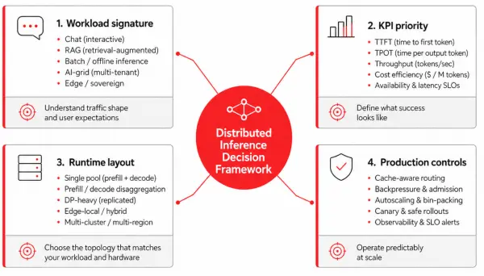
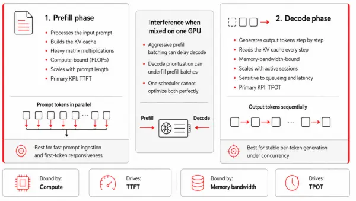
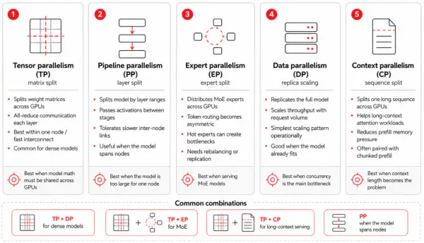

Choosing a model-serving engine like vLLM is a crucial first step for enterprise AI inference, but it's only the foundation. By itself, a runtime does not dictate how a service scales, operates, or balances cost against performance in production.

Think of this blog post as the mental models you need before you touch a config file. We will establish the core vocabulary of inference, break down the inherent structural tension between token generation phases (prefill versus decode), and map out the dimensions of parallelism required to control your infrastructure's baseline limits.

In this three-part series, we design the serving blueprint by mapping a model's needs, a hardware budget, and service-level objectives onto the deployment manifests that fit the actual workload. No single blueprint fits every case, because the workload is shaped by the business behind it:

- How many requests arrive at once
- How long the prompts and contexts run
- The subject-matter domain
- How much reasoning each request demands

We map business needs to a few short-listed major KPIs: time to first token (TTFT), time per output token (TPOT, or inter-token latency), throughput in requests per second and tokens per second, GPU utilization, and key-value (KV) cache hit rate. These trade against each other constantly, so most deployment decisions are about which trade you can tolerate for which workload, and for what business benefit. The structural trade-offs of this framework are mapped out in Figure 1.

Figure 1: The distributed inference decision framework.

Three key things have developed in the ecosystem since the blog post [Why vLLM is the best choice for AI inference today](https://developers.redhat.com/articles/2025/10/30/why-vllm-best-choice-ai-inference-today) was published:

- The llm-d project's acceptance into the CNCF Sandbox gives it a clearer open-governance path and makes it easier to evaluate in environments where vendor neutrality, community stewardship, and long-term ecosystem alignment matter.
- KV cache management has become one of the most active areas of innovation in distributed inference. Projects such as NIXL, LMCache, and Mooncake are competing and converging around different approaches to KV cache transfer, reuse, and offload. For platform teams, this means cache architecture is now a first-class design decision: it affects latency, network requirements, failure handling, observability, hardware affinity, and the sizing of prefill and decode pools.
- Speculative decoding is moving from research technique to practical optimization path. EAGLE 3.1, a collaboration between the EAGLE team, the vLLM team, and TorchSpec, landed in late May 2026 with materially better long-context acceptance length than EAGLE-3. It makes speculative decoding more relevant for long-document workloads that were previously borderline, while leaving the core engineering question intact: whether the acceptance rate, memory overhead, batching behavior, and operational complexity justify enabling it for a given deployment.

### Note

The high-value AI models we use for our examples throughout the article (based on our industry-specific [assessments](https://open-experiments.github.io/Telco-AIX/)) are Alibaba's Qwen3.5 and Qwen3.6 families, in both dense (Qwen3.6-27B) and mixture-of-experts (Qwen3.5-35B-A3B and Qwen3.5-397B-A17B) variants. These models are useful anchors because they span a realistic enterprise serving spectrum: smaller dense models for general-purpose latency-sensitive workloads, mid-sized MoE models for cost-efficient throughput, and larger MoE models for high-capability workloads that stress routing, memory, and distributed execution.

## Prefill/decode: Two phases, two KPIs

LLM inference is two workloads pretending to be one.

*Prefill* processes the input prompt and populates the KV cache. Because the prompt tokens can be processed in parallel, this phase is dominated by dense matrix operations and tends to be compute-bound. It is the primary driver of time to first token (TTFT), especially for long prompts and retrieval-augmented generation workloads.

*Decode* generates the response token by token, repeatedly attending over the accumulated KV cache as each new token is produced. This phase tends to be memory-bandwidth-bound: it stresses HBM capacity and bandwidth more than raw compute, and it is the primary driver of time per output token (TPOT), also called inter-token latency. Figure 2 details the contrasting dynamics and resource bottlenecks of these two foundational phases.

Figure 2: Prefill versus decode.

The two phases interfere whenever they share a GPU, because the batching strategy that helps one hurts the other. Aggressive batching accumulates enough prompt tokens to use GPU compute efficiently, but a large prefill batch can occupy the worker long enough to delay the decode steps queued behind it, raising TPOT and making streaming feel uneven. Prioritizing decode is the opposite failure: it protects inter-token latency but leaves prefill under-batched, wasting compute and raising the cost of long prompts.

The business-level symptoms follow directly: a fleet tuned only for decode feels responsive in chat while burning capacity on prefill-heavy work, and a fleet tuned only for prefill posts healthy aggregate tokens per second while making interactive users wait too long for the first token. This prefill/decode split is a foundational lens for much of what follows, starting with disaggregation.

That leads to an architectural fork. The first path is to run prefill and decode together on the same homogeneous workers and let the scheduler arbitrate between them. This is the default shape for single-GPU vLLM deployments, and it remains the right answer for many small and medium-sized fleets because it is simpler to operate and avoids KV cache transfer overhead.

The second path is to split them across heterogeneous pools and route each request through both. The threshold for that split is not a model size or a token count, but a measurable imbalance between the two phases—one large enough that the savings from right-sizing each pool exceed the cost of moving the KV cache between them.

## The 5D parallelism

Modern LLM serving spans a five-dimensional design space, illustrated in Figure 3:

- Tensor parallelism
- Pipeline parallelism
- Expert parallelism
- Data parallelism
- Context (sequence) parallelism, which often splits into prefill context parallel (PCP) and decode context parallel (DCP).

While the [previous blog post](https://developers.redhat.com/articles/2025/10/30/why-vllm-best-choice-ai-inference-today) introduced the first four dimensions, context parallelism has become a first-class fifth dimension because Qwen3.5's native 262,000-token context makes it unavoidable for any serious long-context deployment.

Figure 3: 5D parallelism.

### Tensor parallelism

*Tensor parallelism* (TP) splits each weight matrix across GPUs and runs an all-reduce per layer. This is latency-sensitive within a node and communication-heavy across nodes, so NVIDIA NVLink and NVSwitch are effectively the budget that decides how far TP can scale before the all-reduce dominates. For dense models, the general best practice is to try the quantized version first, then use the minimum TP that fits the model with adequate KV headroom, then scale out with DP. The exception is a stringent single-request TTFT service-level objective (SLO), which can justify higher TP. For Mixture of Experts (MoE) models, where DP ranks coordinate on the expert layers, the TP/DP split differs because it determines how the experts are distributed.

### Pipeline parallelism

*Pipeline parallelism* (PP) splits the model by layer ranges and passes activations between stages. Because it exchanges activation tensors point-to-point at the stage boundaries rather than running an all-reduce every layer, it is far more tolerant of limited inter-node bandwidth than TP, and it can run over Ethernet-class fabrics where cross-node TP would stall.

However, that tolerance is relative, not absolute: the handoffs still sit on the critical path, the activation volume grows with batch size, sequence length, and hidden dimension, and any added link latency widens the pipeline bubbles that form when one stage waits on its predecessor. Micro-batching exists to hide those bubbles by keeping every stage fed.

All of this makes PP useful when a model is too large to fit one node and the inter-node fabric isn't fast enough for cross-node TP, but it is a last resort, not a default for large models: quantize first, then try EP+DP on one node, and reach for PP only when the weights genuinely don't fit.

### Expert parallelism

*Expert parallelism* (EP) distributes the experts of an MoE model across GPUs. Because each token is routed only to its assigned expert subset, traffic becomes asymmetric and bursty, and one or two popular experts can become tail-latency anchors for the whole fleet under skewed routing. Expert Parallel Load Balancing (EPLB) can replicate hot experts and rebalance routing dynamically, but it is not free: under stable routing patterns the rebalancing overhead can exceed the benefit, so enable EPLB when monitoring confirms persistent imbalance rather than as a blanket default. EP has two further costs.

- Couples DP ranks that would otherwise be independent, because the expert layers synchronize on every forward pass even when some ranks have fewer requests.
- Requires all-to-all traffic that scales with the number of active experts and the batch size.

### Data parallelism

*Data parallelism* (DP) runs full model replicas behind a load balancer for linear throughput scaling with no model-sharding complexity. It is a common starting point when the model fits one node and the bottleneck is concurrent request volume; KServe's ReplicaSet-based serving handles this case directly. DP alone does not set the ceiling, though: the parallelism configuration and routing strategy determine the real performance limit. Common pitfalls include:

- Stacking more DP replicas without checking for API-server bottlenecks
- Ignoring KV cache hit rate and MoE synchronization overhead
- Underestimating multi-node network costs

### Context parallelism

*Context parallelism* (CP) shards the sequence (context) dimension across GPUs, so that a single request's context no longer has to fit, or be computed, on one device. Long context stresses prefill and decode in different ways, and the two phases carry different SLOs, so CP is applied separately to each as PCP and DCP.

#### Prefill context parallel

*Prefill context parallel* (PCP) targets TTFT. During prefill, attention cost grows with the square of the prompt length, so a long prompt can dominate time to first token. PCP partitions the sequence across devices and lets each one compute attention over its own chunk in parallel, which splits the prefill compute across GPUs and brings TTFT down. The cost is hardware: PCP expands the world size and runs in its own communication domain, so the device count becomes TP × PCP. Reach for it when prefill compute is what dominates TTFT and the GPU budget allows.

#### Decode context parallel

*Decode context parallel* (DCP) targets throughput. During decode, the bottleneck is KV cache capacity: the more KV tokens you can hold, the larger the batch, and the higher the throughput. DCP shards the KV cache along the sequence dimension across the GPUs already in the tensor-parallel group, reusing the TP communication domain, so it needs no extra devices.

It is most valuable for models with few KV heads, such as Qwen3.5: under plain TP, when there are fewer KV heads than TP ranks, the KV cache is replicated across ranks and wastes HBM, and DCP removes that duplication and hands the freed memory back to the batch. Decode context parallel is supported in vLLM for both MLA and GQA models, and some attention backends can combine it with multi-token prediction (MTP) to accelerate decoding further.

Because DCP costs no additional GPUs and directly reduces KV duplication, it is the one most deployments should reach first. PCP is a more resource-intensive option, which you can add when a long prefill exceeds your TTFT budget.

| **Model** | **Hardware/precision** | **Suggested layout** | **Notes** |
| --- | --- | --- | --- |
| Qwen3.6-27B (dense) | 1×H100, FP8 | `TP=1` | ~27 GB weights; single-GPU baseline |
| Qwen3.6-27B (dense) | 8×H100, FP8 | `DP=8` | `TP=1` per replica |
| Qwen3.5-35B-A3B (MoE) | 8×H100, FP8 | `DP=8`,  `--enable-expert-parallel` | `EP=8`; experts sharded |
| Qwen3.5-35B-A3B (MoE) | 8×H100, BF16 | `TP=2`, `DP=4`,  `--enable-expert-parallel` | ~70 GB weights → `TP=2` to fit; `EP=8` |
| Qwen3.5-397B-A17B (MoE) | 16×H100 (2 nodes), FP8 | `PP=2`, `EP=8`,  `--enable-expert-parallel` | ~397 GB weights; layers split across the two nodes, experts split within each |
| Any Qwen3.5 ≥128k decode | \+ DCP (on top of above) | `--decode-context-parallel-size 2` | Shards KV on existing TP GPUs; no new devices |
| Any Qwen3.5 ≥128k prefill | \+ PCP (on top of above) | `--prefill-context-parallel-size 2` | Adds GPUs (`TP × PCP`) |

### Note

vLLM computes EP = TP × DP per pipeline stage, so EP= in the table is for convenience. The optimal configuration of different parallelism combinations depends on the model architecture and hardware. Expert parallelism can be latency-optimal for models like Qwen3 with limited key-value heads, whereas data parallelism maximizes throughput but can introduce latency issues due to dispatch bubbles during the prefill and decode stages.

Understanding how these five dimensions of parallelism interact is the difference between a well-tuned enterprise fleet and a cluster that stumbles at every step, wasting costly compute. By scaling your tensor, pipeline, expert, data, and context parallelism based on your specific model size and hardware budget, you establish control over your infrastructure's baseline limits.

However, actually configuring your execution layout is only the first step. Now that you have the essential mental models down, it's time to pull the practical engineering levers that directly control your bottom line and user experience. In part 2, we will look at the deployment patterns and performance updates that help you achieve an efficient deployment.

Read it here:[**Optimizing distributed AI inference: Advanced deployment patterns**](https://developers.redhat.com/articles/2026/06/24/optimizing-distributed-ai-inference-advanced-deployment-patterns)

*Last updated: July 7, 2026*
