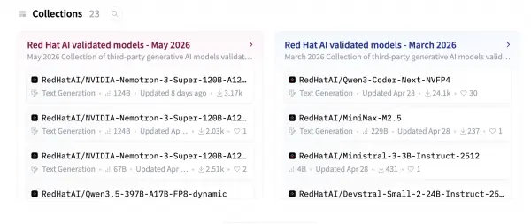
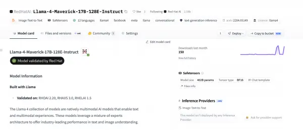
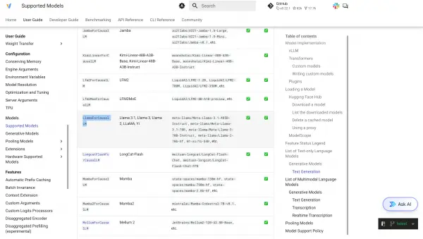
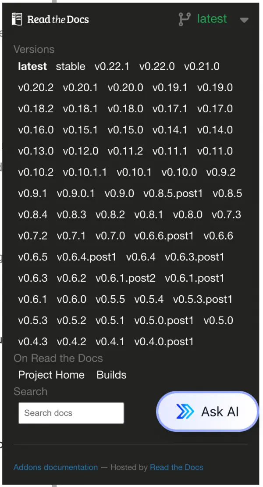

The release of new large language models (LLMs) continues to accelerate. Thankfully, the vLLM community has worked hard to keep pace with the rapid release of new model architectures, often providing Day 0 support for newly released models.

This leaves users asking the question, "What version of vLLM do I need to run my model?"

Determining compatibility comes down to matching your model's underlying architecture against vLLM release capabilities in three practical steps.

## Red Hat validated models

Before inspecting model configuration files manually, check whether your model has already been verified end-to-end through the Red Hat [validated models](https://www.redhat.com/en/products/ai/validated-models) program.

Red Hat engineers test models in the validated models program with official Red Hat vLLM images to verify they run.

You can browse the catalog of validated models on the [RedHatAI](https://huggingface.co/RedHatAI) Hugging Face page (Figure 1).



Figure 1: Collections of validated models on the RedHatAI Hugging Face page.

Alternatively, you can look up specific models on the RedHatAI page and look for the **Model validated by Red Hat** badge (Figure 2).



Figure 2: The "Model validated by Red Hat" badge displayed on a model card.

In addition to the **Model validated by Red Hat** badge, the model card specifies which versions of Red Hat OpenShift AI and Red Hat AI Inference were used to validate the model.

Red Hat OpenShift AI users can also find validated models in the **Models** section of the AI Hub. Models in the AI Hub include performance insights data and let users easily deploy the model using a ModelCar image.

Additionally, Red Hat publishes a [support matrix](https://docs.redhat.com/en/documentation/red_hat_ai/3/html/validated_models/model-support-matrix_validated-models) for validated models in the official Red Hat AI Inference documentation, listing the minimum vLLM version alongside the corresponding Red Hat AI Inference and OpenShift AI releases.

## vLLM model support fundamentals

While the validated models program can help provide customers confidence in supporting models Red Hat has already tested, users might still find themselves trying to understand if vLLM supports a specific model Red Hat hasn't validated.

To find out, it helps to understand how vLLM handles model support.

vLLM generally doesn't support specific models directly. Instead, it supports model architectures.

For example, in the `config.json` file for [Llama-3.3-70B-Instruct](https://huggingface.co/RedHatAI/Llama-3.3-70B-Instruct), you can find the `architectures` attribute:

```
"architectures": [
  "LlamaForCausalLM"
],
```

The model's architecture is a named representation of the specific features and structures the model uses. Many different models, even of different sizes, can use these architectures. For example, [Llama-3.1-8b-instruct](https://huggingface.co/RedHatAI/Llama-3.1-8B-Instruct/blob/main/config.json) also uses the `LlamaForCausalLM` model architecture. While Meta created this specific model architecture, other publishers can use it when building their own models.

In most cases, if a model uses a supported architecture and doesn't introduce unsupported customizations, it should run on a vLLM release supporting that architecture. If a publisher releases a new model using that architecture (for example, Meta creating Llama 3.4), that model should run on any vLLM version that already supports the architecture.

## Checking the vLLM supported models page

The vLLM [supported models](https://docs.vllm.ai/en/latest/models/supported_models.html) documentation is generally the easiest way to determine if vLLM supports a specific model or architecture.

After identifying a model architecture, you can search for that architecture on the supported models page. While the supported models list might not explicitly list a specific model such as Llama-3.3-70B-Instruct, since we know the model architecture is supported, we can confidently assume Llama-3.3-70B-Instruct will run successfully (Figure 3).



Figure 3: Overview of vLLM supported models and getting started resources.

Keep in mind that the supported models documentation defaults to the latest release of vLLM, and not all models are backward compatible (Figure 4).



Figure 4: Selecting specific vLLM release versions in the Read the Docs navigation menu.

For example, [gemma-4-31b-it](https://huggingface.co/google/gemma-4-31B-it/blob/main/config.json) uses the `Gemma4ForConditionalGeneration` model architecture, which the latest release of vLLM supports, but older vLLM versions such as v0.18.0 (shipped in Red Hat OpenShift AI and Red Hat AI Inference 3.4) do not support.

## Finding Red Hat supported vLLM images

Red Hat distributes vLLM under the [Red Hat AI Inference](https://docs.redhat.com/en/documentation/red_hat_ai_inference/) product name. Red Hat AI Inference issues regular releases of vLLM that customers can deploy. Additionally, Red Hat OpenShift AI makes the same Red Hat AI Inference images available through the OpenShift AI platform.

You can find Red Hat AI Inference images in the `rhaii` namespace on the Red Hat Container Catalog, where Red Hat publishes a unique image depending on the accelerator you use. For example, you can find the NVIDIA CUDA image at [rhaii/vllm-cuda-rhel9](https://catalog.redhat.com/en/software/containers/rhaii/vllm-cuda-rhel9).

Understanding the vLLM version shipped in each Red Hat AI Inference release is critical to making informed decisions on which Red Hat AI Inference version you might require to run your desired model.

The easiest way to determine which vLLM version ships in each Red Hat AI Inference release is by checking the [release notes](https://docs.redhat.com/en/documentation/red_hat_ai_inference/3.4/html-single/release_notes/index).

Red Hat AI Inference releases a new version about once a month as either a general availability (GA) release or an early access (EA) release. EA releases aren't supported, but you can use them for testing newer models, while GA releases have a 7-month support window. Because upstream vLLM moves rapidly, developers needing immediate access to newer model architectures can utilize preview images or early access releases between GA cycles.

### Day 0 model support

Additionally, Red Hat publishes preview releases such as [rhaii-preview/vllm-cuda-rhel9](https://catalog.redhat.com/en/software/containers/rhaii-preview/vllm-cuda-rhel9), which you can use to test the latest releases of vLLM and models—often with Day 0 support for new models.

## Conclusion

Determining whether your model will run on vLLM comes down to a few practical checks. If you're deploying on Red Hat platforms, start with the validated models program or AI Hub in OpenShift AI to see if Red Hat has already tested your model end-to-end. For everything else, look up the architecture in the model's `config.json` file, confirm the architecture appears on the supported models page for the version you plan to use, and cross-reference the Red Hat AI Inference release notes if you're running an Red Hat AI Inference image.
