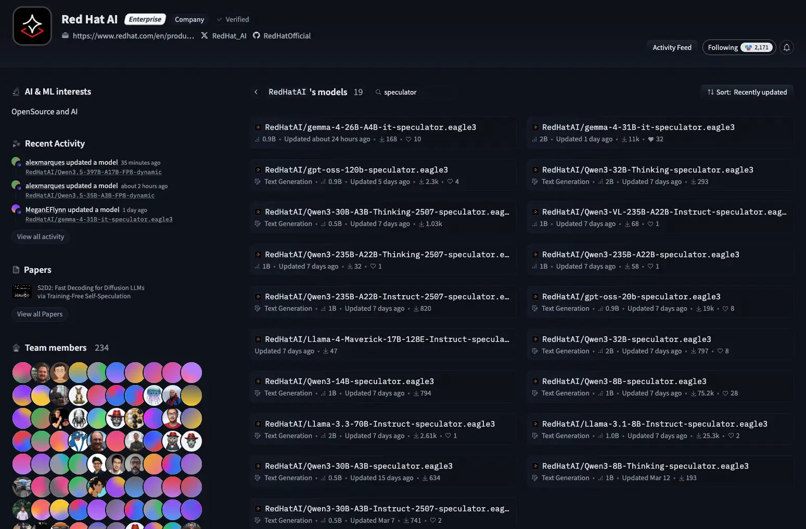

Remember the classic fable where the hare races ahead while the tortoise plods along steadily? In the end, slow and steady wins the race.

I'm about to blow your mind here—but what if they worked together?

What if the hare could sprint ahead and make educated guesses about the terrain, while the tortoise validated the entire path in a single glance based on what the hare told it? Competition? Out the window. Turtle soup? Forget it. The collaboration is what makes them so efficient. That's speculative decoding in a nutshell, and it's one of the most underutilized optimizations in production large language model (LLM) deployments.

If you're serving LLMs in production and not using speculative decoding, you could miss out on more than three times the performance for code generation, structured outputs, and other predictable, non-creative workloads.

## The problem: One token at a time

Typically, LLMs generate text autoregressively. That's a fancy way of saying they produce one token at a time. Each token requires a full forward pass through billions—potentially trillions—of parameters.


Each step in this painstakingly slow process is sequential. You can't generate token 50 until you've generated token 49. Each forward pass through a 70B parameter model takes time, even on high-end GPUs. You wouldn't go to the grocery store, get one item, take it home, and then go back for another. This is the fundamental bottleneck in LLM inference.

## The solution: Let the hare run ahead

Just because traditional approaches for inference might not be the most efficient, not all is lost in the world of AI. Speculative decoding breaks the one-token-at-a-time constraint by using two models:

- **The hare (speculator model):** This is a small, fast model (0.5 to 2B parameters) that generates three to five tokens speculatively. It is occasionally incorrect, but it is fast.
- **The tortoise (target model):** This is the production model (7B, 70B, or larger) that verifies the tokens from the speculator model in a single parallel forward pass.

Here's the upside: When the hare guesses correctly, you receive three to five tokens for the price of one forward pass. When it's wrong, you only lose a few microseconds rejecting the incorrect tokens. The final output is identical to the original process. Speculative decoding simply gets you there faster.

Additionally, speculative decoding is lossless in nature. Unlike quantization, which results in a slight loss in model accuracy as the model becomes more compressed, speculative decoding preserves full accuracy. In the worst case, it slows time to first token (TTFT) by a negligible margin.

Here's the downside: Creating and running your own speculators requires training and fine-tuning a smaller model on the same dataset as the main model. This is easier said than done. To get started, you can visit the vLLM [Speculators](https://github.com/vllm-project/speculators) GitHub repository to create your own, or the [Red Hat AI Hugging Face](https://huggingface.co/RedHatAI/models?search=eagle) repository to download a pretrained model.

## How it actually works

Let's walk through a concrete example. You're generating code, and the next logical tokens are `for i in range(10):`.

### Step 1: The hare sprints ahead

The speculator model (for example, a 1B parameter model) generates four tokens speculatively:

```
for → i → in → range
```

### Step 2: The tortoise validates in parallel

The verifier model (for example, a 70B parameter model) performs a single forward pass to evaluate all four draft tokens simultaneously:

- `for`: Correct
- `i`: Correct
- `in`: Correct
- `range`: Correct

The system accepts all four tokens. You have generated your tokens with one forward pass through the large model.

### Step 3: What happens when the hare is incorrect?

Consider a scenario where the speculator model predicts the following:

```
for → loop → in → range
```

The verifier model validates the tokens:

- `for`: Correct
- `loop`: Incorrect (should be `i`)

The system accepts the first correct token and rejects all tokens following the first mistake. The verifier model generates the correct token (`i`), and the process continues.

The key insight: Incorrect guesses have a negligible cost. You perform the same forward pass either way. When the hare is correct, which occurs 50 to 80% of the time for predictable tasks, the system achieves significant speed improvements.

## When the hare wins

Speculative decoding is most effective in low-concurrency, interactive serving scenarios where you process a smaller number of requests at a time. Notable environments include:

- Single-user interactive sessions (chatbots, coding assistants)
- Low-latency API endpoints (serving individual requests)
- Real-time applications (where response speed is crucial)

In smaller batch sizes, your GPU has an amount of idle compute capacity between sequential token generations. The speculator model uses that idle capacity to generate draft tokens. The following examples demonstrate where speculative decoding generally performs well:

- [Code generation](https://aws.amazon.com/blogs/machine-learning/p-eagle-faster-llm-inference-with-parallel-speculative-decoding-in-vllm/): Programming languages have syntax rules. After `def function_name(`, the subsequent tokens are highly constrained. Small speculator models learn these patterns well.
- [Structured outputs](https://arxiv.org/pdf/2411.04975): When you generate JSON, XML, or API responses, the format is predictable. Keys, brackets, and common patterns repeat constantly.
- [Repetitive tasks](https://aws.amazon.com/blogs/machine-learning/accelerating-decode-heavy-llm-inference-with-speculative-decoding-on-aws-trainium-and-vllm/): Summarization with standard formats, Q&A with consistent structure, or template-based generation all benefit from speculative decoding.

## When the hare loses

Speculative decoding is not a universal solution. It loses effectiveness in environments with high-concurrency offline batch scenarios. Examples include large batch processing and offline bulk inference (for example, processing datasets overnight)

Why is this the case? At larger batch sizes, the GPU is fully saturated because it is processing multiple requests in parallel. This means there isn't any headroom for the speculator model to sit comfortably in. In these scenarios, the speculator model becomes counterproductive, as it adds computational overhead without providing a performance benefit.

The technique is also less effective for highly creative outputs. This includes poetry, fiction, or marketing copy where token choices are often novel. The speculator model's acceptance rate decreases because it is less likely to predict creative tokens accurately. Running the speculator model in these cases can waste compute resources and increase your time to first token (TTFT) for minimal gain.

### Poorly aligned speculator models

If your speculator model was trained on different data from your verifier model, acceptance rates collapse as well. You need domain alignment between the hare and the tortoise.

You can mitigate this by using the vLLM [speculators](https://github.com/vllm-project/speculators) project. If a model doesn't have an associated speculator model for speculative decoding, you can train one.

## How to implement speculative decoding

You can follow these steps to implement speculative decoding. This guide focuses on vLLM, as it is a production-ready implementation.

### Step 1: Choose your speculator model (the hare)

The speculator model must meet the following criteria:

- **Size:** 10 to 50 times smaller than the verifier model (for example, 1B for a 70B target).
- **Domain alignment:** Trained on similar data to the verifier model.
- **Speed:** Optimized for speed rather than accuracy.

A recommended starting point is the Red Hat AI speculator models. These models serve as speculators for popular verifiers, such as Gemma, Qwen, Llama, and Mistral. These models are trained to predict the output of their corresponding flagship models.

You can find available speculator models on the [Red Hat AI Hugging Face repository](https://huggingface.co/RedHatAI/models?search=eagle) (Figure 1).



Figure 1: List of speculator models in the Red Hat AI Hugging Face repository.

If a verifier model does not have an associated speculator model, you can train one using the [vLLM Speculators project](https://github.com/vllm-project/speculators).

### Step 2: Deploy with vLLM

The vLLM engine supports speculative decoding through a single configuration flag. The following examples show the full implementation:

Python API:

```python
from vllm import LLM, SamplingParams
# Initialize with speculative decoding
llm = LLM(
    model="RedHatAI/gemma-4-31B-it-FP8-Dynamic",
    speculative_model="RedHatAI/gemma-4-31B-it-speculator.eagle3",
    num_speculative_tokens=5,
    use_v2_block_manager=True,  # Required for spec decode
    gpu_memory_utilization=0.9,
    dtype="auto"
)
# Use it like normal vLLM
sampling_params = SamplingParams(temperature=0.7, max_tokens=512)
outputs = llm.generate(["Write a Python function to parse JSON"], sampling_params)
\`\`\`
```

OpenAI-compatible Server:

```
vllm serve RedHatAI/gemma-4-31B-it-FP8-Dynamic \
  --speculative-model RedHatAI/gemma-4-31B-it-speculator.eagle3 \
  --num-speculative-tokens 5 \
  --use-v2-block-manager \
  --gpu-memory-utilization 0.9 \
  --dtype auto
```

You can then call the server using the OpenAI Python library:

```python
from openai import OpenAI
client = OpenAI(
    base_url="http://localhost:8000/v1",
    api_key="EMPTY"
)
response = client.chat.completions.create(
    model="RedHatAI/gemma-4-31B-it-FP8-Dynamic",
    messages=[{"role": "user", "content": "Generate SQL for user analytics"}]
)
```

Docker deployment:

```
docker run --gpus all \
  -p 8000:8000 \
  -v ~/.cache/huggingface:/root/.cache/huggingface \
  vllm/vllm-openai:latest \
  --model RedHatAI/gemma-4-31B-it-FP8-Dynamic \
  --speculative-model RedHatAI/gemma-4-31B-it-speculator.eagle3 \
  --num-speculative-tokens 5 \
  --use-v2-block-manager
```

### Step 3: Tune the configuration

The performance of speculative decoding depends on your specific workload and hardware. To optimize your deployment, focus on these three areas:

#### Number of speculative tokens

Begin with a value of four to five tokens. Selecting too many tokens can result in wasted processing time rejecting incorrect guesses. Conversely, selecting too few tokens might not result in a significant performance improvement. If you notice hit rates getting really high, you can increase the number of speculative tokens to improve throughput.

```python
# Conservative (safer for unpredictable tasks)
num_speculative_tokens=3
# Aggressive (best for code/structured output)
num_speculative_tokens=10
```

#### Monitor the acceptance rate

The acceptance rate is your golden metric for performance. Track the percentage of speculator tokens that the verifier model successfully validates.

```python
# Enable metrics in vLLM
llm = LLM(
    model="...",
    speculative_model="...",
    num_speculative_tokens=5,
    enable_metrics=True  # Exposes Prometheus metrics
)
```

Target acceptance rates**:**

- 60 to 80%: You're in the sweet spot, a two- to three-times speed improvement.
- Below 50%: Your speculator model might be poorly aligned with the target model, or the workload might be too creative for effective prediction.
- Above 85%: Consider increasing the `num_speculative_tokens` value to improve performance further.

Speculative decoding works best with smaller batch sizes of one to eight. At large batch sizes (32 or more), your GPU is already saturated, and the performance benefit diminishes.

### Step 4: Measure the impact

Track these metrics before and after:

- **Tokens per second (TPS):** This should increase substantially for most workloads.
- **Time to first token (TTFT):** This might increase slightly due to speculator model overhead.
- **Time per output token (TPOT):** This should decrease significantly.
- **Cost per 1,000 tokens:** This should also decrease substantially.

If you do not see at least an approximately 1.5 times performance increase, your workload might not be predictable or your speculator model might not be well-aligned.

The following comparison demonstrates the performance difference between standard inference and inference with an aggressive speculator:

```
vllm serve Qwen/Qwen3.5-9B --max-num-batched-tokens 32768 - Left (Standard Inference)
```

Versus:

```
vllm serve Qwen/Qwen3.5-9B --speculative-config '{"method": "dflash", "model": "z-lab/Qwen3.5-9B-DFlash", "num_speculative_tokens": 15}' --max-num-batched-tokens 32768 - Right
```

Both configurations are running on a singular H100 GPU.


In standard inference (left), the Qwen3.5-9B model achieves a throughput of approximately 145 tokens per second. With speculative decoding, the same model (right) reaches approximately 424 tokens per second. That is nearly a three times increase in performance. Although the TTFT is slightly higher, speculative decoding absolutely thrashes standard inference in the long run.

## The hidden benefit: Cost reduction

Speculative decoding does more than speed up processing; it also cuts costs.

When running on cloud-based GPUs, the cost per token decreases significantly:

- Standard inference: 100 tokens per second at $5 per hour costs $0.05 per 1,000 tokens.
- Speculative decoding (2.5 times faster): 250 tokens per second at $5 per hour costs 2 cents per 1,000 tokens.

That's a 60% cost reduction using the same hardware. Alternatively, you can serve 2.5 times more users on the same GPU cluster.

For a production deployment serving 10 million tokens per day:

- Standard cost: $500 per day
- Optimized cost: $200 per day
- Annual savings: $109,500

Boom!

## Both the tortoise and the hare win

In Aesop's fable, the tortoise wins by being steady and reliable, while the hare loses because of overconfidence.

In speculative decoding, these two models collaborate. The hare sprints ahead with educated guesses, while the tortoise validates the results in parallel to make sure they are accurate. Together, they deliver faster inference with no loss in quality.

This optimization is available without additional licensing or infrastructure costs. Implementing this technique requires a configuration change rather than a model replacement. You can continue to use the verifier model you trust while generating tokens more quickly.

## The action plan

If you serve LLMs in production and your workload involves:

- Code generation
- Structured outputs (JSON, SQL, API responses)
- Template-based generation
- Predictable patterns

Then you should use speculative decoding. Here are the next steps:

1. Identify your workload type: Is it predictable or creative?
2. Choose a speculator model: Check the Red Hat AI Hugging Face repository for speculator models or train your own.
3. Enable speculative decoding: Implement a configuration change in vLLM, TensorRT-LLM, or another supported engine.
4. Measure the acceptance rate: Aim for a target of 60 to 80% for predictable workloads.
5. Monitor cost savings: Expect a 50 to 60% reduction in cost per token.

Default configurations are built for demos, not production. Your GPU can do a whole lot more than you're currently asking of it. Give it a try.

Want to learn more about LLM optimization? Visit the [Red Hat AI Hugging Face repository](https://huggingface.co/RedHatAI) for more than 600 pre-optimized models and speculator models ready for production.
