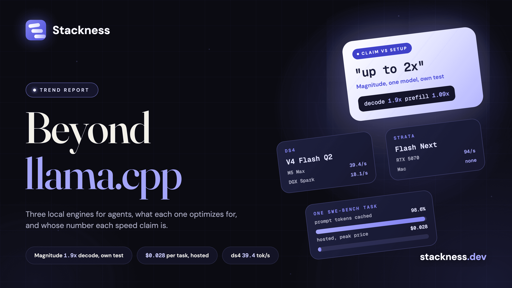

The three llama.cpp alternatives for local agents that drew attention between 24 September and 2 October 2026 each optimize for something different. [ds4](https://stackness.dev/tools/ds4) runs a few large mixture-of-experts models fast on 96 GB and bigger Macs and on the DGX Spark. [Magnitude](https://stackness.dev/tools/magnitude) tunes its kernels on your own machine for small and mid-size models. [Strata](https://stackness.dev/tools/strata) puts one model, Qwen3.8 Flash Next, on a Windows or Linux gaming PC. Every headline speed number behind them is self-reported. Magnitude's "up to 2x faster than llama.cpp" is 1.9x on decode and 1.09x on prefill, for one model on one Mac, measured by Magnitude.

ds4 is not new, whatever the week's headlines said. Salvatore Sanfilippo, the creator of Redis, started it in May 2026. The [Hacker News post](https://news.ycombinator.com/item?id=49936575) of 2 October linked a community site, not the project. The baselines it is measured against are [llama.cpp](https://stackness.dev/tools/llama-cpp), [vLLM](https://stackness.dev/tools/vllm), [Ollama](https://stackness.dev/tools/ollama), [MLX](https://stackness.dev/tools/mlx) and [SGLang](https://stackness.dev/tools/sglang).

## What does each local inference engine optimize for, and for whom?

ds4 optimizes for one session on one large machine with a few hand-picked models. Magnitude optimizes for speed and memory on your exact device, with several agent sessions at once. Strata optimizes for installing one model in one click. llama.cpp covers the most hardware, Ollama is the easiest to install, and vLLM and SGLang serve many requests at once.

| Engine | Optimizes for | Models | Hardware today | Licence | Latest |
| --- | --- | --- | --- | --- | --- |
| ds4 | One session, a few big models, its own coding agent | [DeepSeek](https://stackness.dev/tools/deepseek-v4) V4 and V4.1 Flash, V4 Pro, [GLM](https://stackness.dev/tools/glm) 5.2 and 5.3, [Qwen](https://stackness.dev/tools/qwen) 3.8 Flash Next | Metal, CUDA, ROCm on Strix Halo | MIT | No releases; last commit 20 September |
| Magnitude | Kernels tuned on your device, several sessions | Qwen3.5 to 3.8 up to 35B, Gemma 4, LFM2.5, MiniCPM5 | Metal, CUDA, Vulkan, CPU | Apache 2.0 | 0.2.4, 2 October |
| Strata | One-click install of one model | Qwen3.8 Flash Next only | NVIDIA RTX 20 to 50, selected AMD; Windows and Linux | MIT | v0.1.38, 3 October |
| llama.cpp | Any GGUF model on almost any hardware | Most open architectures; V4.1 support still an open PR | Metal, CUDA, HIP, Vulkan, SYCL, CPU and more | MIT | Build b11371, 3 October |
| vLLM | Serving throughput, batching, multi-GPU | V4.1 Flash, GLM 5.3 Flash, Flash Next | NVIDIA, AMD, Intel, CPUs | Apache 2.0 | v0.30.0, 22 September |
| Ollama | Ease of install and agent integrations | Its library: Qwen3.8 27B local, GLM 5.3 cloud only | NVIDIA, AMD, Apple silicon | MIT | v0.35.1, 29 September |
| SGLang | Agentic and large-scale serving, prefix cache | V4.1 Flash, GLM 5.3 Flash, Flash Next | NVIDIA, AMD Instinct, TPU, Apple | Apache 2.0 | v0.5.21, 2 October |

ds4's [README](https://github.com/antirez/ds4) calls it "deliberately narrow, not a general GGUF runner": it loads only GGUF files the project produces, and a model "may be removed when a better replacement arrives". Simon Willison summed up the pitch on HN: "it only supports a small set of carefully chosen models, but it supports them really well."

Magnitude's [launch post](https://news.ycombinator.com/item?id=49911995), from a YC S25 company, places vLLM and SGLang in the datacenter, llama.cpp and Ollama at broad compatibility, and ds4 as specialised but "lacking engine completeness". Tuning takes "around ~1 minute whenever you download a new model".

## Which speed claims are published, and who measured them?

All the headline numbers come from the projects themselves. Magnitude compared against llama.cpp running a heavier KV cache than its own. ds4 publishes a recorded baseline sweep, and Strata's headline uses speculative decoding. The only outside evidence is HN replies and community reports filed in the projects' own repos.

| Claim | Setup | Measured by | Outside check |
| --- | --- | --- | --- |
| Magnitude, "92% faster decode on Metal, 19% on CUDA" than llama.cpp | Qwen3.6 35B-A3B, 4-bit, 64K context. M4 Pro: decode 30 to 57 tokens/s, prefill 466 to 507. DGX Spark: decode 49 to 58. llama.cpp on a 16-bit KV cache, Magnitude on 8-bit keys and 4-bit values | Magnitude | Four HN users saw llama.cpp or MLX engines match or beat it on other hardware |
| ds4, DeepSeek V4 Flash Q2 | M5 Max 128 GB: 39.4 tokens/s generation at 2K context, 27.6 at 64K. DGX Spark: 18.1 and 13.8 | ds4, "a baseline, not a fresh benchmark of every commit" | Volunteers ran 76 of 100 random SWE-Bench Verified instances on an M5 Max, in issue #389 |
| Strata, Qwen3.8 Flash Next | RTX 5070 12 GB: "94 tokens/s" writing, 2,650 tokens/s reading a 32K prompt. MTP speculative decoding on | Strata | A community RTX 5090 run: 179 tokens/s at a 4K prompt, 165 at 128K |

The Magnitude comparison has two more catches. Its "27% less memory per agent" comes from the same lighter KV cache. And its own engine is days old: release 0.2.0, about four hours before the Launch HN, replaced "the llama.cpp-based inference engine with Magnitude's own engine". In the thread, one user on an RTX 5070 Ti found llama.cpp "about 20-30% faster at decode", and another on an M5 Max found it "roughly 2x faster". A third measured [Rapid-MLX](https://stackness.dev/tools/rapid-mlx) at 175 tokens/s against Magnitude's 161. The founders put the M5 gap down to Metal 4 matrix units they do not use yet.

## Which hardware does each engine support today?

ds4 needs a big-memory Mac, a DGX Spark or a Strix Halo box. Magnitude runs on any Apple silicon Mac and most GPUs through Vulkan, but not ROCm or several GPUs. Strata runs only on Windows and Linux PCs with a recent NVIDIA or selected AMD card and 32 GB or more of RAM. llama.cpp still runs on the widest range.

- **ds4.** Its README says Metal is "the primary target, on Macs with 96 GB or more", while its Qwen3.8 file is "the starting option for 64 GB Macs" with weights streamed from the SSD. DeepSeek V4.1 Flash does not fit in memory on one 128 GB machine: it needs SSD streaming, two machines linked over RDMA, or a 512 GB Mac. No Vulkan, no Intel GPUs.
- **Magnitude.** Metal on macOS 15, CUDA from Ampere up, Vulkan, CPU. Its user docs say it does "not currently ship a ROCm backend", and multi-GPU is "on our near-term roadmap".
- **Strata.** It keeps the hottest experts in VRAM, the rest in RAM and the model's n-gram table on the SSD. The minimum VRAM it states has moved in a week, from 8 GB in a 28 September HN title to 12 GB in the README to "a 6 GB card starts" in v0.1.38. No Mac support.

Qwen3.8 Flash Next is 125B parameters with 6B active, or about 180B counting its n-gram embeddings and draft layer, per its [model card](https://huggingface.co/Qwen/Qwen3.8-Flash-Next). Strata quotes the first number, Magnitude's catalog the second.

## When is a local engine worth it for an agent workload, and when is a hosted API still cheaper?

On cost alone, hosted is cheaper for almost everyone. One SWE-Bench task run through ds4 on an M5 Max took about 11 minutes and 1.15 million prompt tokens. The same tokens cost $0.028 at DeepSeek's peak V4.1 Flash price. Local pays for privacy, offline work, no rate limits and research, not for the token bill.

The worked example uses a volunteer's run of 20 SWE-Bench Verified instances, posted in [ds4 issue #389](https://github.com/antirez/ds4/issues/389) on 27 July. Per instance it averaged 653 seconds, 45 model calls, 1,147,283 prompt tokens, 98.6% of them cached, and 13,873 output tokens. My arithmetic at [DeepSeek's prices](https://api-docs.deepseek.com/quick_start/pricing):

| Model, hosted | Input | Cached input | Output | That task |
| --- | --- | --- | --- | --- |
| DeepSeek V4.1 Flash, peak | $0.30 | $0.006 | $1.20 | $0.028 |
| DeepSeek V4.1 Flash, off-peak | $0.15 | $0.003 | $0.60 | $0.014 |
| GLM 5.3 Flash, Z.ai | $0.15 | $0.03 | $0.50 | Not computed |
| Qwen3.8 Flash, Qwen Cloud | $0.15 | $0.016 | $0.47 | Not computed |

Prices are per million tokens on 3 October. A machine running such tasks around the clock finishes about 132 a day, worth about $3.72 at peak hosted prices or $1,360 a year, before electricity. A 128 GB [Framework Desktop](https://stackness.dev/tools/framework-desktop) lists at $3,449 and is out of stock, and a reseller lists the [DGX Spark](https://stackness.dev/tools/dgx-spark) Founders Edition at $4,699. The comparison is rough: the local run used V4 Flash at 2-bit, and DeepSeek now serves only V4.1 Flash.

The same data says what matters for agents. With 98.6% of prompt tokens repeated, prefix reuse matters more than raw decode speed, and a local engine has to keep the KV cache warm across turns. ds4 keeps it on disk across restarts, Magnitude shares prefixes across sessions, and Strata caches one conversation at a time.

## How is this slot different from the decision-model runtime slot?

Different output, different unit of speed and different model size. These engines serve chat completions and tool calls from models of 1B to 750B parameters, measured in tokens per second. A decision-model runtime such as [Ollaya](https://stackness.dev/tools/ollaya) serves typed questions from small encoders, measured in milliseconds per question.

The [runtime post](https://stackness.dev/blog/how-do-you-run-system-one-decision-models-locally-ollaya-laya-mlx-and-the-runtime-slot) covered that slot with Ollaya and [laya-mlx](https://stackness.dev/tools/laya-mlx). The two slots now overlap in one place: Ollama 0.35.0 on 28 September [added decision models](https://github.com/ollama/ollama/releases/tag/v0.35.0) through `/v1/systemone`, "based on TypeSafe's Jev API". For a stack, that means a chat engine and a decision runtime can now be the same daemon.

## What is missing from each engine right now?

| Need | ds4 | Magnitude | Strata | llama.cpp |
| --- | --- | --- | --- | --- |
| OpenAI and Anthropic APIs | Yes | Yes | Yes | Yes |
| Responses API, for Codex | Yes | Yes | No, requested in #451 | Yes |
| Several requests at once | Native on Metal; in order on one CUDA GPU | Yes, sharing prefixes | "One request at a time" | Yes |
| Releases | None, "beta quality" | Since 0.2.0, own engine | 38 in nine days | Rolling builds |

- **ds4.** No tagged releases. Qwen3.8 Flash Next lacks tensor parallelism, SSD streaming and ROCm. Open issues include a stall when a tool call follows an unclosed think block.
- **Magnitude.** The big MoE models are switched off in its catalog, Qwen3.8 Flash Next and DeepSeek V4 Flash among them, marked "not implemented yet". No ROCm, no multi-GPU. So no single model runs on all three new engines today.
- **Strata.** One model, one request, no Mac. The first start can freeze the PC for one to three minutes while 35 to 55 GB loads.
- **llama.cpp.** DeepSeek V4.1 support is an [open pull request](https://github.com/ggml-org/llama.cpp/pull/28696), opened on 10 September.

On Stackness, as of 3 October 2026, 1 real profile lists Ollama and 1 lists [LM Studio](https://stackness.dev/tools/lm-studio). llama.cpp, vLLM, MLX and Magnitude are on none ([data sources](https://stackness.dev/about/data-sources)). The [LLMs and model tools developers list on Stackness](https://stackness.dev/categories/llms) are hosted models for now, and the [trending page](https://stackness.dev/trending) will show if a local engine starts climbing.

## Key numbers

- **1.9x** decode and **1.09x** prefill over llama.cpp on an M4 Pro, for one model at 64K context, measured by Magnitude ([GitHub](https://github.com/magnitudedev/magnitude), **30 September 2026**).
- **4 hours** between Magnitude 0.2.0, which replaced its llama.cpp-based engine, and its Launch HN on **30 September 2026**.
- **39.4** tokens/s generation for DeepSeek V4 Flash Q2 on an M5 Max 128 GB in ds4, self-reported, and **76 of 100** SWE-Bench Verified instances solved in a volunteer run ([ds4](https://github.com/antirez/ds4)).
- **94** tokens/s for Qwen3.8 Flash Next on a 12 GB RTX 5070 in Strata, with speculative decoding, self-reported ([Strata](https://github.com/Niko1221/Strata), **3 October 2026**).
- **$0.028** for one ds4 SWE-Bench task's tokens at DeepSeek's peak V4.1 Flash price, by my arithmetic, on **3 October 2026**.
- **1** real Stackness profile lists Ollama and **0** list llama.cpp, vLLM or MLX, as of **3 October 2026** ([data sources](https://stackness.dev/about/data-sources)).

## Quick answers

**What are the best llama.cpp alternatives for running local agents?** It depends on the machine. ds4 for a few large models on a 96 GB or bigger Mac or a DGX Spark, Magnitude for small and mid-size models tuned to your device, Strata for Qwen3.8 Flash Next on a gaming PC, and vLLM or SGLang for serving many requests.

**Is Magnitude 2x faster than llama.cpp?** On one model, one Mac and its own test, it measured 1.9x on decode and 1.09x on prefill, with a lighter KV cache than llama.cpp's. HN users on other hardware found llama.cpp matching or beating it.

**Who made ds4?** Salvatore Sanfilippo, antirez, the creator of Redis. It started in May 2026, is MIT-licensed C, and has no tagged releases.

**Can Strata run on a Mac?** No. It supports Windows and Linux with NVIDIA RTX 20 to 50 or selected AMD GPUs and at least 32 GB of RAM.

**Is a local engine cheaper than a hosted API for coding agents?** Rarely on tokens alone. One ds4 SWE-Bench task used tokens worth $0.028 at DeepSeek's peak V4.1 Flash price, so a $3,449 or $4,699 machine takes years to pay back.
