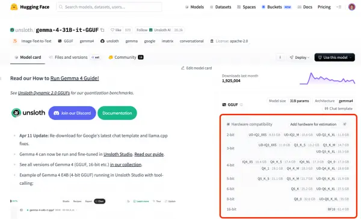
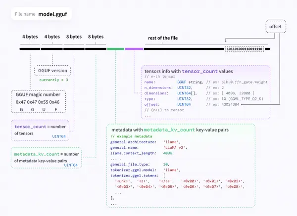
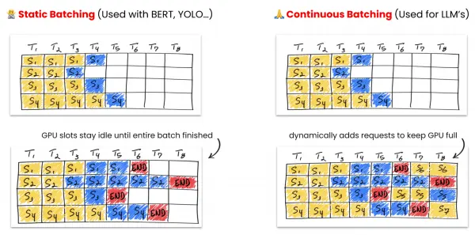
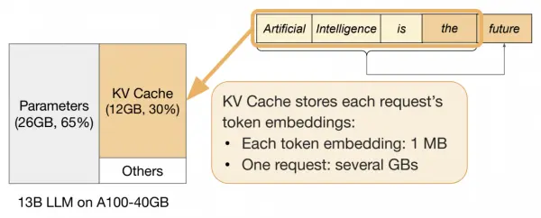
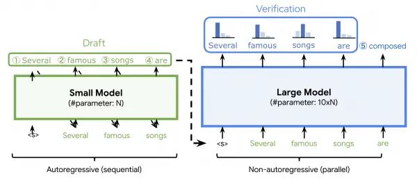
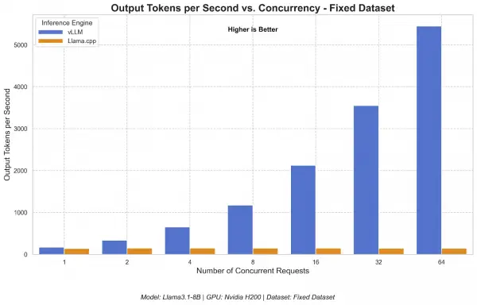
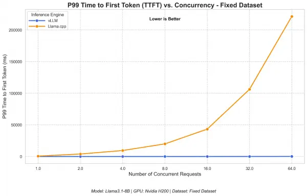
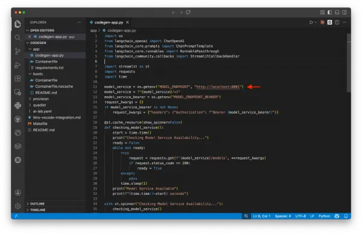

Everyone wants to run local large language models (LLMs) right now, and for good reason. Running your own GPT-style models means no API bills creeping up month over month, no rate limits from a model vendor, and full data privacy by default. Whether you're building [retrieval-augmented generation (RAG) pipelines](https://www.redhat.com/en/topics/ai/what-is-retrieval-augmented-generation), spinning up [AI agents](https://www.redhat.com/en/topics/ai/what-is-agentic-ai), or using an [AI code assistant](https://developers.redhat.com/articles/2026/04/22/opencode-model-neutral-ai-coding-assistant-openshift-dev-spaces), two inference engines keep coming up in most conversations: llama.cpp and vLLM.

They solve the same core problem—running open-weight models yourself—but they approach it from different angles. By the end of this article, you'll know exactly when to use each one, and we'll back it up with benchmarks.

## The evolution of open-weight models: Why local inference exists

The need for local language model inference engines traces back to 2023. When Meta released [Llama 2](https://about.fb.com/news/2023/07/llama-2/) as one of the first commercially viable open-weight model families, it shifted the landscape of open-access AI. Sure, ChatGPT and other hosted services already existed, but Llama 2 was different. You could download it. You could own it.

One small problem, though: you probably couldn't actually run it.

Llama 2 shipped in [7B, 13B, and 70B parameter sizes](https://huggingface.co/blog/llama2). Even the 7B model required significant GPU memory in its native precision. If you didn't have a dedicated NVIDIA GPU (and most developers don't), running these sizes was difficult. That gap between *you can download this* and *you can run this* is where llama.cpp and vLLM emerged, each solving a different side of the problem.

## llama.cpp: Efficient AI inference on consumer hardware

The [llama.cpp](https://github.com/ggml-org/llama.cpp) project started with a simple question: Instead of asking *How do we get bigger GPUs?*, what if we made it possible to run optimized models on the hardware we already have?

The project started as a lightweight, dependency-free way to run Llama models (in C++, hence the name), but has since become the primary way to run LLMs on consumer hardware thanks to a few key optimizations.

### Reducing compute requirements with quantization

[Quantization compresses model weights](https://newsletter.maartengrootendorst.com/p/a-visual-guide-to-quantization) from their original 16-bit or 32-bit floating-point representations down to 4-bit or even 2-bit integers. In practice, this means a model that originally required about 30 GB of memory can shrink to around 4 GB, which is small enough to fit in your laptop's RAM.

Figure 1: Released in 16-bit format, the model takes up approximately 60 GB. Compression to 4-bit gives us a model that only takes up around 18 GB of space.

The tradeoff is some loss in output quality, but modern quantization techniques preserve surprisingly good performance for most use cases. For example, our [FP8 and INT8 benchmarks on DeepSeek retained near-perfect accuracy](https://developers.redhat.com/articles/2025/03/03/deployment-ready-reasoning-quantized-deepseek-r1-models). Both llama.cpp and vLLM benefit from quantization, but they apply it in different ways depending on the backend, model format, and deployment target. For example, llama.cpp supports widely used quantized GGUF models and also uses activation quantization in some backends, such as CUDA and Vulkan, when paired with compatible int8-based weights. vLLM also supports [several quantization workflows](https://docs.vllm.ai/en/latest/features/quantization/) like FP8, INT8, INT4, and other quantization formats.

### The GGUF format for standardized model packaging

The llama.cpp project also introduced [GGUF](https://github.com/ggml-org/ggml/blob/master/docs/gguf.md) (GPT-Generated Unified Format), a single-file format that bundles model weights and all associated metadata: tokenizer configuration, architecture details, and quantization parameters into one portable unit. This makes loading and swapping models fast, and it's become the de facto standard for local model distribution. If you've ever browsed [Hugging Face](https://huggingface.co/models) for quantized models, you've seen GGUF files everywhere.

Figure 2: Instead of just safetensors, GGUF is a binary format that's optimized for quick loading and saving of models.

### CPU-first inference and its downstream effects

The vast majority of personal computers don't have a dedicated GPU. llama.cpp was designed to run efficiently on CPUs, with optional GPU acceleration when available. This single decision made local LLMs accessible to millions of developers, and its impact extends far beyond the project itself. For example, if you've used [Ollama](https://github.com/ollama/ollama) or [LM Studio](https://lmstudio.ai/), llama.cpp's underlying engine enables these tools.

## vLLM: High-throughput AI inference at scale

Running one model on a laptop is great. But what happens when 10 users hit your AI model at the same time? Or when you deploy to [Kubernetes](https://www.redhat.com/en/topics/containers/what-is-kubernetes), where workloads are distributed across nodes and regions?

[vLLM](https://github.com/vllm-project/vllm) takes the local LLM idea and scales it up, focusing on production inference with hardware accelerators like NVIDIA GPUs, Google tensor processing units (TPUs), AMD GPUs, Intel accelerators, and more. It's an LLM serving engine, just like llama.cpp, but it's built around solving problems with LLM inference: specifically, [managing the key-value (KV) cache (an LLM's short-term memory)](https://www.redhat.com/en/topics/ai/what-is-vllm) from requests and resolving issues with GPU underutilization. To support this, vLLM includes several features designed for deploying LLMs at scale.

### Maximizing throughput with continuous batching

With traditional predictive AI models, such as [BERT](https://en.wikipedia.org/wiki/BERT_%5C\(language_model%5C)) or [YOLO](https://github.com/ultralytics/ultralytics), we had fixed inputs, like a single image, and fixed outputs, like *It's a cat*. Instead of processing each request individually or batching 10 and waiting, vLLM uses continuous batching to process incoming requests per token across the batch. If 10 requests arrive at roughly the same time, vLLM interleaves their token generation rather than making nine of them wait.

Figure 3: Static batching wastes GPU slots waiting, whereas continuous batching fills them dynamically as requests finish.

### Efficient KV cache management with PagedAttention

Every time a model processes a prompt, it computes a KV cache. This cache is a set of intermediate calculations that the model references when generating each subsequent token, which saves compute later on. However, these caches grow quickly. For longer conversations or complex prompts, a single request's KV cache can consume dozens of gigabytes of GPU memory.

Figure 4: The KV cache grows with each request's token embeddings, and can consume a large part of GPU memory.

With many hardware accelerators offering only 10, 40, or 80 GB of VRAM, loading the model weights *and* maintaining KV caches for concurrent users is a serious memory challenge. vLLM's [PagedAttention](https://arxiv.org/abs/2309.06180) mechanism manages KV cache memory the way an operating system manages virtual memory: allocating and freeing blocks dynamically to maximize GPU utilization.

### Scaling performance with speculative decoding and disaggregation

Both llama.cpp and vLLM benefit from quantization, as well as [speculative decoding](https://developers.redhat.com/articles/2025/11/19/speculators-standardized-production-ready-speculative-decoding), where you use a small, fast “draft” model to generate candidate tokens, then verify them with the large model in a single forward pass. When the draft model guesses correctly (which it often does for predictable tokens), you get multiple tokens for the cost of one verification step.

Figure 6: A small draft model proposes candidate tokens, then the large model verifies them in one parallel pass.

However, so far we've been talking about single-node deployments, which will eventually encounter challenges with memory limits, throughput bottlenecks, and latency under load. In some cases, just adding n + 1 inference engine servers won't be enough.

That's why the [llm-d](https://llm-d.ai/) project exists: to separate the prefill (processing the prompt) and decode (generating tokens) stages of inference across different hardware. This split allows each stage to be optimized and scaled independently on Kubernetes.

## Benchmarking llama.cpp vs. vLLM

To put concrete numbers behind these architectural differences, we benchmarked both engines using [GuideLLM](https://developers.redhat.com/articles/2025/06/20/guidellm-evaluate-llm-deployments-real-world-inference), an open source toolkit for evaluating LLM inference performance. The test ran Llama 3.1 8B at full precision (16-bit) on a single NVIDIA H200 GPU with concurrency levels from 1 to 64 simultaneous users. For full methodology and additional metrics, see the [detailed benchmark comparison](https://developers.redhat.com/articles/2025/09/30/vllm-or-llamacpp-choosing-right-llm-inference-engine-your-use-case).

### Note

These benchmarks show a high-concurrency serving scenario on a data center GPU, more suited to vLLM’s strengths. llama.cpp is often used in a different context: local, single-user, CPU-first, or consumer-hardware inference. The results should be read as a production-serving comparison, not a general statement that one engine is better in every environment.

### Throughput: How many users can we serve?

At a single concurrent request, both engines produce tokens at a comparable rate. The difference emerges as concurrency increases.

Figure 7: vLLM's output throughput scales with concurrency. At 64 simultaneous users, it generated roughly 44 times more tokens per second than llama.cpp.

### Responsiveness: Time to first token under load

The time to first token (TTFT) metric shows how long a user waits before the first token of a response arrives, which is especially relevant for interactive applications.

Figure 8: vLLM's P99 TTFT remains low and stable across all concurrency levels, while llama.cpp's TTFT grows exponentially. At 64 concurrent users, it takes more than three minutes before receiving the first token.

This is a consequence of llama.cpp's sequential queuing model: requests are processed one at a time, so later arrivals wait in line. For a single user, both engines respond immediately.

## Should you choose llama.cpp or vLLM?

Both engines serve models through an [OpenAI-compatible API endpoint](https://developers.openai.com/api/reference/overview). That means whether you're building RAG, AI agents, or any application that talks to an LLM, swapping between llama.cpp and vLLM (or a hosted API like OpenAI) is essentially a URL change. No code rewrite required.

Figure 9: Developers can easily switch between a proprietary and local model just by replacing one endpoint with localhost.

Choose llama.cpp (or [Ollama](https://github.com/ollama/ollama) and [LM Studio](https://github.com/lmstudio-ai)) when you are prototyping on your laptop or workstation, have a consumer-grade or no GPU, want to quickly test different models by swapping GGUF files, and need offline inference in situations like factory floors and Internet of Things (IoT).

### Note

Explore our [side-by-side comparison of Ollama and vLLM](https://developers.redhat.com/articles/2025/08/08/ollama-vs-vllm-deep-dive-performance-benchmarking) to see exactly how they match up under pressure.

On the other hand, choose vLLM when you need to serve multiple concurrent users, have access to data center GPUs (such as the A100 or H100), need to meet specific latency service-level agreements (SLAs), and want features like disaggregated serving with llm-d.

## Choosing the right engine for your AI journey

The typical path many teams follow is starting with a paid API (such as OpenAI or Anthropic) for quick prototyping, watching the bill grow, and then moving to llama.cpp on a local machine for development. When it's time to deploy to users, they switch to vLLM on GPU infrastructure.

To get started, the `llama-cli` tool (for experimentation) and `llama-server` tool (for serving) support llama.cpp workflows, while the [vLLM Recipes](https://recipes.vllm.ai/) provide guides and commands for running vLLM models. You can also explore the [Red Hat AI collection of optimized models](https://huggingface.co/RedHatAI), which are ready for deployment. Balancing these architectural tradeoffs allows you to select the precise infrastructure required to sustain your local LLM deployment.

*Last updated: July 13, 2026*
