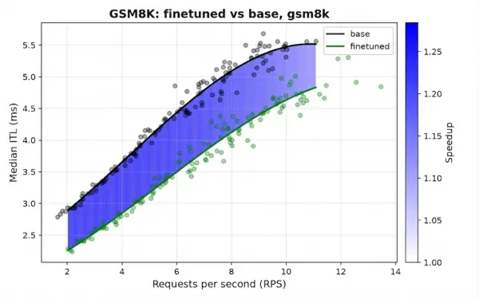

Autoregressive decoding makes large language model (LLM) inference memory-bandwidth bound: every token needs 1 full forward pass over billions of parameters, so the hardware spends most of its time moving weights rather than computing. MTP is a training objective: models like the DeepSeek and Qwen families learn to predict several future tokens at each position, which improves their data efficiency and quality. That objective leaves behind extra prediction heads, and at inference, engines can repurpose those heads as a speculator, proposing several future tokens per step for a verifier to accept or reject.

Reusing native MTP heads avoids adding new parameters, but inference engines execute them differently than they were trained, causing acceptance to drop. Speculators 0.6.0 implements FastMTP-style fine-tuning, a training recipe that adapts a single shipped MTP head for the recursive, multi-step drafting that engines like vLLM perform in production. In their 2025 paper on FastMTP, Cai et al. demonstrated how recursive training adapts a single MTP head for multi-step drafting.

## Key features

- **FastMTP-style MTP fine-tuning:** A teacher-forced, multi-step training loop with exponential-decay position weighting adapts 1 MTP head for recursive reuse across several speculative tokens.
- **Native MTP weight extraction:** The MTPConverter lifts native `mtp.*` weights directly out of a verifier checkpoint to initialize fine-tuning, with no training from scratch.
- **Full-vocabulary draft head:** The speculator shares the verifier's `embed_tokens` and `lm_head`, so there's no vocabulary reduction and no separate output projection to reconcile.
- **vLLM-ready checkpoints:** The stitcher emits weights in the exact `mtp.*` key format vLLM expects, so a fine-tuned head deploys with a standard `vllm serve`.

## What is multi-token prediction?

Engineers train and run a standard language model autoregressively: given tokens t₀…tᵢ, it predicts tᵢ₊₁, appends it, and repeats, 1 full forward pass per token. Speculative decoding hides that idle time. A small speculator (or draft head) proposes several tokens cheaply, and the large verifier (or target model) accepts or rejects them in a single forward pass. Any accepted tokens are effectively free, because verification costs 1 pass regardless of how many candidates it checks.

Multi-token prediction is a training objective, not a serving mode: the model learns to predict several future tokens at each position instead of only the immediate next one, which sharpens its representations and improves data efficiency. It adds *D* sequential MTP modules, 1 per additional future token, and chains them causally: each module conditions on the previous module's output rather than predicting positions in parallel like independent output heads.

The module at depth k takes the hidden state from depth *k-1* together with the embedding of the ground-truth token tᵢ₊ₖ and predicts tᵢ₊ₖ₊₁. Each module has its own transformer block and input projection but shares the embedding layer and output head with the main model. Two consequences matter:

- Every MTP module trains on ground-truth context (teacher forcing).
- Inference engines can repurpose the modules at inference as a ready-made draft head for speculative decoding.

Most open-weight models don't ship these modules at all; among those that do are DeepSeek-V3 and the Qwen3-Next family.

Learn more:

- Multi-token prediction, Gloeckle et al., 2024 (arXiv:2404.19737)
- DeepSeek-V3 technical report: the sequential, causal-chain MTP variant (arXiv:2412.19437)
- FastMTP: The recipe this feature is based on
- vLLM speculative decoding documentation

## Why fine-tune a single MTP head

In training, DeepSeek-V3 uses *D* distinct modules, each responsible for 1 specific future position.

In production, providers rarely ship the full stack. Most ship a single MTP module, and even when several are shipped, inference engines typically keep only the first to avoid memory overhead. To speculate multiple tokens, the engine applies that single module autoregressively: it drafts 1 token, then feeds that token and the module's own output hidden state back in to run it again.

This is the train/serve mismatch. Creators trained the shipped module to predict the immediate next token from ground-truth input, never to consume its own outputs. Applied recursively, small errors compound, and acceptance drops off for the second and third speculative tokens. FastMTP-style fine-tuning removes this mismatch by training that single module exactly how the server uses it: recursively.

## How FastMTP-style fine-tuning works in Speculators

The Speculators MTP speculator (`MTPDraftModel`) is a single transformer layer with an input projection fusing the verifier's last hidden state with the target token's embedding. Training runs a teacher-forced recursive loop that mirrors serving. At step *k*:

1. The system fuses the token embedding for `input_ids[t+k+1]` with the current hidden state.
2. The MTP layer produces an output hidden state, and `lm_head` produces logits.
3. The loss target is `input_ids[t+k+2]`.
4. The trainer feeds the output hidden state back as the input for step *k+1*.

Following FastMTP, Speculators weights per-step losses with normalized exponential decay:

```python
def compute_step_weights(beta: float = 0.6, num_steps: int = 3) -> list[float]:
    """alpha_k = beta^(k-1) / sum(beta^(j-1) for j=1..K)"""
    raw = [beta**k for k in range(num_steps)]
    total = sum(raw)
    return [w / total for w in raw]
# beta=0.6, num_steps=3 -> [0.51, 0.31, 0.18]
```

The default β = 0.6 over 3 steps helps step 0 carry roughly half the loss, as verifiers accept early speculative tokens more often. A note on the full-vocabulary head. The MTP speculator shares the verifier's complete `lm_head`, keeping the draft numerically identical to the target's output distribution. Future updates will include Frequency-Ranked Speculation (FR-Spec)-style vocabulary reduction to shrink recursive step costs.

## When to use MTP fine-tuning

**1\. Does the verifier already ship an MTP head?**

MTP fine-tuning starts from native `mtp.*` weights. Speculators 0.6.0 supports Qwen3-Next and Qwen3.5 (including Mixture of Experts, or MoE). If your target doesn't have an MTP head, use [EAGLE-3](https://developers.redhat.com/articles/2025/07/01/fly-eagle3-fly-faster-inference-vllm-speculative-decoding), DFlash, or [P-EAGLE](https://developers.redhat.com/articles/2026/09/03/speeding-llm-inference-p-eagle-vllm-speculators) instead.

**2\. How much memory and compute can you spend?**

MTP is the lightest speculator to train because it reads only the last layer's hidden states. This results in smaller offline datasets and faster online training via vLLM's hidden extraction system.

**3\. Are you serving a specialized workload?**

Creators train a shipped MTP head on general data. fine-tuning on domain-specific data (math, code, and so on) sharpens the head's predictions where they matter most.

## Fine-tune, stitch, and serve an MTP head

The following example fine-tunes Qwen/Qwen3.5-9B on Grade School Math 8K (GSM8K) in about 443 seconds on 2× NVIDIA H200.

### 1\. Prepare data

MTP requires training data that the target model itself generates.

```python
python scripts/prepare_data.py \
  --model Qwen/Qwen3.5-9B \
  --data ./output/dataset/gsm8k.jsonl \
  --max-samples 5000 --seq-length 8192 --output ./output
```

### 2\. Serve the verifier

Online training generates hidden states on the fly from a live vLLM server.

```python
python scripts/launch_vllm.py Qwen/Qwen3.5-9B --target-layer-ids 32 -- --port 8000
```

### 3\. Fine-tune

The trainer extracts the native MTP head and optimizes it recursively.

```python
python scripts/train.py \
  --verifier-name-or-path Qwen/Qwen3.5-9B \
  --data-path ./output \
  --vllm-endpoint http://localhost:8000/v1 \
  --save-path ./output/checkpoints \
  --speculator-type mtp \
  --num-speculative-steps 3 \
  --target-layer-ids 32 \
  --step-weight-beta 0.6 \
  --epochs 3 --lr 1e-4 --total-seq-len 8192 \
  --on-missing generate --on-generate delete
```

### 4\. Stitch and serve

The stitcher writes the fine-tuned head back into the verifier checkpoint.

```python
vllm serve ./output/stitched \
  --speculative-config '{"method":"mtp","num_speculative_tokens":3}' \
  --no-enable-chunked-prefill
```

## Performance and verification metrics

We measure performance using mean accepted length via GuideLLM. Higher values indicate more tokens emitted per forward pass.

| **Position** | **Base** | **Fine-tuned** |
| --- | --- | --- |
| pos 0 | 0.897 | 0.912 |
| pos 1 | 0.719 | 0.776 |
| pos 2 | 0.476 | 0.616 |

Recursive fine-tuning on the native MTP head of [Qwen/Qwen3-Next-80B-A3B-Instruct](https://huggingface.co/Qwen/Qwen3-Next-80B-A3B-Instruct) yields an improvement in acceptance over the shipped head on domain-specific data, as shown in Figure 1. When trained on around 8,000 samples from [openai/gsm8k](https://huggingface.co/datasets/openai/gsm8k), we measure acceptance rates on the test split of the dataset. Longer training might yield a better speculator.



Figure 1: Median inter-token latency (ITL) (ms) vs. requests per second (RPS) for Qwen/Qwen3-Next-80B-A3B-Instruct trained and evaluated on GSM8K using GuideLLM==0.16.0 and vLLM==0.24.0.

## What's next?

- Frequency-ranked draft-vocabulary reduction (FR-Spec-style)
- Support for verifier families beyond Qwen3-Next and Qwen3.5
- Benchmarking FastMTP fine-tuning across DeepSeek-V3 and Llama 3 model families

## Get started with Speculators 0.6.0

Install from the Python Package Index (PyPI) or source:

```python
uv pip install speculators==0.6.0
# or from source
git clone https://github.com/vllm-project/speculators.git
cd speculators && uv pip install -e .
```

Then run the ready-to-use [example script](https://github.com/vllm-project/speculators/blob/main/examples/train/mtp_qwen3_5_9b_gsm8k_online.sh):

```
bash examples/train/mtp_qwen3_5_9b_gsm8k_online.sh
```

Explore the full [Speculators documentation](https://docs.vllm.ai/projects/speculators/en/latest/) to run FastMTP fine-tuning on your custom datasets and share your acceptance rate benchmarks with the vLLM community.

Accelerate low-latency inference by bringing speculative draft model training to your enterprise workloads. Learn how [Red Hat OpenShift AI](https://www.redhat.com/en/technologies/cloud-computing/openshift/openshift-ai) and the [Red Hat AI Inference](https://www.redhat.com/en/products/ai/inference) simplify end-to-end MTP fine-tuning and deployment at scale.

Learn more:

- [Speculators v0.5.0: DFlash support and online training](https://developers.redhat.com/articles/2026/06/04/speculators-v050-dflash-support-and-online-training)
- [Fly Eagle(3) fly: Faster inference with vLLM & speculative decoding](https://developers.redhat.com/articles/2025/07/01/fly-eagle3-fly-faster-inference-vllm-speculative-decoding)
- [Speculators: Standardized, production-ready speculative decoding](https://developers.redhat.com/articles/2025/11/19/speculators-standardized-production-ready-speculative-decoding)
- [Diving into speculative decoding training with Speculators v0.3.0](https://blog.vllm.ai/2025/12/13/speculators-v030.html)
- [Speeding up LLM inference with P-EAGLE in vLLM Speculators](https://developers.redhat.com/articles/2026/09/03/speeding-llm-inference-p-eagle-vllm-speculators)
- Cai, Yuxuan, et al. *FastMTP: Accelerating LLM Inference with Enhanced Multi-Token Prediction*. arXiv preprint arXiv:2509.18362, 2025.
- Zixuan Zhou, Xuefei Ning, Ke Hong, Tianyu Fu, and Jiaming Xu. *A Survey on Efficient Inference for Large Language Models*. arXiv preprint arXiv:2404.14294, 2024.
