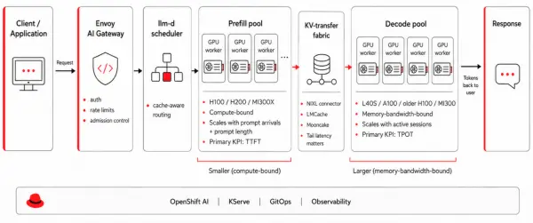
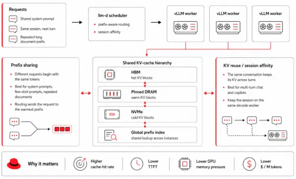
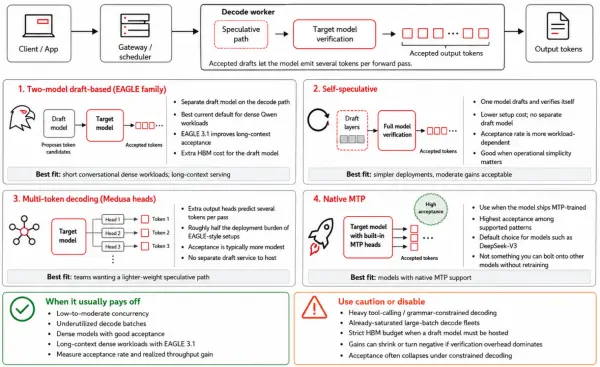

In [Designing distributed AI inference: Core concepts and scaling dimensions](https://developers.redhat.com/articles/2026/06/22/designing-distributed-ai-inference-core-concepts-and-scaling-dimensions), we established the groundwork for distributed inference: the prefill/decode split that shapes every deployment decision, and the five dimensions of parallelism—tensor, pipeline, expert, data, and context—that determine how a model maps onto hardware.

This blog covers the three optimization levers that push past that baseline: prefill/decode disaggregation, key-value (KV) cache strategy, and speculative decoding. Each one trades operational complexity for a measurable improvement in cost, latency, or throughput. We'll walk through each lever starting with the decision rule (when does it pay off?), then the mechanism, and finally the production concerns that tend not to surface until you are running at scale.

## P/D disaggregation as a deployment pattern

The [previous article](https://developers.redhat.com/articles/2026/06/22/designing-distributed-ai-inference-core-concepts-and-scaling-dimensions) described disaggregation as a feature of llm-d, but in practice it is a deployment topology (the most consequential one we cover here), and we need to reason about it as such rather than check it off as a capability.

Figure 1: Separation of prefill and decode phases in a disaggregated inference architecture.

### When to disaggregate

The decision rule is not based on model size; it depends on measurable observations within the system. Profile a baseline single-pool deployment to measure the ratio of prefill GPU-seconds to decode GPU-seconds on your real traffic. Then compare that to the ratio of decode-optimized to prefill-optimized GPU cost in your environment. If your traffic is prefill-heavy while you pay for decode-class hardware (because decode dominates wall-clock), or vice versa, the gap between those two ratios represents your available savings.

Disaggregation tends to pay off for long-prompt retrieval-augmented generation (RAG) with short answers (prefill-heavy), high-concurrency chat with short prompts and long answers (decode-heavy), or any fleet large enough that the cost reduction justifies the operational complexity. In our benchmarks, this architecture reduces costs by 25% to 40% on chat- and RAG-shaped traffic. This block aligns with published disaggregation results: [Splitwise](https://arxiv.org/abs/2311.18677) reports approximately 20% lower cost at 1.4× throughput, and [DistServe](https://arxiv.org/abs/2401.09670) shows up to 7.4× higher goodput.

Conversely, disaggregation does not pay off for single-node deployments where the network hop between prefill and decode workers exceeds the savings. It is also inefficient for a fleet small enough that two pools of one worker are worse than one pool of two workers.

### Sizing the two pools

Prefill workers scale with the arrival rate of new prompts and with prompt-length distribution, while decode workers scale with concurrent active sessions, average token output sizing and target TPOT, and the two scale independently. A useful first cut for a chat workload with mean prompt 800 tokens and mean output 200 tokens at 5,000 concurrent sessions on Qwen3.5-35B-A3B works out to roughly one H100 of prefill capacity per ~30 requests/second of arrival rate, and roughly one decode GPU per ~150 concurrent sessions, in our lab measurements. These numbers move with model and quantization, but the ratio (typically 1:3 to 1:5 prefill to decode workers for chat) is broadly stable across the workloads we have benchmarked.

### KV-transfer connectors and the data path

Once the pools are split, the KV cache produced by prefill must reach decode workers, and vLLM exposes a KVConnector interface with three production-relevant implementations.

| **Connector** | **Recommended for** | **Transport** | **Notes** |
| --- | --- | --- | --- |
| `NixlConnector` | Single-cluster, RDMA/NVLink available | NVIDIA NIXL over UCX | Default for high-performance PD; metadata server is a startup single point of failure (SPOF) |
| `LMCacheConnector` | Cross-instance cache sharing, HBM → DRAM → NVMe tiering | NIXL under the hood, plus offload backends | Adds tiered KV cache + shared prefix index ([LMCache, arXiv:2510.09665](https://arxiv.org/abs/2510.09665)) |
| `MooncakeConnector` | Cluster-scale shared cache pools | RDMA-native | Recommended when you want a separate KV-cache cluster that many vLLM instances pull from |
| `MooncakeStoreConnector` | Tiered cache offloading through use of a distributed master store | Cache offloading | Offload tier behind `MooncakeConnector`; KV lands in a distributed master store rather than peer HBM |

Treat the KV-transfer fabric like any other production data path. Measure end-to-end latency, including queue time, alert on tail latency rather than the mean, and verify RDMA driver health on every node. NIXL's asynchronous send and receive operations provide the right primitive for production only when prefill workers do not block on decode-side acknowledgement.

### The disaggregated KV cache pool

Instead of viewing the cluster's KV cache as per-worker memory plus a transfer protocol, treat it as a cluster-wide resource with its own scheduling concerns. [LMCache](https://arxiv.org/abs/2510.09665) implements this approach by tiering data across HBM, DRAM, and NVMe storage tiers while exposing a global prefix index. When two requests share a prefix (such as a system prompt, a few-shot prefix, or the first thousand tokens of a contract), they share KV blocks regardless of which instance generated them.

### The llm-d scheduler

Cache-aware routing turns disaggregation from a feature into a functional deployment pattern, Instead of distributing requests via round-robin routing across decode workers, llm-d routes a request directly to the worker that contains the warmest KV state for the request's prefix. [Published llm-d benchmarks](https://llm-d.ai/blog/llm-d-v0.5-sustaining-performance-at-scale) report up to 57× faster time-to-first-token (TTFT) and two times the throughput of round-robin routing under high prefix reuse (using eight pods and 16 H100 GPUs).

Our internal measurements are more conservative and serve as illustration rather than a guarantee. We observed a 25% improvement on default settings, a two- to three-fold increase in tokens per second per GPU when paired with prefix-cache-hit routing, and three- to five-fold cost-per-token reduction on chat-shaped workloads with high prefix reuse. While live production deployment numbers will vary from these lab-style figures, the overall performance improvements remain consistent across every workload we measured.

### Hybrid GPU-CPU prefill

A new architectural pattern is emerging in accelerated computing environments. In this configuration, the CPU handles early prefill tasks like embedding lookups and attention preparation, while the GPU processes matrix-multiplication operations. This architecture is not yet a primary recommendation for production environments. However, designing your deployment with a separately scheduled prefill pool is advantageous, because you can change the worker type as the hardware matures without refactoring the underlying system.

### Failure modes that bite in production

The NIXL metadata server is a single point of failure on startup. Deploy two metadata servers behind a TCP load balancer and verify failover capabilities before initiating the first canary rollout. Decode workers that lag during KV transfers create tail-latency bottlenecks for the entire fleet. Implementing admission control at the API gateway is more effective than retrying failed requests downstream. Canary rollouts for disaggregated fleets must update only one pool at a time. Configure automated rollback gates for both TTFT and time-per-output-token (TPOT) to catch a performance regression in either key performance indicator (KPI) before it affects the cluster.

## KV cache: Tiering, sharing, squeezing

While [PagedAttention](https://arxiv.org/abs/2309.06180) solved the fragmentation problem inside a single GPU, the next challenges occur across multiple GPUs and across the cluster. These distributed environments require a different set of tools. The shared key-value (KV) cache hierarchy (Figure 2) illustrates how system components interact across different hardware layers to mitigate memory pressure.

Figure 2: Shared KV cache hierarchy.

### Tiered hierarchy

Now that we have covered how LMCache manages cache tiering as a cluster-wide resource, we need to consider when to enable this feature. Most enterprise workloads include inactive data prefixes that can fit into DRAM or NVMe storage but exceed your HBM capacity. The evaluation process is straightforward: if your prefix-cache hit rate increases by using a 10 times larger cache than you can afford in expensive onboard memory, implementing a tiering strategy provides a clear performance advantage.

### KV reuse versus prefix sharing

Developers often confuse prefix sharing with KV cache reuse, but these concepts represent distinct operational concerns that require different configuration settings.

Prefix sharing allows two separate requests that begin with the same tokens to share a single cache. In contrast, KV cache reuse retains the data from a single request across multiple turns of a live session. Multi-tenant chat platforms benefit from both capabilities. Shared system prompts utilize prefix sharing, while conversation history relies on KV cache reuse. Therefore, prefix sharing is a routing function that directs a new request to the specific worker node hosting the warm prefix. Cache reuse is a session-affinity function that keeps a conversation session linked to the same decode worker.

### Quantization

[Using an 8-bit floating-point (FP8) KV cache](https://vllm.ai/blog/2026-04-22-fp8-kvcache) halves the memory footprint with a measurable but usually acceptable quality cost on most enterprise tasks. In contrast, a 4-bit floating-point (FP4) cache strategy is more aggressive. Currently, you should deploy FP4 formats only on workloads where you can run an evaluation pass against your own data. Red Hat's [LLM Compressor](https://github.com/vllm-project/llm-compressor) produces quantized variants of Qwen models and validates them against your own evaluation set rather than a generic benchmark.

### Decode kernels

vLLM's decode path is fast in 2026 due to a combination of multiple architectural advancements. Several open source projects contribute to these speed improvements, including [FlashMLA](https://github.com/deepseek-ai/FlashMLA) from DeepSeek, [ThunderMLA](https://hazyresearch.stanford.edu/blog/2025-03-04-thundermla) from Stanford, and the PyTorch FlexAttention decode path.

Platform teams rarely tune these kernels directly. However, knowing which kernel your vLLM build uses helps you investigate unexpected decode regressions after a version upgrade. Managing multi-node fleets introduces challenges with tracking code origins and maintaining consistency across environments. Every prefill, decode, and draft-model replica must load identical, pinned kernel binaries.

To achieve this consistency, a production runtime compiles kernels from source and includes a software bill of materials (SBOM) directly within the container image. This approach avoids pulling binaries from a public registry on the first request. We discuss this kernel supply-chain trade-off and the GPU Kernel Manager (GKM) bridge for heterogeneous fleets in the blog post [What GPU kernels mean for your distributed inference](https://developers.redhat.com/articles/2026/05/20/what-gpu-kernels-mean-your-distributed-inference).

### PagedAttention versus RadixAttention

[SGLang's RadixAttention](https://arxiv.org/abs/2312.07104) takes a different architectural bet by organizing the cache as a prefix tree. With this design, the structure of conversation guides how the system removes old data. In contrast, PagedAttention treats the cache like virtual memory pages.

Engineers often debate these architectural trade-offs: RadixAttention excels on workloads with deep, branching prefix trees, including agent workflows and structured prompting. PagedAttention performs better on workloads with irregular prefix patterns and highly varied sequence lengths. vLLM continues to use PagedAttention because it serves as a general-purpose runtime. Its page-table abstraction model scales efficiently across disaggregated architectures, where data naturally moves in pages.

## Speculative decoding

Speculative decoding generates multiple candidate tokens simultaneously by using a lower-cost draft path. Next, the target model verifies these tokens. When the system accepts these draft tokens, the model emits multiple tokens during a single forward pass. The different categories of speculative decoding techniques that vLLM supports have vastly different operational costs. You can see this token verification loop in action in Figure 3.

Figure 3: The speculative decoding token verification loop, where a draft model proposes candidate tokens for verification by the target model.

### Two-model, draft-based (EAGLE family)

In this deployment strategy, a small draft model proposes tokens that the target then verifies. [Benchmarks show that EAGLE-3](https://arxiv.org/abs/2503.01840) can achieve up to a six times speedup on dense models. The newer [EAGLE 3.1](https://vllm.ai/blog/2026-05-26-eagle-3-1) framework (released in May 2026) extends these performance gains into long-context workloads. It delivers up to two times the token acceptance length of EAGLE-3, making it an excellent starting choice for dense Qwen3.6 workloads.

### Single-model self-speculative

In this strategy, the model drafts and verifies its own outputs. The system typically uses a subset of the model's own layers to generate the draft. This approach lowers setup costs because you do not have to train or host a separate draft model. However, this setup results in a more variable acceptance rate that fluctuates based on your workload.

### Multi-token decoding (Medusa heads)

Adding multiple output heads to the target model with the [Medusa](https://arxiv.org/abs/2401.10774) architecture lets the engine predict several tokens per pass. This technique requires roughly half the engineering cost of EAGLE-3. However, token acceptance rates are correspondingly more modest, typically ranging from 0.55 to 0.70.

### Interleaved decode and constrained-decoding interactions

Less a technique than a scheduling choice, vLLM interleaves spec-decoded sessions with normal decode steps to keep batches full. There is one important caveat: when the workload uses constrained decoding (such as JSON mode or tool calls with grammars), the acceptance rate of speculative decoding often collapses because the constraint mask invalidates speculative tokens. Be sure to measure performance before assuming speculative decoding helps in tool-calling traffic.

### Multi-token prediction (MTP)

Some models, notably [DeepSeek-V3](https://arxiv.org/abs/2412.19437), ship with MTP heads trained jointly with the main model, and acceptance rates can exceed 80% out of the box. This efficiency makes MTP a natural choice for any model that ships MTP-trained, but you cannot add it to other models without re-training them.

| **Workload** | **Anchor model** | **Recommended** | **Why** |
| --- | --- | --- | --- |
| Short conversational, dense | Qwen3.6-27B | EAGLE 3.1 | Best accept-rate/cost ratio, current generation |
| Long-context (>64k) | Qwen3.5 dense or MoE | EAGLE 3.1 | Long-context acceptance is the headline improvement |
| MoE flagship | Qwen3.5-397B-A17B | Native MTP if trained; else EAGLE-3 | Active-param shape favors MTP-style heads |
| Code completion | Qwen3.6 dense | n-gram / prompt-lookup | Repetitive code structure makes hit rate high; no draft to host |
| Strict memory budget | any | n-gram | No draft model to host on decode GPU |
| Heavy tool-calling traffic | any | Disable or test | Constrained decoding interaction is severe |

### Note

The draft model occupies decode-worker HBM and adds verification overhead. On already-saturated, large-batch decode fleets, the performance gain from speculative decoding shrinks because the batch already amortizes the kernel launch. At the extreme, this overhead can result in a net loss. The clearest advantages occur at low-to-moderate concurrency, where each forward pass is underutilized.

## Putting inference optimization levers into practice

These three levers—disaggregation, cache architecture, and speculative decoding—are where most cost and latency improvements live once the parallelism layout is set. However, they are still individual mechanisms. The real deployment question is how they work together for a specific traffic shape, and what to do if performance regresses in production.

In the next blog post, we'll put the techniques from parts 1 and 2 into practice with concrete deployment blueprints for six traffic profiles. We also walk through inference troubleshooting recipes for the failures that recur most often at scale, and lay out a structured growth path from a single-node baseline to a multi-model AI grid.

Read it here: [**Deploying distributed AI inference: Blueprints & troubleshooting**](https://developers.redhat.com/articles/2026/06/26/deploying-distributed-ai-inference-blueprints-troubleshooting)

*Last updated: July 7, 2026*
