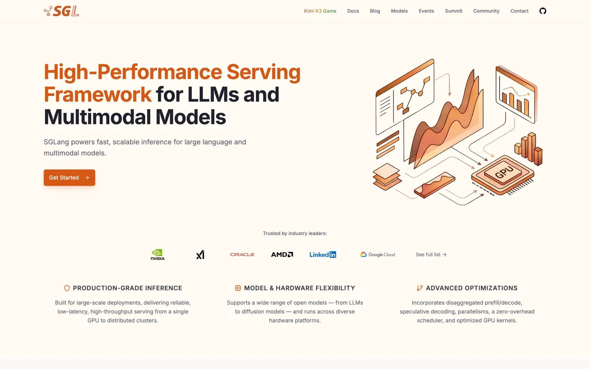
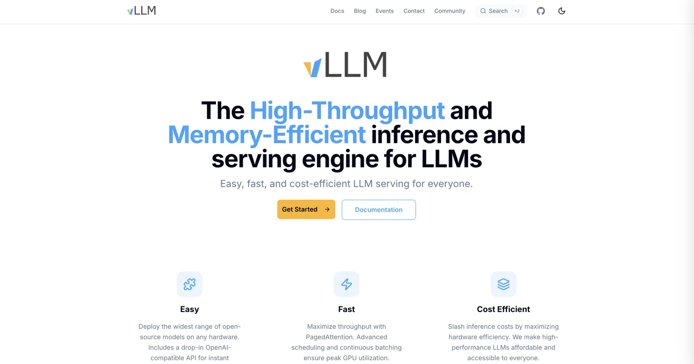
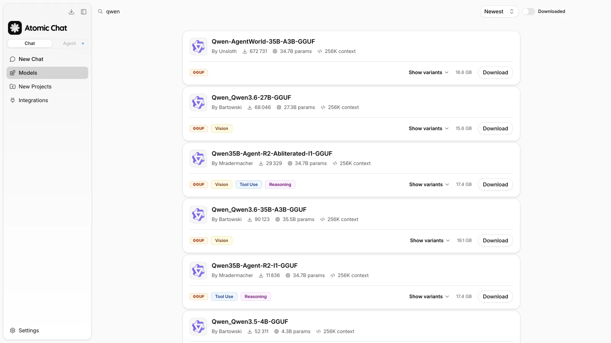
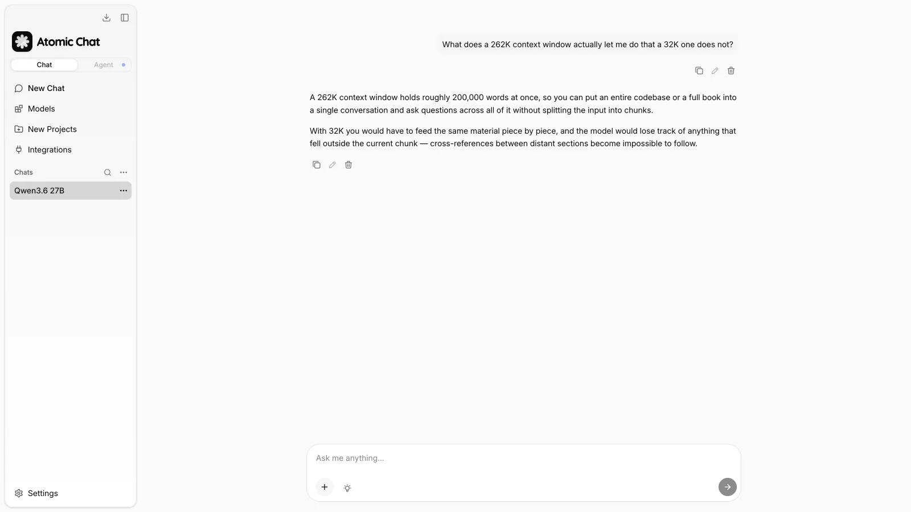

/

/

SGLang vs vLLM: Which Inference Engine Should You Use? (2026)

#### Table of Contents[link](#)

In this article we'll compare SGLang and vLLM — two popular inference engines for local AI. We'll look at ease of setup, performance, model format support, and more.

## SGLang vs vLLM: at a glance

Let's first establish some general information about each platform:

|  | SGLang | vLLM |
| --- | --- | --- |
| Core technique | RadixAttention | PagedAttention |
| KV cache | Radix-tree prefix cache | Paged KV cache |
| Batching | Cache-aware continuous batching | Continuous batching |
| Best at | Shared-prefix workloads | High-throughput serving |
| Structured outputs | Native constrained decoding | Guided decoding |
| Speculative decoding | Yes | Yes |
| Quantization | AWQ, GPTQ, FP8, FP4 | AWQ, GPTQ, FP8, GGUF, BitsAndBytes |
| Hardware | NVIDIA, AMD, TPU, Ascend | NVIDIA, AMD, TPU |

## What is SGLang

SGLang is an open-source inference framework for serving and programming large language models (LLMs). It originated at UC Berkeley's Sky Computing Lab, is hosted by LMSYS, and joined the [PyTorch ecosystem](https://pytorch.org/blog/sglang-joins-pytorch/) in 2025.

SGLang is designed for production LLM serving workloads, including chat applications, coding agents, and other agent-based systems. It is used in large-scale deployments, including serving models such as Grok, with deployments reaching hundreds of thousands of GPUs.

SGLang website

A central design goal of SGLang is reducing repeated computation in applications that send similar prompts across requests. For example, coding agents often resend the same system instructions, tool definitions, and conversation context. SGLang uses **RadixAttention** to cache and reuse attention states for repeated prefixes, reducing redundant prefill computation.

Beyond RadixAttention, SGLang includes:

- **CPU-based scheduling** to reduce scheduling overhead and improve resource utilization.
- **Prefill-decode disaggregation**, which separates prompt processing from token generation across different GPU resources.
- **Speculative decoding**, including V2 support in current releases, to improve generation throughput.
- **Structured output generation** through the xgrammar engine.
- **Support for new model releases**, including optimized kernels and integrations for models such as [Kimi K3](https://atomic.chat/blog/guides/how-to-run-kimi-k3-locally), [GLM-5.1](https://atomic.chat/blog/guides/how-to-run-glm-locally), and [Qwen3.6](https://atomic.chat/blog/guides/how-to-run-qwen-locally).

## What is vLLM

vLLM is an open-source inference and serving engine for large language models. It was developed at UC Berkeley and introduced two techniques that became widely used in LLM serving: **PagedAttention** and **continuous batching**.

- PagedAttention improves memory management by organizing the attention cache more efficiently.
- Continuous batching allows the server to combine requests dynamically instead of processing fixed batches.

Together, these techniques improved the efficiency of serving multiple users on shared GPU resources.

vLLM is widely supported across the LLM ecosystem. Many new model architectures are tested with vLLM during release preparation because of its broad adoption and integration with model repositories.

Also read: [Ollama vs vLLM](https://atomic.chat/blog/llm-updates/ollama-vs-vllm).

vLLM website

Recent vLLM releases have added additional performance and scaling features, including **Model Runner V2**, which improves throughput on newer GPU architectures, and **EAGLE 3.1 speculative decoding**.

Learn more about [speculative decoding](https://atomic.chat/blog/guides/what-is-speculative-decoding).

Let's compare the two platforms on:

- Model formats
- Hardware support
- How they handle concurrency
- Resulting performance differences

## Model formats and quantization

SGLang and vLLM generally use the same model formats. Standard Hugging Face checkpoints in **safetensors** format can usually be loaded by either engine without conversion.

Both engines support common precision formats and quantization methods, including:

- **FP16**
- **BF16**
- **FP8**
- **AWQ**
- **GPTQ**

**GGUF** is an exception. It is primarily designed for llama.cpp-based runtimes and local inference workflows rather than server-oriented inference engines, so SGLang and vLLM are generally not the preferred runtimes for GGUF models.

## Hardware and operating system support

Both SGLang and vLLM are primarily used on Linux systems. Windows deployments are typically done through compatibility layers such as WSL2 or Docker.

## Concurrency

In short, SGLang uses a more performant mechanism to handle concurrency, which gives it a slight to moderate performance advantage.

### SGLang

SGLang improves concurrent inference efficiency through **RadixAttention**, a prefix caching mechanism based on a radix tree.

In this structure, each tree node represents a token sequence prefix and maps to corresponding KV cache blocks stored in GPU memory. When a new request arrives, SGLang performs a longest-prefix match against the tree. Tokens that already exist in the cache can skip prefill computation, and only the new portion of the prompt needs to be processed.

The scheduler also groups requests with shared prefixes so that similar cache entries are reused more frequently than they would be under simple arrival-order scheduling.

This design has several practical implications:

- **The main benefit is reduced prefill cost.** Cache hits reduce time-to-first-token because repeated prompt tokens do not need to be recomputed. Decode performance after generation begins is generally unchanged.
- **The KV cache shares GPU memory with active requests.** Cached blocks and running sequences compete for the same memory pool configured by `--mem-fraction-static`. When memory pressure increases, older cache entries are evicted using LRU-based policies.
- **The effectiveness depends on prefix reuse.** Workloads with repeated prefixes, such as agents that resend identical system prompts and tool definitions, benefit significantly. Requests with little or no prefix overlap receive limited gains while still incurring cache management overhead. The cache is process-local, so restarting the server clears cached entries.

### vLLM

vLLM improves concurrent inference efficiency through **PagedAttention** and **continuous batching**.

PagedAttention manages the KV cache using fixed-size memory pages instead of allocating a contiguous buffer for each request. This reduces memory fragmentation and allows the engine to store more active sequences within the available GPU memory.

**Continuous batching** handles request scheduling by dynamically adding new requests as previous sequences finish. Completed sequences release their allocated pages, while waiting requests can enter the next execution cycle instead of waiting for a fixed batch to complete. This keeps GPU resources better utilized as concurrency increases.

vLLM also includes **automatic prefix caching**, which identifies and reuses identical KV cache blocks across requests. It provides similar benefits to SGLang's RadixAttention for workloads with repeated prompt prefixes, but the two approaches differ in their matching and scheduling strategies.

vLLM's prefix caching operates at page granularity, while SGLang's RadixAttention uses a radix tree structure for prefix matching and can schedule requests around shared prefixes. These differences can affect performance depending on the workload, especially in applications with large repeated prompts such as agent systems.

## SGLang vs vLLM: performance benchmarks

Let's see if SGLang or vLLM has an edge when it comes to performance.

We'll compare two scenarios:

- How each software handles situations where every prompt is unique
- How each software handles situations where prompts share a lot of repeating values (such as system prompts)

### Unique-prompt throughput

A third-party H100 benchmark compared SGLang and vLLM serving Llama 3.3 70B Instruct in FP8 with 50 concurrent requests and unique prompts.

| Metric | SGLang | vLLM |
| --- | --- | --- |
| Throughput | ~1,920 tok/s | ~1,850 tok/s |
| Difference | +3.8% | — |
| Time per output token | ~20 ms | ~20 ms |

Under unique-prompt workloads, both engines showed similar performance. The larger differences appear in workloads with repeated prefixes, such as multi-turn chat and agent systems.

### Prefix-heavy and agent workloads

Workloads with repeated prompt prefixes benefit more from KV cache reuse. This includes agent systems that repeatedly send the same system prompt, tool definitions, and conversation context.

In a benchmark using high prefix reuse, SGLang showed higher throughput and lower time-to-first-token latency than vLLM:

| Metric | SGLang | vLLM |
| --- | --- | --- |
| Throughput | ~16,200 tokens/s | ~12,500 tokens/s |
| Throughput difference | +29% | — |
| Time to first token (1 request) | ~42 ms | ~45 ms |
| Time to first token (100 requests) | ~710 ms | ~740 ms |

The larger difference compared with unique-prompt workloads comes from prefix caching behavior. When requests share long prompt prefixes, SGLang's RadixAttention can reuse more previously computed KV cache states.

## When to use SGLang or vLLM

Now that we understand what each platform is, what it does, and where its advantages lie, let's talk about situations when you might want to use one over the other. In most vLLM vs SGLang decisions, the deciding factor is how much of your prompt content repeats between requests.

### Choose SGLang when:

- **Requests share long prefixes.** Agent workloads, multi-turn conversations, and applications with repeated system prompts or tool definitions can benefit from RadixAttention-based prefix caching.
- **You need structured outputs at high throughput.** SGLang includes optimized support for constrained generation through the xgrammar engine.
- **You use AMD GPUs.** SGLang includes AMD support as part of its supported hardware configurations.
- **Your model has SGLang-specific optimizations.** Some recent model releases include custom kernels or integrations optimized for SGLang.

SGLang provides less advantage for workloads with little or no prefix reuse. In these cases, prefix caching contributes less to performance while still requiring memory for cache management.

### Choose vLLM when:

- **Requests mostly contain unique prompts.** Batch inference, evaluation workloads, and data generation often have limited prefix overlap.
- **You need broad model and hardware compatibility.** vLLM supports a wide range of model architectures, quantization formats, and accelerator backends.
- **You operate distributed deployments.** vLLM includes support for multi-GPU and multi-node serving, including Ray-based deployment workflows.
- **You rely on existing integrations.** Many LLM tools and platforms support vLLM as a serving backend.

## Desktop alternative to SGLang and vLLM: Atomic Chat

SGLang and vLLM are inference servers designed for deploying models in production environments. They are not intended for personal use and running AI models locally on a Mac or Windows PC. For applications like this, you need a local AI app, such as [Atomic Chat](https://atomic.chat/) — an open-source app we've built that makes it easy to set up and run offline AI models. Atomic Chat:

- Downloads and manages GGUF models from Hugging Face through an integrated model catalog.

Atomic Chat model catalog

- Provides a built-in graphical interface to chat with the model.

Chatting with a local model in Atomic Chat

- Comes with performance optimizations designed for maximum performance on consumer hardware through a heavily modified [llama.cpp](https://atomic.chat/blog/guides/ollama-vs-llamacpp) -based inference engine with [TurboQuant](https://atomic.chat/turboquant) KV cache compression — it reduces KV cache memory usage by storing cache values at approximately 3-bit precision instead of 16-bit precision.
- Provides a local OpenAI-compatible API so you can easily connect your tools and agents to a locally running AI model.

## FAQ

Quick answers to common questions about SGLang and vLLM.

### Is SGLang faster than vLLM?

SGLang can be faster than vLLM on workloads with repeated prompt prefixes. For example, in benchmarks, the gap ranged from approximately 4% on unique prompts to around 29% on workloads with heavy prefix reuse. When requests have little shared context, performance is often similar.

### How do I estimate my prefix hit rate?

Estimate prefix reuse by dividing repeated prompt tokens by total input tokens: prefix hit rate = repeated prefix tokens / total prompt tokens. The repeated portion usually includes system prompts, tool definitions, and conversation history that is sent with every request.

### Does vLLM have prefix caching?

Yes. vLLM includes automatic prefix caching, which identifies and reuses matching KV cache blocks across requests. But vLLM's prefix caching works at page granularity, while SGLang's RadixAttention uses a radix tree and can schedule requests around shared prefixes.

### Who uses SGLang in production?

SGLang is used in large-scale deployments, including serving Grok at xAI.

### Can I switch between SGLang and vLLM without changing my code?

Usually, yes. Most client applications only need a different server URL. However, deployment configuration does not transfer directly: launch options, parallelism settings, hardware configuration, and supported quantization formats differ between the two engines.

## Bottom line

In this article, we compared SGLang and vLLM — two widely used inference engines for running AI models in production environments. Here are the main takeaways:

- **SGLang and vLLM are inference engines for serving AI models.** Both are designed primarily for server and production deployments rather than running models locally on personal computers.
- **SGLang is optimized for workloads with repeated context.** It can outperform vLLM when requests reuse the same content, such as long system prompts, tool definitions, and conversation history. With unique prompts, the performance difference is much smaller.
- **SGLang and vLLM have similar performance on unique prompts.** When requests do not share prefixes, benchmark differences are typically within a few percent.
- **SGLang and vLLM are server inference engines.** For running models locally on consumer hardware, use tools designed for local inference, such as [Atomic Chat](https://atomic.chat/), Ollama, and LM Studio.
