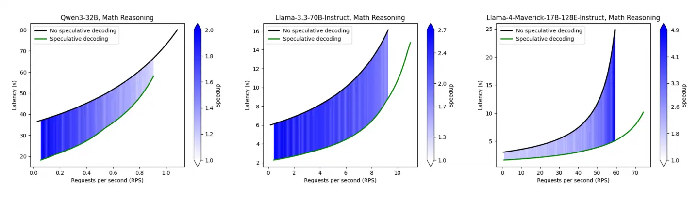
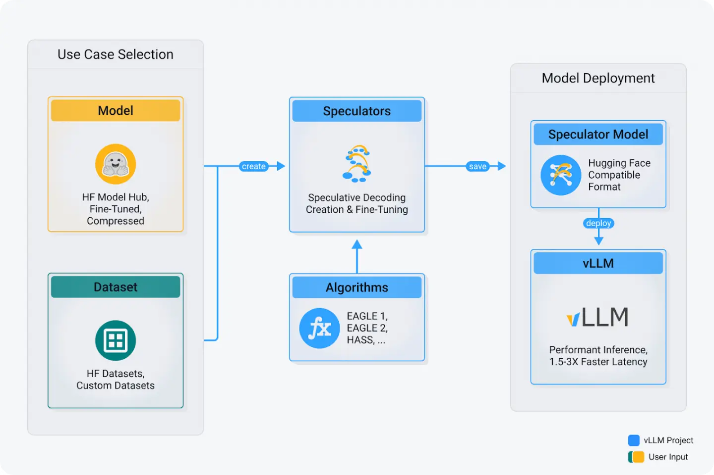

Large language models (LLMs) are powerful, but slow. Every token requires a forward pass through billions of parameters, which quickly adds up at scale. Speculative decoding flips the script:

- A small **speculator model** (or **draft model**) predicts multiple tokens cheaply.
- The large **verifier model** (or **target** **model**) verifies multiple predicted tokens in a single forward pass.

As we showed in our blog [Fly, EAGLE-3, fly!](https://developers.redhat.com/articles/2025/07/01/fly-eagle3-fly-faster-inference-vllm-speculative-decoding), speculative decoding can result in significantly faster inference (typically 1.5 to 2.5x) without compromising quality. This is especially noticeable at low request rates, where inference is memory-bound and the cost of verifying multiple predicted tokens with the verifier model is roughly the same as using it to generate a single token.

Despite the inference benefits, the widespread adoption of speculative decoding in production is hampered by several challenges:

- Lack of **standard format**, leading to ecosystem fragmentation and complex hyperparameter management.
- Most algorithms are available as research code that does not always scale to **production workloads**.
- State-of-the-art algorithms need **speculator models trained to match the output** of the specific verifier model.

That’s where **Speculators** comes in. It offers a standardized Hugging Face configuration for various speculator models and algorithms, with immediate compatibility with vLLM. Future releases will expand to include training capabilities, ultimately covering all stages of speculator model creation and deployment.

Along with the Speculators **v0.2.0** release, we are now releasing [**new speculator models**](https://huggingface.co/collections/RedHatAI/speculator-models-68c39684ac2649111619f068):

- Llama-3.1-8B-Instruct-speculator.eagle3
- Llama-3.3-70B-Instruct-speculator.eagle3
- Llama-4-Maverick-17B-128E-Instruct-speculator.eagle3 (converted from NVIDIA)
- Qwen3-8B-speculator.eagle3
- Qwen3-14B-speculator.eagle3
- Qwen3-32B-speculator.eagle3
- gpt-oss-20b-speculator.eagle3

These models typically achieve **1.5 to 2.5x speedup** across use cases such as math reasoning, coding, text summarization, and RAG. In certain situations, we have measured more than 4x speedup, as shown in Figure 1.



Figure 1: Performance of speculator models in math reasoning for Qwen3-32B (2xA100), Llama-3.3-70B-Instruct (4xA100), and Llama-4-Maverick-17B-128E-Instruct (8xB200). Speculative decoding achieves 2-2.7x speedup in the low-latency regime across all models. Notably, Llama-4-Maverick sustains substantial gains in the high-throughput regime, reaching up to 4.9x latency reduction.

## Meet Speculators: Your toolkit for production-ready speculative decoding

The [Speculators repository](https://github.com/vllm-project/speculators) provides a **unified framework** for speculative decoding algorithms. **Release v0.2.0** further expands the model architectures and algorithms supported.

What's new and why it matters:

- **Unified interface:** We are building a clean API to support every speculative method. No more juggling different repositories or formats.
- **vLLM integration:** Train or test models, then deploy for efficient inference with vLLM, using the same model definition and interface.
- **Conversion utilities:** Integrate your pre-trained draft models with a single command, eliminating the need for manual checkpoint adjustments.
- **Hugging Face format:** By building on the standard Hugging Face model format, we ensure portability and define all speculative decoding details under a predictable `speculators_config` in `config.json`.


Figure 2: Speculators user flow diagram.

## What's supported today

Algorithms:

- EAGLE
- EAGLE-3
- HASS

Verifier architectures:

- Llama-3
- Llama-4
- Qwen3
- gpt-oss

## How to use Speculators in practice

Here’s how Speculators v0.2.0 makes speculative decoding practical, step by step.

### Deploy in minutes

Serve a pretrained EAGLE-3 model (e.g., for Qwen3-8B) with a single `vllm serve` command. No custom setup required.

```
vllm serve --model RedHatAI/Qwen3-8B-speculator.eagle3
```

### Train your own Speculator

The training functionality is currently under development. The models available in the [Speculators collection](https://huggingface.co/collections/RedHatAI/speculator-models-68c39684ac2649111619f068) were created using a preliminary version of the training code, which was adapted from the original [EAGLE](https://github.com/SafeAILab/EAGLE) and [HASS](https://github.com/HArmonizedSS/HASS) codebases. Future releases will be focused on improved training capabilities.

### Conversion API

Easily bring existing models into the ecosystem. Our conversion API takes an externally-trained EAGLE model and converts it to the Speculators format, making it instantly deployable with vLLM. Here is an example of how to convert NVIDIA's EAGLE-3 speculator model for Llama-4-Maverick-17B-128E-Instruct:

```python
from speculators.convert.eagle.eagle3_converter import Eagle3Converter
speculator_model = "nvidia/Llama-4-Maverick-17B-128E-Eagle3"
base_model = "meta-llama/Llama-4-Maverick-17B-128E-Instruct"
output_path = "Llama-4-Maverick-17B-128E-Instruct-speculator.eagle3"
converter = Eagle3Converter()
converter.convert(
    input_path=speculator_model,
    output_path=output_path,
    base_model=base_model,
    validate=True,
    norm_before_residual=False,
    eagle_aux_hidden_state_layer_ids=[1, 23, 44],
)
```

Now run inference with vLLM using the speculator:

```
vllm serve --model Llama-4-Maverick-17B-128E-Instruct-speculator.eagle3 -tp 8
```

This means you can migrate draft models from research repos into speculators and immediately serve them with vLLM.

## How to benchmark Speculator models

[GuideLLM](https://github.com/vllm-project/guidellm) provides comprehensive capabilities to measure performance of LLMs, including speculative decoding. Once a vLLM server is initialized, one can produce the data used in Figure 1 using the following command:

```
GUIDELLM_PREFERRED_ROUTE="chat_completions" \
guidellm benchmark \
  --target "http://localhost:8000/v1" \
  --data "RedHatAI/speculator_benchmarks" \
  --data-args '{"data_files": "math_reasoning.jsonl"}' \
  --rate-type sweep \
  --max-seconds 600 \
  --output-path "speculative_decoding_benchmark.json"
```

Using the chat completions ensures that the requests are formatted correctly using the model's chat template, which is paramount to obtain the best performance from speculator models.

GuideLLM will run a sweep of request rates, ranging from synchronous requests (one request at a time) to maximum throughput (system saturated with hundreds of requests), running each scenario for the time specified (600 seconds in the example above).

## What’s next: The Speculators roadmap

The journey doesn’t stop at v0.2.0.

### Model support

We are currently working to add support to a wide range of architectures for the verifier model, including:

- Qwen3 MoE
- Qwen3-VL

### Training

We are building a production-ready training environment for speculator models, which is based on the following principles:

- **Modular:** Any new algorithm should slot in easily.
- **Integrated:** Research models → production deployment with zero friction.
- **Scalable:** Works for single-GPU experiments up to multi-GPU serving.

## Wrap-up

With **Speculators v0.2.0**, speculative decoding is no longer just a research trick. It’s becoming **a standardized, production-ready ecosystem,** complete with model conversion, vLLM integration, and a clean interface across algorithms.

Check out the [Speculators project on GitHub](https://github.com/vllm-project/speculators).
