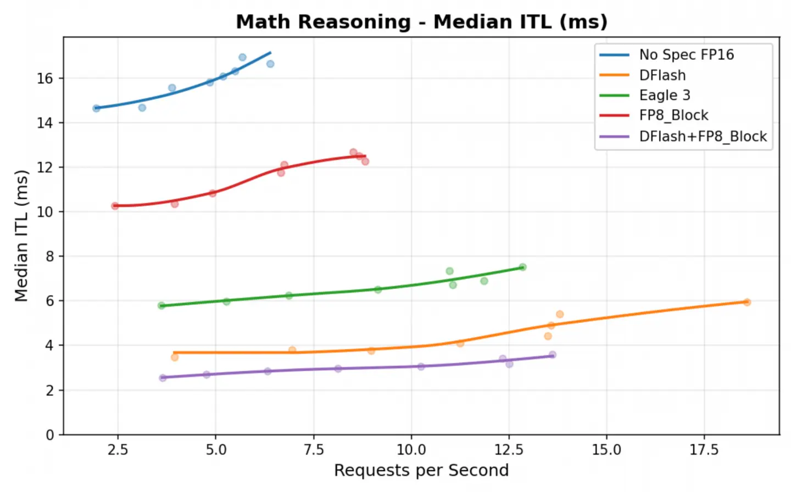

The [v0.5.0 release](https://github.com/vllm-project/speculators/releases/tag/v0.5.0) brings significant architectural improvements to speculative decoding model training, introducing DFlash algorithm support, fully unified online training capabilities, and a migration to vLLM's native hidden states extraction system. This release represents a major step forward in both training flexibility and production readiness for speculative decoding workflows.

Key features include:

- DFlash algorithm support for single-pass draft token generation with block diffusion
- Gemma 4 DFlash results
- vLLM-native online and offline training with unified hidden states extraction
- Updated documentation and examples outlining key workflows

## DFlash algorithm support

v0.5.0 introduces training support for the DFlash speculative decoding algorithm, a fundamentally different approach to draft token generation compared to the autoregressive Eagle 3 models. While Eagle 3 generates draft tokens autoregressively through multiple forward passes, DFlash employs block diffusion to generate draft tokens in a single forward pass.

The single-pass nature of DFlash can dramatically reduce the overhead of speculative decoding, particularly for longer draft sequences. The drafter produces a block of tokens of length B for each prefix. This block structure is entirely accomplished using the attention mask. Another key difference from Eagle 3 is that DFlash uses a noncausal attention pattern where queries within a block can attend to all other tokens within the same block.

During training, multiple predicted blocks are trained on in parallel. A straightforward approach would be to start a prediction block after every possible point in the sequence. For a long sequence, however, this causes the attention mask to grow extremely large, making training impractical in both memory usage and compute cost. To avoid this, we do not start blocks everywhere. Instead, we randomly choose a smaller set of "anchor" positions from locations that actually contribute to the training loss. Predicted blocks are only attached to these anchors. This keeps the number of predicted blocks fixed regardless of sequence length, allowing training to scale to much longer contexts while keeping the attention mask manageable.

## Training a DFlash speculator

Training a DFlash model follows a similar online workflow to Eagle 3. Review the [online DFlash training tutorial](https://docs.vllm.ai/projects/speculators/en/latest/user_guide/tutorials/train_dflash_online/) for detailed instructions.

The key difference from Eagle 3 is the speculator-specific parameters in the training command:

```
torchrun --standalone --nproc_per_node 2 scripts/train.py \
    --verifier-name-or-path "Qwen/Qwen3-8B" \
    --vllm-endpoint "http://localhost:8000/v1" \
    --speculator-type dflash \
    --draft-vocab-size 8192 \
    --block-size 8 \
    --max-anchors 3072 \
    --num-layers 5 \
    --target-layer-ids "2 18 33" \
    --epochs 5 --lr 1e-4
```

DFlash-specific parameters include:

```
--block-size # Number of tokens generated per diffusion block
--max-anchors # Maximum anchor points for speculation during training
--speculator-type # Must specify dflash
```

## Gemma 4 DFlash speculator

Using the DFlash algorithmic support, a [Gemma 4 31B DFlash speculator](https://huggingface.co/RedHatAI/gemma-4-31B-it-speculator.dflash) was trained and acceptance rates were evaluated across diverse task types. The results demonstrate strong performance particularly on reasoning and code generation tasks:

| Dataset | Pos 0 | Pos 1 | Pos 2 | Pos 3 | Pos 4 | Pos 5 | Pos 6 | Pos 7 | Avg. Length |
| --- | --- | --- | --- | --- | --- | --- | --- | --- | --- |
| HumanEval | 85.8% | 72.1% | 60.3% | 50.4% | 41.8% | 34.3% | 26.9% | 19.6% | 4.91 |
| math\_reasoning | 88.7% | 76.1% | 64.8% | 54.9% | 45.5% | 36.5% | 28.8% | 21.5% | 5.17 |
| qa | 67.5% | 41% | 23.8% | 13.8% | 8.1% | 4.5% | 2.6% | 1.3% | 2.63 |
| question | 75.1% | 51.1% | 34.7% | 24.5% | 17.9% | 13% | 9.4% | 6.5% | 3.32 |
| rag | 76.1% | 54.8% | 39.8% | 28.7% | 19.9% | 12.9% | 7% | 3.8% | 3.43 |
| summarization | 67.3% | 39.9% | 22.3% | 12% | 6.4% | 3.1% | 1.5% | 0.7% | 2.53 |
| tool\_call | 65.7% | 45.7% | 31.6% | 21.7% | 15% | 9.6% | 6.2% | 3.6% | 2.99 |
| translation | 73.4% | 51.4% | 35.3% | 23.6% | 15.6% | 9.3% | 5.4% | 2.6% | 3.17 |
| writing | 75.3% | 51.6% | 35.1% | 24.5% | 17.8% | 13% | 9.4% | 6.5% | 3.33 |

Gemma 4 DFlash achieves better intertoken latency than both Eagle 3 and a standalone FP8 quantized verifier. Combining DFlash with an FP8 quantized verifier yields even greater gains, as shown in Figure 1.



Figure 1: Median intertoken latency (ms) comparison between DFlash, Eagle 3, and FP8 quantized verifiers as requests per second increase.

## Serving DFlash models in vLLM

DFlash models integrate with vLLM's speculative decoding infrastructure, as of PR [#38300](https://github.com/vllm-project/vllm/pull/38300), which is included in `vllm>=0.20.0`.

Similar to the Eagle 3 models, DFlash models contain a `speculators_config` in their `config.json` file, which contains details on the target model, speculative tokens, the name of the speculative algorithm, and so on. With this config, models can be served using a basic `vllm serve` command:

```
vllm serve -tp 2 RedHatAI/gemma-4-31B-it-speculator.dflash
```

## Unified online and offline training support

v0.5.0 adds native support for both online and offline training modes through [vLLM's hidden states extraction system](https://vllm.ai/blog/extract-hidden-states) (introduced in vLLM v0.18.0). Previous versions of Speculators extracted hidden states using lower-level utilities from vLLM, requiring vLLM to be a direct Python dependency. This approach tightly coupled the training pipeline to vLLM's internal APIs, which often change between vLLM version updates, and required manual synchronization with upstream changes. This integration removes the previous custom data generation pipeline and eliminates vLLM as a direct Python dependency.

Both training modes now use the same vLLM-based extraction path:

- Online training: Extract hidden states on the fly during training
- Offline training: Pregenerate and cache hidden states to disk, then train

By using vLLM's native hidden states extraction, Speculators inherits vLLM's inference optimizations including efficient memory management, batching strategies, and hardware acceleration support. Training now communicates with a running vLLM server via its standard REST API, decoupling the training infrastructure from vLLM's internal implementation details. This architectural shift provides better version stability and makes it easier for teams to update vLLM independently of the Speculators training framework.

What happens during online training:

1. vLLM server initializes with the base model (and some special configuration)
2. Training prompts are sent to vLLM for inference
3. Hidden states are extracted and temporarily written to disk (or RAM disk)
4. The training process loads the extracted hidden states and deletes the file
5. Speculator model trains on extracted states

[The online Eagle 3 training tutorial](https://docs.vllm.ai/projects/speculators/en/latest/user_guide/tutorials/train_eagle3_online/) provides more information on the online training workflow.

Offline data generation has also been updated to use the same hidden states extraction system and data format as online. New scripts have been developed to saturate the running vLLM server with requests and write them to disk. The two approaches are so tightly coupled that you can even run a combination of them. For example, you can partially generate hidden states offline and then run training and load the existing hidden states, while generating any that are missing. You can also run an online training job that does not clear the files after generating them, allowing you to generate once on the first epoch and then load the files on subsequent ones.

[The offline Eagle 3 training tutorial](https://docs.vllm.ai/projects/speculators/en/latest/user_guide/tutorials/train_eagle3_offline/) provides more detail on the offline training workflow.

## Added comprehensive documentation

Review the updated [Speculators documentation site](https://docs.vllm.ai/projects/speculators/en/latest/) for concise introductions to the speculative decoding algorithms supported by Speculators, along with detailed tutorial walkthroughs for training speculator models. For developers, we also introduced a guide covering how to add new speculative decoding algorithms to the Speculators library, as well as a comprehensive API reference.

## Get started with Speculators v0.5.0

Speculative decoding reduces LLM inference latency, and vLLM integration helps bring these workflows to production-ready deployments. To optimize performance gains for your specific use case, benchmark these speculative models on your workloads and consider fine-tuning them on your own data.

You can explore the [Speculators repository](https://github.com/vllm-project/speculators) to start training, evaluating, and serving your own DFlash or Eagle 3 speculator models.
