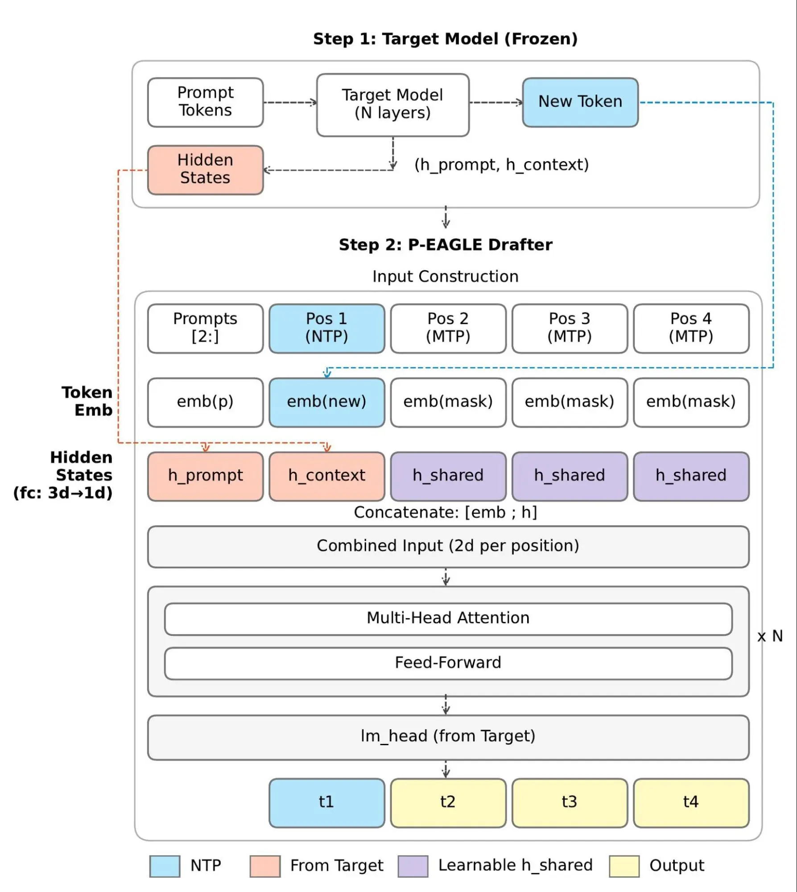

[P-EAGLE](https://arxiv.org/pdf/2602.01469) (Parallel EAGLE), a new speculative decoding algorithm developed by Amazon, brings the next evolution of speculative decoding to [Speculators](https://github.com/vllm-project/speculators) by extending EAGLE-3 with parallel drafting. Instead of predicting draft tokens one at a time, P-EAGLE generates multiple future tokens in a single forward pass, reducing drafting latency and improving hardware utilization while preserving the exact output quality of the verifier model.

Speculators v0.6.0 provides a complete open source implementation of P-EAGLE, including data preparation, hidden-state extraction with vLLM, training, evaluation, and deployment. Under the hood, the implementation introduces several key optimizations: COD sampling, learnable mask embeddings and a custom flex-attention mask, making multi-token prediction practical to train at scale while remaining fully compatible with the existing EAGLE-3 framework.

Whether you want to use one of our pretrained draft models or train a speculator tailored to your own model and workload, Speculators provides an end-to-end workflow that takes you from raw data to production-ready speculative decoding. As the project continues to grow with new algorithms and optimizations, our goal remains the same: make state-of-the-art speculative decoding accessible, reproducible, and easy to deploy for everyone.

## What is speculative decoding?

Over the past decade, large language models have grown dramatically in size and capability, yet this progress comes at a cost: latency. LLMs generate text sequentially, which requires that each token complete a full forward pass through billions of parameters in order to predict the next token. This token-by-token generation creates a fundamental bottleneck where computational costs scale rapidly as models expand, limiting LLMs despite their impressive abilities.

Speculative decoding offers a promising solution by enabling LLMs to generate multiple tokens in a single forward pass. The technique pairs a small "draft" model with the full-sized "verifier" model (that is, the LLM you are trying to serve). For the state-of-the-art speculative decoding algorithm EAGLE-3, the draft model is composed only of a single Llama 3 layer.

This draft model quickly predicts several tokens ahead, which the verifier then evaluates in parallel, accepting or rejecting each prediction. When the verifier rejects a token, it discards the remainder of the speculative sequence, ensuring only validated tokens appear in the final output. This approach achieves faster generation without sacrificing quality. Because the final output maintains the same distribution as if only the verifier model had been used, there is no degradation in model performance while the draft model's small size keeps computational overhead minimal.

## From EAGLE-3 to P-EAGLE



Figure 1: P-EAGLE architecture.

For EAGLE-3 in particular, the draft model predicts candidate tokens sequentially. While effective, this autoregressive drafting process introduces dependencies between token predictions, limiting the degree of parallelism that can be exploited during generation. To better exploit parallelism during decoding, [P-EAGLE](https://arxiv.org/abs/2602.01469) extends EAGLE 3 using parallel drafting—multi-token prediction per forward pass. By reducing the number of sequential drafting steps, P-EAGLE lowers drafting latency and improves hardware utilization, resulting in higher decoding throughput and lower end-to-end latency. This parallel drafting strategy is particularly beneficial for long reasoning traces, where the cumulative cost of sequential draft generation can otherwise limit the speedups achievable by speculative decoding.

## P-EAGLE support in Speculators v0.6.0

Speculators v0.6.0 ships with training support for [P-EAGLE](https://arxiv.org/pdf/2602.01469), which drafts multiple tokens in a single forward pass. If you've used EAGLE-3 before, P-EAGLE builds directly on top of it. EAGLE-3 drafts tokens autoregressively: predict token 1, feed it back, predict token 2, and so on. P-EAGLE updates this by introducing prediction depths. At each position, the model simultaneously predicts the next K tokens in one shot. The target model then verifies all of them in a single forward pass and accepts the correct prefix. P-EAGLE in Speculators is an extension of the existing EAGLE-3 model definition. Under the hood, the [PEagleDraftModel](https://github.com/vllm-project/speculators/blob/main/src/speculators/models/peagle/core.py#L21) inherits from [Eagle3DraftModel](https://github.com/vllm-project/speculators/blob/main/src/speculators/models/eagle3/core.py#L25) and adds three optimizations, including COD sampling, learnable mask parameters, and flex-attention masking.

### COD sampling

Training a multi-depth model directly without careful design would require memory proportional to the number of depths by sequence length, which increases quickly. Conditional Drop-token (COD) sampling introduced in P-EAGLE avoids this with geometric decay, where depth 0 keeps all positions, depth 1 keeps 0.7 of all positions, depth 2 keeps 0.49 of all positions, and so on. A floor of 0.2 prevents the deepest levels from being starved entirely. This means the model still learns to predict multiple tokens ahead, but deeper predictions train on progressively fewer positions per batch, keeping memory manageable.

### A learnable mask parameter

At deeper depths, the model doesn't have a real input token because it hasn't been predicted yet. P-EAGLE fills these slots with a dedicated `mask_token_id`, essentially a placeholder that tells the model "nothing is predicted yet." When training from scratch, `resolve_mask_token_id` tries to fill the mask token ID with an explicit CLI argument first (you can choose a mask token ID that does not carry any semantic meaning or special character in the vocabulary). If not present, it falls back to the verifier tokenizer's built-in mask token, then tries dynamically adding a `<|MASK|>` special token if there are unused embedding slots. If there are no empty embedding slots, it tries to use `pad`, `eos`, or `unk` token IDs and raises an error if none succeed.

The mask token provides token level input, but the model also needs hidden-state information. Instead of EAGLE-3's fixed padding, P-EAGLE learns a `mask_hidden tensor` that fills in unsampled positions during training. P-EAGLE predicts multiple tokens in parallel, but positions beyond depth 0 don't have a known token yet. While EAGLE-3 uses fixed padding for these unknown positions, P-EAGLE instead introduces `mask_hidden`, a learnable tensor of shape `[1, 1, 3*hidden_size]` that fills in the hidden state at unsampled positions. During training, this parameter learns to become a good "I'm empty, look around me" signal, letting the attention mechanism effectively pull information from the real positions at depth 0.

### Learnable embedding

EAGLE-3 freezes its embedding table because every position has a real token to look up. P-EAGLE, on the other hand, needs to look up a mask token at deeper depths, and the verifier's embedding for that token ID was trained for a completely different purpose. By unfreezing the table, the mask token entry can learn a meaningful "empty position" representation.

### Flex-attention mask

With multiple depth prediction running in a single forward pass, standard causal masking doesn't apply anymore. We instead need to decide what each position can see, and P-EAGLE builds a custom flex attention mask with the following rules:

- Depth 0 positions (first draft token) attend causally to each other, exactly like a normal autoregressive model. These are the "base context" with real tokens and real hidden states.
- Deeper positions in a rollout attend to their own chain. A depth 2 token at anchor position 5 can see the depth-1 and depth-0 tokens at that same anchor, but not tokens from a rollout starting at anchor position 3.
- All positions attend to preceding depth 0 context. Regardless of depth, every token can look back at the base sequence up to its anchor position, giving it the full causal context it needs to predict.

In short, each position sees all the causal base context plus its own rollout chain, but never sideways into other rollouts or forward in the base sequence.

### Train your own in 4 steps

Here's the end-to-end pipeline for Qwen3-8B. The process works the same for other supported models.

1. Prepare your data:
	```
	python scripts/prepare_data.py \
	   --model Qwen/Qwen3-8B --data sharegpt \
	   --output ./output/peagle_qwen3_8b \
	   --max-samples 5000 --seq-length 4096
	```
	This command takes about 30 seconds. It outputs tokenized Arrow files and a token frequency distribution.
2. Extract hidden states with vLLM:
	P-EAGLE draft model takes internal hidden states from the target as input. We use vLLM to serve the target and extract them:
	```
	# Launch vLLM with hidden state extraction
	  CUDA_VISIBLE_DEVICES=0,1 python scripts/launch_vllm.py Qwen/Qwen3-8B \
	    --hidden-states-path ./output/peagle_qwen3_8b/hidden_states \
	    -- --data-parallel-size 2 --port 8000
	 
	  # Generate and cache hidden states
	  python scripts/data_generation_offline.py \
	    --preprocessed-data ./output/peagle_qwen3_8b \
	    --endpoint http://localhost:8000/v1 \
	    --output ./output/peagle_qwen3_8b/hidden_states \
	    --max-samples 5000 --concurrency 32 --validate-outputs
	```
	For Qwen3-8B, hidden states are pulled from layers 2, 18, and 33 (early, mid, and late representations from the 41-layer model) and concatenated into a 3 × 4096 input tensor.
3. Train:
	```
	CUDA_VISIBLE_DEVICES=0,1 torchrun --standalone --nproc_per_node 2 \
	    scripts/train.py \
	    --verifier-name-or-path Qwen/Qwen3-8B \
	    --data-path ./output/peagle_qwen3_8b \
	    --hidden-states-path ./output/peagle_qwen3_8b/hidden_states \
	    --save-path ./output/peagle_qwen3_8b/checkpoints \
	    --speculator-type peagle \
	    --num-layers 4 --num-depths 4 \
	    --down-sample-ratio 0.7 --down-sample-ratio-min 0.2 \
	    --no-norm-before-residual \
	    --mask-token-id 151669 \
	    --scheduler-type cosine --epochs 5 --lr 6e-4 --total-seq-len 4096
	```
	On 4x H100s with 5K samples, training takes about 50 minutes end-to-end.
4. Deploy:
	Every checkpoint is directly servable in vLLM. It reads the config and enables speculative decoding automatically:
	```
	vllm serve ./output/peagle_qwen3_8b/checkpoints/checkpoint_best
	```

## Example model

The following table summarizes the results of the [trained and published P-EAGLE draft model for the Qwen3-a8B model](https://huggingface.co/RedHatAI/Qwen3-8B-speculator.peagle).

| Dataset | Pos 1 | Pos 2 | Pos 3 | Pos 4 | Pos 5 | Pos 6 | Pos 7 | Avg Length |
| --- | --- | --- | --- | --- | --- | --- | --- | --- |
| HumanEval | 81.3% | 59.0% | 41.1% | 27.9% | 18.8% | 12.8% | 8.9% | **3.500** |
| math\_reasoning | 83.3% | 63.5% | 47.0% | 34.3% | 24.4% | 17.2% | 11.8% | **3.820** |
| qa | 70.5% | 44.7% | 27.6% | 17.1% | 10.8% | 7.1% | 4.8% | **2.830** |
| question | 74.6% | 49.6% | 31.6% | 20.2% | 13.1% | 8.5% | 5.6% | **3.030** |
| rag | 73.6% | 48.4% | 29.8% | 18.4% | 11.3% | 6.9% | 4.1% | **2.930** |
| summarization | 68.0% | 39.0% | 21.0% | 10.8% | 5.4% | 2.6% | 1.2% | **2.480** |
| tool\_call | 73.7% | 47.6% | 28.7% | 17.1% | 10.3% | 6.2% | 3.7% | **2.870** |
| translation | 73.8% | 47.7% | 28.7% | 17.3% | 10.4% | 6.5% | 4.1% | **2.890** |
| writing | 75.0% | 50.0% | 32.1% | 20.6% | 13.3% | 8.7% | 5.7% | **3.050** |
| Average | **74.9%** | **49.9%** | **31.9%** | **20.4%** | **13.1%** | **8.5%** | **5.5%** | **3.044** |

P-EAGLE and the broader Speculators toolkit are open and ready for use today. The fastest way to see speculative decoding in action is to grab one of our pretrained speculators from the [Red Hat AI speculator models collection on Hugging Face](https://huggingface.co/collections/RedHatAI/speculator-models). Every model and workload is different. If you want a draft model tailored to your target LLM and your data distribution, Speculators provides a single command to train one end-to-end.

If you're interested in P-EAGLE, follow the steps described in this blog post and train your own!

Speculators is open source and under active development. We welcome contributions of every kind. [Open an issue or a pull request on GitHub](https://github.com/vllm-project/speculators) and come build the next generation of speculative decoding with us.
