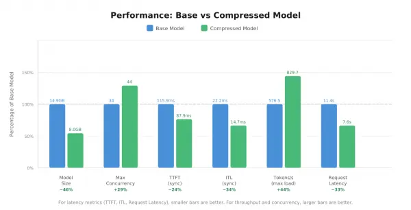
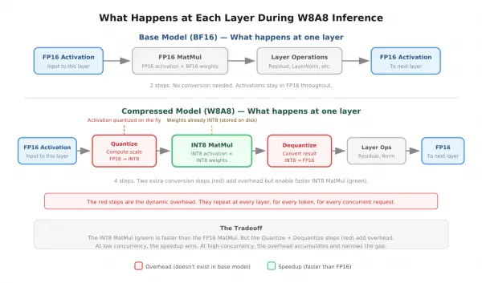

In [Understanding W8A8 INT8 LLM quantization: Half the size, better performance, same accuracy](https://developers.redhat.com/articles/2026/09/07/understanding-w8a8-int8-llm-quantization), we compressed a Llama 3.1 8B Instruct model from 14.9 GB to 8.0 GB using 8-bit integer (INT8) W8A8 quantization with SmoothQuant and Generative Pre-trained Transformer Quantization (GPTQ). We walked through how each algorithm works: SmoothQuant modifies Root Mean Square Normalization's (RMSNorm) gamma to prevent activation outliers, and GPTQ quantizes the weights from 16-bit brain floating point (BF16) to INT8 with error compensation to minimize rounding damage. Both algorithms rely on a calibration dataset—in our case, WikiText-2—to observe the model's internal behavior before quantization.

We completed the compression. Now the questions: Did we break anything? And did we gain the performance improvements that quantization promises?

Accuracy after quantization: Did we lose anything?

To measure the impact of quantization on model quality, we evaluated both the base and compressed models on 4 benchmarks using `lm-eval-harness`. Each benchmark tests a different capability:

- [Massive Multitask Language Understanding (MMLU)](https://arxiv.org/abs/2009.03300): Factual knowledge across 57 subjects
- [AI2 Reasoning Challenge (ARC) Easy](https://arxiv.org/abs/1803.05457): Scientific reasoning
- [HellaSwag](https://arxiv.org/abs/1905.07830) —commonsense reasoning
- [Instruction-Following Evaluation (IFeval)](https://arxiv.org/abs/2311.07911): Instruction following

We evaluated both models under identical conditions: zero-shot (no examples provided before each question), the same benchmark tasks, and the same hardware.

### Base vs. compressed accuracy results: The numbers

| **Benchmark** | **Base accuracy** | **Compressed accuracy** | **Delta** |
| --- | --- | --- | --- |
| MMLU | 0.6322 | 0.6311 | −0.0011 |
| ARC Easy (acc) | 0.8136 | 0.8106 | −0.0030 |
| HellaSwag (acc\_norm) | 0.7251 | 0.7277 | +0.0026 |
| IFeval (inst strict) | 0.8189 | 0.8237 | +0.0048 |

At first glance, some benchmarks dropped slightly while others improved slightly. However, are these differences meaningful?

### Interpreting the deltas: Standard error

The `lm_eval` tool computes a standard error for the model and benchmark under question. The value of standard error depends on the model's performance on N samples in the benchmark. Standard error tells you how much uncertainty is built into the score. If you ran the same MMLU evaluation on the same base model twice, you wouldn't get exactly 0.6322 both times. You might get 0.6322 the first time and 0.6340 the second time. The standard error (±0.0038 as described in the following table) tells you roughly how much the score can vary between runs.

Because both our models (base and compressed) scored almost identically, their standard errors are almost the same, so we report 1 value in the following table.

| **Benchmark** | **Delta** | **Standard error** | **Delta within noise?** |
| --- | --- | --- | --- |
| MMLU | −0.0011 | ±0.0038 | Yes (3.5× smaller) |
| ARC Easy | −0.0030 | ±0.0080 | Yes (2.7× smaller) |
| HellaSwag | +0.0026 | ±0.0045 | Yes (1.7× smaller) |
| IFeval | +0.0048 | not reported | Likely (similar magnitude) |

The difference between base and compressed model accuracies on MMLU is only 0.0011, which is smaller than this natural variation (0.0038). In other words, the score shifts more from re-running the evaluation than from the effect of quantization.

The preceding table shows that every delta is smaller than its standard error. The differences between the base and compressed models are indistinguishable from the natural variation in the benchmarks themselves. Based on these results, we can conclude that quantization didn't measurably degrade accuracy on any of the 4 benchmarks.

### A closer look: MMLU across domains

MMLU covers 57 subjects grouped into 4 categories. Breaking down the results by category:

| **Category** | **Base accuracy** | **Compressed accuracy** | **Delta** |
| --- | --- | --- | --- |
| Humanities | 0.5864 | 0.5911 | +0.0047 |
| STEM | 0.5062 | 0.5043 | −0.0019 |
| Social Sciences | 0.7442 | 0.7394 | −0.0048 |
| Other | 0.7184 | 0.7132 | −0.0052 |

All 4 category deltas are within noise. Humanities improved slightly while the others dropped slightly.

### How our results compare to other quantization schemes

To put our results in context, [Red Hat AI](https://www.redhat.com/en/products/ai) published a [W8A16 quantized version](https://huggingface.co/RedHatAI/Meta-Llama-3.1-8B-Instruct-quantized.w8a16) of the same model, also using GPTQ via [llm-compressor](http://github.com/vllm-project/llm-compressor). Their model card reports accuracy within 1% of the unquantized baseline across MMLU, ARC-Challenge, HellaSwag, and other benchmarks. Our W8A8 results are consistent with this—accuracy is well preserved at 8-bit precision.

Note that these comparisons are directional, not exact. Our evaluation used zero-shot, raw text prompting, and log-likelihood scoring, while the Red Hat AI models were evaluated using 5-shot, chat template prompting, and generation-based scoring.

The key difference between W8A8 and W8A16 isn't accuracy but inference speed. W8A8 quantizes both weights and activations to INT8, enabling faster computation through INT8 tensor cores. W8A16 only quantizes weights and still performs computation in BF16, leading to a smaller model, but providing no compute speedup.

## Performance after quantization: What did we gain?

Accuracy tells us whether the model's capabilities survived compression. Performance tells us whether compression delivered on its promise: a smaller, faster model that can handle more traffic. *The combination of good accuracy and good performance means a smaller and faster model is on par with a larger, slower model.*

We benchmarked both models under identical conditions using [vLLM](https://github.com/vllm-project/vllm) as the inference server and [GuideLLM](https://github.com/vllm-project/guidellm) to generate concurrent traffic and collect metrics. GuideLLM is a benchmarking tool that simulates production-like traffic against a vLLM server. It generates synthetic requests with configurable prompt and output lengths (in our case, 1,024 input tokens and 512 output tokens) and sends them at varying rates to measure how the server responds under different levels of load. At the time of this experiment, GuideLLM used a text file of *Pride and Prejudice* as the source text to generate synthetic prompts. It starts with a single request at a time (synchronous), then gradually increases the request rate up to the server's maximum throughput, collecting latency and throughput metrics at each level.

We served both models on the same hardware (single NVIDIA L40S GPU, 46 GB video RAM (VRAM)), with the same configuration, under the same load patterns.



Figure 1: Performance comparison between the base (BF16) and compressed (INT8) models on a single NVIDIA L40S GPU. The compressed model is 46% smaller, handles 29% more concurrent requests, and generates tokens 33% faster. For latency metrics (TTFT, ITL, request latency), smaller bars are better. For throughput and concurrency, larger bars are better.

### Concurrency

GuideLLM results indicate that the number of concurrent requests on identical hardware increased from 34 to 44 after quantization.

```
Base model:       34 max concurrent requests
Compressed model: 44 max concurrent requests
Improvement:      +29%
```

This is the direct result of the model size reduction—from 14.9 GB to 8.0 GB. The compressed model occupies roughly 7 GB less GPU memory than the base model. That freed memory goes to the key-value (KV) cache. The KV cache stores intermediate values (called keys and values) that the model computes for every token it's processed so far, at every layer. These values are needed during generation so the model doesn't have to recompute them for previous tokens at every step. Since every concurrent request maintains its own KV cache, more KV cache space means more requests can be active simultaneously.

### Time to first token (TTFT)

TTFT measures how long it takes from receiving a request to producing the first output token. This is dominated by the prefill phase, where the model processes the entire input prompt through all 32 layers in Llama 3.1 8B before generating anything. A smaller TTFT means the model takes less time to output its first token.

We got the following TTFT results for our base and compressed models:

|  | **Base** | **Compressed** | **Change** |
| --- | --- | --- | --- |
| Synchronous | 115.9 ms | 87.9 ms | −24% |
| At max load | 147.0 ms | 119.7 ms | −19% |

In a transformer (or any other deep learning model), each layer performs a matrix multiplication of weights and activations. This is where the W8A8 quantization scheme pays off. Because both weights and activations are in INT8, the matrix multiplication runs on the GPU's INT8 tensor cores, which are faster than the BF16 tensor cores used by the base model. Faster matrix multiplication per layer, across all layers, means the prefill completes sooner and the first token arrives faster.

This is the compute speedup that W8A16 doesn't provide. As we noted in the accuracy section, W8A16 only quantizes weights while activations remain in BF16, so the matrix multiplication still runs on BF16 tensor cores. So even though W8A16 reduces the model size and requires less memory to load the model, it doesn't speed up inference. On the other hand, W8A8 quantizes both, resulting in a smaller memory footprint and faster inference.

### Inter-token latency (ITL)

ITL measures the time between generating each subsequent token after the first. Each token requires a forward pass through all layers, each performing a matrix multiplication. The same INT8 tensor core speedup that improved TTFT also improves ITL.

Our experiment yielded the following ITL values for the 2 models:

|  | **Base** | **Compressed** | **Change** |
| --- | --- | --- | --- |
| Synchronous | 22.2 ms | 14.7 ms | −34% |
| At max load | 39.6 ms | 34.5 ms | −13% |

Notice, though, that the improvement is much larger at synchronous (−34%) than at max load (−13%)—this is the cost of *dynamic* activation quantization. Remember that activations are quantized at runtime, at each layer, for each token. Each quantization step involves measuring the activation's range, computing a scale, converting to INT8, performing the matrix multiplication, and converting back to BF16. These steps don't exist in the base model, and they add overhead to every single token generated by the compressed model.



Figure 2: Comparison of per-layer inference steps in the base model (top) versus the W8A8 compressed model (bottom). The compressed model adds 2 extra steps per layer—quantizing activations to INT8 before the matrix multiplication and dequantizing back to BF16 after. The INT8 MatMul (green) is faster, but the quantize/dequantize overhead (red) accumulates at high concurrency.

This overhead is also why activations are quantized per token (1 shared scale across all channels of that token) rather than per channel. As discussed earlier, per-channel activation quantization isn't impractical—it's mathematically impossible. Even setting that aside, computing a separate scale for each of the 4,096 channels at every layer for every token would add substantial overhead, making the ITL improvement at high loads even smaller.

With a single request, this overhead is small relative to the INT8 speedup, but at high concurrency, it adds up. At each layer, for each concurrent request, 1 quantize-dequantize cycle occurs (quantize the activation, run the INT8 matrix multiplication, dequantize the result). With 44 concurrent requests across 32 layers:

```
44 requests × 32 layers = 1,408 quantize-dequantize cycles per decode step
```

None of these cycles exist in the base model. As concurrency increases, these cycles grow in number, but the matrix multiplication and the quantize-dequantize steps behave differently as that number grows. The INT8 matrix multiplication becomes compute-bound, since the weight matrix only needs to be loaded once and can then be reused across all concurrent requests. The quantize and dequantize steps remain memory-bound, since each activation must be individually loaded and converted. This is why quantize-dequantize takes up a growing share of total inference time as concurrency increases, and why the improvement shrinks from 34% to 13% under load.

### Output tokens per second

The number of tokens produced per second is the combined effect of 2 factors: faster per-token generation (due to INT8 tensor cores) and higher concurrency (more requests running in parallel due to more KV cache space). More concurrent requests, each generating tokens faster, results in significantly more total tokens produced per second.

Our experiment resulted in the following numbers:

```
Base model:       576.5 tokens/sec at max load
Compressed model: 829.7 tokens/sec at max load
Improvement:      +44%
```

### Request latency

Request latency is the total time from receiving a request to completing the full response. It includes TTFT plus the time to generate all subsequent tokens. Since both TTFT and ITL improved, the total time required to complete a request decreased. The improvement is larger at synchronous (−33%) than at max load (−13%), reflecting the same dynamic activation quantization overhead that narrows the ITL gap under high concurrency.

|  | **Base** | **Compressed** | **Change** |
| --- | --- | --- | --- |
| Synchronous | 11.4 s | 7.6 s | −33% |
| At max load | 20.4 s | 17.8 s | −13% |

The results mean that the compressed model completes a request roughly 1/3 faster.

### The tradeoff: ITL degradation ratio

The ITL degradation ratio measures how much ITL grows as concurrency increases. We calculate it by dividing ITL at maximum concurrency by ITL at minimum concurrency (synchronous):

```
Base:       39.6 / 22.2 = 1.78  (ITL grew 1.78× from low to high load)
Compressed: 34.5 / 14.7 = 2.34  (ITL grew 2.34× from low to high load)
```

These computations show that the time required to produce subsequent tokens (ITL) grows faster for the compressed model than the base model as the number of requests increases (the cost of dynamic activation quantization discussed earlier).

However, this number requires context. Despite degrading faster, the compressed model's ITL at maximum load (34.5 ms) is still lower than the base model's ITL at maximum load (39.6 ms). The compressed model starts at a much lower baseline (14.7 ms versus 22.2 ms), so even with faster degradation, it doesn't become worse than the base model across the entire concurrency range tested.

### SLO check

We defined a service-level objective (SLO): TTFT must be ≤ 200 ms for 95% of requests (p95) at maximum concurrency.

```
Base model at max concurrency (34 requests):       p95 TTFT = 162.4 ms  ✓
Compressed model at max concurrency (44 requests):  p95 TTFT = 136.0 ms  ✓
```

These results show that both models met the SLO, meaning the base model would have been good enough for this particular use case with these specific SLOs. However, someone deploying the base model might ask if the model can be compressed without breaking accuracy and improving performance even further. In our case, the answer was yes, and we could serve more users while doing so.

## Takeaways and recommendations

In this post, we compressed a Llama 3.1 8B Instruct model from 14.9 GB to 8.0 GB using INT8 W8A8 quantization with SmoothQuant and GPTQ. We then evaluated the impact on both accuracy and system-level performance.

### What we found

On the accuracy side, quantization didn't measurably degrade the model's capabilities. Across 4 benchmarks covering factual knowledge (MMLU), scientific reasoning (ARC), commonsense reasoning (HellaSwag), and instruction following (IFeval), all accuracy deltas were smaller than the standard error of the benchmarks themselves. The model retained its capabilities across all 4 dimensions we tested.

On the performance side, the gains were significant. The compressed model handled 29% more concurrent requests, generated tokens 44% faster at max load, and reduced time to first token by 24%. The 1 tradeoff was a higher ITL degradation ratio under high concurrency, caused by the overhead of dynamic activation quantization. Even so, at maximum tested load, the compressed model's latency remained lower than the base model's.

### When W8A8 INT8 quantization is a good fit

Consider using W8A8 INT8 quantization if your environment matches any of the following scenarios:

- Single GPU deployments where memory is a constraint
- Server-side inference where throughput and concurrency matter
- Latency-sensitive applications that need faster time to first token
- Situations where you want both memory savings and compute speedup (unlike W8A16, which only saves memory)
- Older architectures like Ampere GPUs and CPUs supporting W8A8 INT8 (whereas W8A8 FP8 requires newer hardware such as Hopper or Blackwell GPUs)

### What to watch out for

Keep the following considerations in mind when applying this quantization method:

- ITL degrades faster under high concurrency due to dynamic activation quantization overhead. For very high concurrency workloads, monitor ITL scaling behavior.
- Calibration data quality matters. We used WikiText-2 for simplicity, but a calibration dataset matched to your deployment domain and style will likely produce equal or better results.
- The `lm_head` layer should stay in full precision to avoid impacting token selection quality.

### What to explore next

Here are a few ways you can build on these results to continue optimizing your models and improving performance:

- Using a domain-matched calibration dataset (such as [UltraChat](https://huggingface.co/datasets/stingning/ultrachat) for chat applications) to see if accuracy can be preserved even further
- Comparing W4A16 quantization for applications where memory savings matter more than compute speedup
- FP8 quantization, which is gaining support on newer GPU architectures
- Multi-GPU serving to distribute the dynamic quantization overhead and reduce ITL degradation at high concurrency

The full end-to-end example, including notebooks and documentation for every step from benchmarking to compression to deployment, is available in the [model-serve-flow](https://www.google.com/search?q=https://github.com/sanafayyaz315/red-hat-ai-examples/tree/main/examples/model-serve-flow) repository.

## References

**Evaluation benchmarks:**

- **MMLU**: Hendrycks et al., [Measuring Massive Multitask Language Understanding](http://arxiv.org/abs/2009.03300) (ICLR 2021)
- **ARC**: Clark et al., [Think you have Solved Question Answering? Try ARC, the AI2 Reasoning Challenge](https://arxiv.org/abs/1803.05457) (2018)
- **HellaSwag**: Zellers et al., [HellaSwag: Can a Machine Really Finish Your Sentence?](http://arxiv.org/abs/1905.07830) (ACL 2019)
- **IFeval**: Zhou et al., [Instruction-Following Evaluation for Large Language Models](https://arxiv.org/abs/2311.07911) (2023)

**Tools:**

- [lm-eval-harness](http://github.com/EleutherAI/lm-evaluation-harness)
- [vLLM](https://github.com/vllm-project/vllm)
- [GuideLLM](https://github.com/vllm-project/guidellm)

**Models and datasets:**

- [RedHatAI/Meta-Llama-3.1-8B-Instruct-quantized.w8a16](https://huggingface.co/RedHatAI/Meta-Llama-3.1-8B-Instruct-quantized.w8a16)
