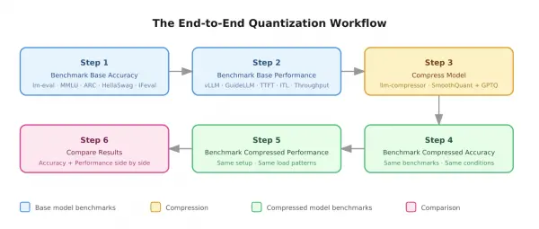
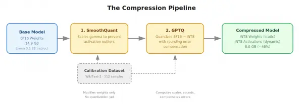
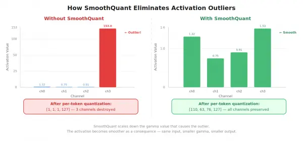
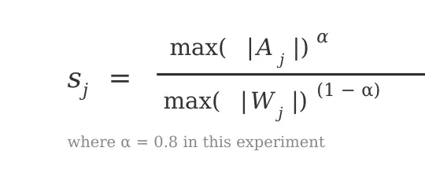

Large language models are expensive to serve. A model like Llama 3.1 8B in Bfloat16 (BF16) precision occupies roughly 15 GB of GPU memory. In BF16, each of the 8 billion parameters takes 2 bytes to store, which adds up to roughly 15 GB for the weights—and that's not all. The GPU needs memory for the key-value (KV) cache to store context for active requests, alongside intermediate tensor outputs (activations, as we call them) generated during inference. A single GPU with 16 GB video random-access memory (VRAM) might technically fit the model weights, but with barely 1 GB left for KV cache and activations, it would struggle to serve even a single request. On a single GPU, these memory demands also directly limit how many requests you can serve concurrently and how fast each response is generated.

This creates a gap between what a model can do and where it can practically run. A model that performs well in a notebook might be too large, too slow, or too expensive to deploy in a production environment where latency, throughput, and hardware cost all matter.

One approach to closing this gap is quantization—reducing the precision of the model's weights (and optionally its activations) to a lower-precision representation. Common targets include 8-bit integer (INT8) and 4-bit integer (INT4) formats, or 8-bit floating point (FP8) formats. A smaller representation means less memory, faster computation, and potentially more concurrent users, but it has to be done without degrading what the model is good at.

In part 1 of this series, we take a Llama 3.1 8B Instruct model and walk through the mathematical mechanics of INT8 W8A8 quantization using [SmoothQuant](http://arxiv.org/abs/2211.10438) and [GPTQ](http://arxiv.org/abs/2210.17323) (Accurate Post-Training Quantization for Generative Pre-trained Transformers). We explain step-by-step how we compressed Llama 3.1 8B by 46% (from 14.96 GB down to 8.0 GB) while preparing it for deployment with [vLLM](https://github.com/vllm-project/vllm) and [llm-compressor](https://github.com/vllm-project/llm-compressor).

Here is the end-to-end compression workflow for quantizing Llama 3.1 8B, along with the math and GPU memory mechanics that make INT8 W8A8 effective. In [part 2](https://developers.redhat.com/articles/2026/09/14/understanding-w8a8-int8-llm-quantization-accuracy-and-performance-results), we will run load tests with [GuideLLM](https://github.com/vllm-project/guidellm) and present full accuracy benchmark comparisons showing a 33% generation speedup with no accuracy loss.

## The experiment: What we built and why

Before compressing a model using quantization or any other technique, you need to know what you're starting with. Without a baseline, you have no way to measure what compression changed. Did accuracy drop? Did latency improve? By how much? You can't answer these questions unless you measured the original model first under the same conditions.

This is why our workflow starts with benchmarking the base model before touching it. The full pipeline has 6 steps:

1. **Benchmark the base model's accuracy** using [lm-eval-harness](http://github.com/EleutherAI/lm-evaluation-harness) across 4 tasks: Massive Multitask Language Understanding (MMLU), AI2 Reasoning Challenge (ARC), HellaSwag, and Instruction Following Evaluation (IFeval).
2. **Benchmark the base model's performance** by serving it with vLLM and generating load with GuideLLM to measure latency, throughput, and concurrency.
3. **Compress the model** using [LLM Compressor](https://github.com/vllm-project/llm-compressor) with INT8 W8A8 quantization (SmoothQuant + GPTQ).
4. **Benchmark the compressed model's accuracy** using the same benchmarks and conditions as step 1.
5. **Benchmark the compressed model's performance** using the same serving setup and load conditions as step 2.
6. **Compare** the accuracy and performance of both models side by side.

Consistency matters. We evaluate both models on the same benchmarks, serve them on the same hardware, and test them under the same load conditions. This helps verify that the comparison is fair and any differences are attributable to compression, not to differences in evaluation setup, as shown in Figure 1.



Figure 1: The 6-step quantization workflow. Both the base and compressed models are benchmarked under identical conditions before comparing results, helping verify that any differences are attributable to compression alone.

**Hardware:** Single NVIDIA L40S GPU, 46 GB VRAM. **Model:** [RedHatAI/Llama-3.1-8B-Instruct](https://huggingface.co/RedHatAI/Llama-3.1-8B-Instruct).

## How we compressed the model

We used `llm-compressor` to apply INT8 quantization to the base model's weights and activations. This quantization scheme is called W8A8 quantization. W8A8 means both weights and activations are represented in 8-bit integers during matrix multiplication, allowing the GPU to use its INT8 tensor cores, which are faster than the BF16 tensor cores used by the uncompressed model.

At its core, quantizing a weight involves 2 steps: scaling and rounding.

```
scale = max(abs(weight_column)) / 127
quantized_weight = round(weight / scale)
```

You find the maximum value in a weight column, divide by 127 (the largest positive INT8 value) to get a scale, then divide every weight in that column by that scale and round to the nearest integer. The rounding is where information is lost. Each weight picks up a small error, and across billions of weights, these errors accumulate and can shift a layer's output away from what it should be.

Since each layer's output becomes the next layer's input, that error compounds through all layers.

Another challenge that comes into play is activation quantization. During inference, activations are also quantized to INT8 before each matrix multiplication. This quantization uses a single scale per token—1 scale computed across all channels of that token's activation, dynamically, at runtime. The problem is that activations can have persistent outlier values in certain channels. A single shared scale cannot handle both the outlier and the small values without destroying one or the other.

To address these challenges, the compression pipeline shown in Figure 2 uses 2 algorithms in sequence. [SmoothQuant](https://arxiv.org/abs/2211.10438) handles the activation outlier problem by modifying the weights before quantization, so the activations they produce are smoother. GPTQ then calibrates the weight values before they're rounded to INT8, using error compensation to minimize the rounding damage.



Figure 2: The 2-stage compression pipeline. SmoothQuant first modifies weights to prevent activation outliers, then GPTQ quantizes the smoothed weights from BF16 to INT8 with error compensation. Both stages use a calibration dataset (WikiText-2, 512 samples). In practice, both stages are defined together in a single llm-compressor recipe and applied automatically in sequence. The result is a 46% smaller model (14.9 GB to 8.0 GB).

## Why naively quantizing weights doesn't work, and how GPTQ solves it

Quantizing a model's weights offline reduces memory requirements, but doing so without correcting for rounding errors causes accuracy loss. Understanding how GPTQ addresses this requires looking first at why naive weight quantization fails.

### The problem with naive quantization

Since weight quantization happens offline (in advance, not at runtime), we can afford to compute a separate quantization scale for each channel (column) of the weight matrix, rather than using a single scale for the entire tensor.

In naive quantization (Round to Nearest), we divide a column by its respective scale and then round it to its nearest integer to get the INT8 representation. In practice, it looks something like this.

Consider a small weight matrix with 2 columns (channels):

```
Weight matrix:
       ch0     ch1
row0: [0.31,   0.82]
row1: [0.74,   0.45]
row2: [0.52,   0.93]
```

Now compute quantization scales for the 2 channels:

```
scale_ch0 = max(ch0) / 127
          = 0.74 / 127
scale_ch0 = 0.005827

scale_ch1 = max(ch1) / 127
          = 0.93 / 127
scale_ch1 = 0.007323
```

Now scale the weights using the quantization scale with the formula:

```
scale = max(abs(weight_column)) / 127
quantized_weight = round(weight / scale)
```

The quantized weight matrix becomes:

```
Quantized weight matrix (INT8):
       ch0   ch1
row0: [53,   112]
row1: [127,   62]
row2: [89,   127]
```

The weight matrix now contains INT8 values instead of floating-point numbers.

Now to see how much error was introduced by rounding, we can reverse the effects of scaling by multiplying the quantized weight values by the quantization scale. This should reverse the effects of scaling, but the reversed values will still have the impact produced by rounding.

Scale for channel 0: 0.005827 Scale for channel 1: 0.007323

```
ch0 reconstructed:
[53 × 0.005827, 127 × 0.005827, 89 × 0.005827] = [0.3088, 0.7400, 0.5186]

ch1 reconstructed: [112 × 0.007323, 62 × 0.007323, 127 × 0.007323] = [0.8202, 0.4540, 0.9300]

Reconstructed Weight matrix:
       ch0       ch1
row0: [0.3088,   0.8202]
row1: [0.7400,   0.4540]
row2: [0.5186,   0.9300]

Weight matrix:
       ch0     ch1
row0: [0.31,   0.82]
row1: [0.74,   0.45]
row2: [0.52,   0.93]
```

As we can see, there's a small difference between the values of the original weight matrix and the reconstructed one. This difference exists because rounding loss remains even after reversing the impacts of scaling.

Now let's compute the output using both the original and reconstructed weight matrices to see how rounding affected the result. We'll use a simple input activation:

```
Input activation: [1.0, 2.0, 0.5]
```

Output using original weights:

```
ch0: (1.0 × 0.31) + (2.0 × 0.74) + (0.5 × 0.52) = 0.31 + 1.48 + 0.26 = 2.050
ch1: (1.0 × 0.82) + (2.0 × 0.45) + (0.5 × 0.93) = 0.82 + 0.90 + 0.465 = 2.185

Original output: [2.050, 2.185]
```

Output using reconstructed (dequantized) weights:

```
ch0: (1.0 × 0.3088) + (2.0 × 0.7400) + (0.5 × 0.5186) = 0.3088 + 1.4800 + 0.2593 = 2.048
ch1: (1.0 × 0.8202) + (2.0 × 0.4540) + (0.5 × 0.9300) = 0.8202 + 0.9080 + 0.4650 = 2.193

Reconstructed output: [2.048, 2.193]
```

Comparing the two:

|  | Original | Reconstructed | Error |
| --- | --- | --- | --- |
| ch0 | 2.050 | 2.048 | −0.002 |
| ch1 | 2.185 | 2.193 | +0.008 |

The errors are small here because we only have 3 weights per channel. In Llama 3.1 8B, the model used in this experiment, each channel has 4,096 weights and the model has 32 layers. These small per-weight rounding errors accumulate across thousands of weights, and the resulting output error flows into the next layer as a slightly wrong activation, which gets multiplied by the next layer's weights, potentially amplifying the error through all layers. GPTQ reduces the impact produced by rounding weight values.

### The solution: How GPTQ improves on naive quantization

GPTQ takes a different approach. Naive quantization (Round to Nearest) rounds every weight and moves on, letting the rounding errors accumulate uncorrected. GPTQ adds a compensation step: after rounding each weight, it measures the error that was introduced and adjusts the remaining unquantized weights to correct for it.

The idea is simple: after quantizing 1 weight, GPTQ measures how much that rounding shifted the layer's output. It then nudges the remaining unquantized weights to bring the output back in line. By the time all weights are quantized, the total output is approximately the same as the original, even though every individual weight was rounded.

Let's revisit our earlier example. The first weight in channel 0 was 0.31, which after quantization and reconstruction became 0.3088, introducing a rounding error of −0.0012. In naive quantization, this error is ignored. GPTQ instead takes that error and distributes it across the remaining 2 weights in the channel, nudging them slightly before they are quantized, so the total output of the channel stays close to the original output—2.050. When those adjusted weights are then rounded, their rounding errors are again redistributed to whatever weights remain. This process repeats: quantize, measure error, adjust remaining weights, until every weight in the channel has been quantized and each rounding error has been compensated for along the way.

There's a catch, though: not all weights can safely absorb this redistributed error. While some weights might barely affect the output and can safely absorb some of the error, others heavily influence on the layer's output, and pushing extra error onto them would cause more damage than it fixes. GPTQ uses the Hessian, a matrix computed from the calibration dataset, to measure this sensitivity and guide where the error goes.

The Hessian is computed from the calibration dataset, which is a small set of input samples (no outputs, no labels) that are fed through the model to observe how it behaves internally. These samples are run through each layer, and the resulting activations for that layer are used to compute how much the output would change if each weight were perturbed slightly. Weights with high Hessian values strongly affect the output and thus GPTQ avoids pushing error onto them. Weights with low Hessian values barely matter and therefore can safely absorb more rounding error.

The full GPTQ process for 1 layer looks like this:

1. Feed calibration data through the layer and record the original output.
2. Compute the Hessian from the calibration activations.
3. Quantize the first weight, measure the rounding error.
4. Use the Hessian to redistribute that error to the remaining unquantized weights: more error to less important weights, less to important ones.
5. Quantize the next weight, measure error, redistribute again.
6. Repeat until all weights in the layer are quantized.
7. The final output approximates the original output.

One general practice worth keeping in mind is excluding the language modeling head—often referred to as `lm_head` layer is often excluded from quantization entirely. This is the final layer that projects the model's hidden representations (4,096 dimensions in Llama 3.1 8B) to vocabulary logits (around 128,000 tokens). The model selects the highest-scoring token from the logits as its next output. Since token selection depends directly on these scores, rounding errors introduced by quantization can change which token is chosen, potentially altering the model's entire response. For this reason, the `lm_head` is typically kept in full precision.

## Why activation quantization is hard, and how SmoothQuant fixes it

In the previous section, we discussed how weight quantization introduces rounding errors and how GPTQ compensates for them. There's another challenge, however: quantizing the activations.

Activations produced by a specific layer can persistently have outlier values in some channels. This makes activation quantization difficult. Here is why:

Activations are quantized per token, dynamically, at runtime. This means a single quantization scale is computed across all channels of that token's activation (an activation tensor is 1D). Per-channel scaling—a separate scale for each channel (4,096 for Llama 3.1 8B)—isn't possible here: activation channels sit on the inner axis of the dot product, so they get summed together during matrix multiplication, and once their values are combined into a single sum, individual per-channel scales can't be reversed afterward. A single shared scale across all channels avoids this, since it can be cleanly applied and reversed after accumulation. This shared scale creates a new problem, though: if even 1 channel has an outlier, that outlier dominates the scale and destroys all the smaller values.

Consider an activation tensor with an outlier:

```
activations = [1.32, 0.75, 0.91, 153.0]
```

The quantization scale is computed by dividing the maximum absolute value of the activation tensor by 127.

```
activations = [1.32, 0.75, 0.91, 153.0]
scale = max(activation) / 127
scale = 153.0 / 127
scale = 1.205
```

The activation tensor is then scaled by performing element-wise division of the activation tensor by scale.

```
activations = [1.32, 0.75, 0.91, 153.0]
scale = 1.205

1.32  / 1.205 = 1.10  → rounds to 1. Squashed.
0.75  / 1.205 = 0.62  → rounds to 1. Squashed.
0.91  / 1.205 = 0.76  → rounds to 1. Squashed.
153.0 / 1.205 = 127.0 → rounds to 127. Perfect.

quantized activation = [1, 1, 1, 127]
```

The outlier is preserved perfectly. Everything else is destroyed. SmoothQuant addresses this before quantization happens.

### How SmoothQuant prevents outliers in activation tensors

To understand where that outlier activation came from, we need to look at what happens between 2 linear layers in a transformer. The output of 1 layer's matrix multiplication doesn't go straight into the next layer's weights—it first passes through a normalization layer. For Llama 3.1 8B, that's Root Mean Square Normalization (RMSNorm).

RMSNorm does 2 things, in order. First, it divides every value by the vector's Root Mean Square (RMS), which stabilizes the overall magnitude of the activation across tokens and training iterations. Second, it multiplies the result, channel by channel, by a trained vector called `gamma`. The `gamma` parameter has 1 independent value per channel, learned during training, and it stays fixed at inference—the same `gamma` values are applied to every token that passes through this layer. This second step is where a persistent outlier comes from: since `gamma` is fixed and identical for every token, a large `gamma` value in 1 channel stretches that specific channel by the same amount, every single time.

Since `gamma` reintroduces the outlier, `gamma` is where SmoothQuant intervenes. The key principle is that SmoothQuant only modifies weights—specifically, RMSNorm's `gamma`, along with a compensating adjustment to the next layer's weights, which we explain next. It doesn't touch activations directly. Smoother activations are a natural consequence of smoothing `gamma`.

Here's where that outlier activation from the previous example comes from. Suppose that after dividing by RMS, the result is:

```
normalized = [1.32, 0.75, 0.91, 1.53]
```

These values are relatively balanced across channels—but as we saw, dividing by RMS doesn't guarantee this; it only fixes the overall magnitude, not the relative differences between channels. Now RMSNorm multiplies this by its trained `gamma` vector, where channel 3 happens to have a large learned value:

```
gamma = [1, 1, 1, 100]
activation = normalized × gamma (channel by channel)
  ch0: 1.32 × 1   = 1.32
  ch1: 0.75 × 1   = 0.75
  ch2: 0.91 × 1   = 0.91
  ch3: 1.53 × 100 = 153.0

activation = [1.32, 0.75, 0.91, 153.0]
```

This is the same activation we quantized earlier, and now we can see why channel 3 was an outlier: not because of any weight matrix, but because `gamma` multiplied that 1 channel by 100. As shown earlier, quantizing this activation squashes channels 0 through 2 down to \[1, 1, 1\], destroying most of their precision.

Now consider the same example, but with `gamma` smoothed by a factor of 100 in channel 3:

```
Same normalized input: [1.32, 0.75, 0.91, 1.53]

Modified gamma (channel 3 ÷ 100):
gamma = [1, 1, 1, 1]

activation = normalized × gamma
  ch0: 1.32     ← unchanged
  ch1: 0.75     ← unchanged
  ch2: 0.91     ← unchanged
  ch3: 1.53     ← was 153.0, now 1.53

activation = [1.32, 0.75, 0.91, 1.53]
```

Same normalized input, smoothed `gamma`, smoother output. Now quantize this activation:

```
scale = 1.53 / 127 = 0.012

ch0: round(1.32 / 0.012) = round(110.0) = 110    ← well represented
ch1: round(0.75 / 0.012) = round(62.5)  = 63     ← well represented
ch2: round(0.91 / 0.012) = round(75.8)  = 76     ← well represented
ch3: round(1.53 / 0.012) = round(127.5) = 127    ← perfect

quantized activation after smoothing = [110, 63, 76, 127]
```

Compare the two:

|  | Without SmoothQuant | With SmoothQuant |
| --- | --- | --- |
| ch0 | 1 | 110 |
| ch1 | 1 | 63 |
| ch2 | 1 | 76 |
| ch3 | 127 | 127 |

As shown in Figure 3, without SmoothQuant, 3 channels were destroyed. With SmoothQuant, all 4 channels are well represented. The outlier was eliminated before quantization happened—not by touching the activations directly, but by scaling down the `gamma` value that caused the outlier in the first place.



Figure 3: Without SmoothQuant (left), a single outlier in channel 3 dominates the quantization scale and destroys the other 3 channels. With SmoothQuant (right), the outlier-causing gamma value is scaled down before quantization, resulting in smoother activations where all 4 channels are well represented.

To preserve the model's overall behavior, the next layer's weights are scaled up by the same factor on the corresponding input channel. This helps keep the final output the same—the magnitudes are redistributed between the normalization layer and the next linear layer. Scaling up these weights is safe because, as we saw in the previous section, GPTQ quantizes weights using per-channel scales. Each column gets its own scale, so a large value in 1 column doesn't affect any other column.

### How the SmoothQuant smoothing factor is computed

To know which channels have outliers and how large they are, SmoothQuant needs to observe the activations the model produces. Since activations only exist when data flows through the model, we use a calibration dataset. This is a small set of input samples without any outputs or labels. The calibration dataset is fed through the model to record activation values at each layer.

From these recorded activations, SmoothQuant computes a separate smoothing factor for each channel using the following formula:



S sub j equals max of absolute A sub j to the alpha power, over max of absolute W sub j to the 1 minus alpha power, where alpha equals 0.8.

Where:

- `max(abs(A_j))` is the largest activation value observed in channel j across all calibration samples.
- `max(abs(W_j))` is the largest weight value in row j of the receiving linear layer's weight matrix—the layer whose input is this activation.
- α (alpha) controls how aggressively difficulty is shifted from activations to weights.

In this experiment, we used α \\= 0.8, meaning most of the difficulty is transferred to the weights.

SmoothQuant computes the smoothing factor for every channel, not just the ones with outliers. The formula naturally produces a large `s` for channels with outliers, which means `gamma` is scaled down substantially for those channels. For channels with normal activations, the formula produces a small *s* (close to 1), which means `gamma` is barely changed. The smoothing is proportional to the severity of the outlier. The worse the outlier, the more aggressively that channel's `gamma` value is scaled.

After computing the smoothing factors, SmoothQuant divides RMSNorm's `gamma` by the corresponding `s` for each channel, and multiplies the matching input row of the receiving linear layer's weights by the same `s`. The weights are still BF16 at this point, but smoothed. No quantization has happened yet. GPTQ takes over next and quantizes the modified weights to INT8.

### How the calibration dataset shapes quantization quality

Both SmoothQuant and GPTQ depend on a calibration dataset to do their job. The calibration dataset is a small set of input samples without any outputs or labels. As the name implies, the calibration dataset is used to calibrate the outputs of GPTQ and SmoothQuant to production-like data so the quantized model performs well when inputs from real users come in. These calibration samples are fed through the base model to observe how it behaves internally. Both algorithms use the same calibration dataset and perform the same step: feed the inputs through the model and collect the activations at each layer. However, they use those activations for different purposes. SmoothQuant uses the activations to find which channels have outliers and how severe they are. This drives the computation of the smoothing factor for each channel. GPTQ uses the activations to compute the Hessian, which measures how sensitive the layer's output is to each weight. This guides where rounding error is redistributed during quantization.

The quality of these measurements depends on how well the calibration data represents the inputs the model will see in production. The idea is that the calibration dataset produces activation patterns similar to real usage, so both algorithms make decisions based on accurate measurements—SmoothQuant smooths the right channels, and GPTQ protects the right weights.

If the calibration data doesn't match, the measurements can be off. SmoothQuant might smooth channels that don't cause outliers in production, while leaving the real problem channels untouched. GPTQ might protect weights that don't matter for real inputs, while pushing rounding error onto weights that do. The result: more accuracy loss than necessary.

For this reason, the calibration dataset should match the model's intended use case. For a chat application, conversational data like [UltraChat](https://huggingface.co/datasets/stingning/ultrachat) would be appropriate. For a code generation model, you should use code samples; similarly, a medical question-and-answer system requires medical text samples.

In this experiment, we used [WikiText-2](https://huggingface.co/datasets/Salesforce/wikitext), a general-purpose dataset of encyclopedia-style text, to calibrate Llama 3.1 8B Instruct. The quality of calibration depends on how well the calibration data reflects the activation patterns the model will produce in real use, which is influenced by both the domain (what the text is about) and the style (how the text is structured—prose, questions, commands, etc.).

In terms of domain, WikiText-2 aligns reasonably with 3 of our 4 evaluation benchmarks. MMLU, ARC, and HellaSwag all test forms of general knowledge, which is similar to what Wikipedia covers. IFeval is domain-agnostic—it doesn't test knowledge of any subject. In terms of style, WikiText-2 is descriptive prose, while MMLU and ARC use questions, HellaSwag uses scenario completions, and IFeval uses direct commands. The model itself, being instruction-tuned, was designed for questions and commands rather than passive prose.

Despite these differences, accuracy was preserved across all 4 benchmarks. This suggests that the quantization process remains effective even with imperfect calibration data. For production deployments, we recommend using a calibration dataset that matches both the domain and style of the model's actual use case. Our results with WikiText-2 can be considered a conservative lower bound.

### The result

After applying SmoothQuant and GPTQ with WikiText-2 as the calibration dataset, the model size dropped from 14.9 GB to 8.0 GB—a 46% reduction.

Here's where these numbers come from. Each weight in the model is a number. In BF16, each number takes 16 bits to store, which is 2 bytes. In INT8, each number takes 8 bits, which is 1 byte. Llama 3.1 8B has approximately 8 billion weights:

```
BF16: 8,000,000,000 weights × 2 bytes per weight = 16,000,000,000 bytes
      16,000,000,000 / 1,024³ ≈ 14.9 GB

INT8: 8,000,000,000 weights × 1 byte per weight = 8,000,000,000 bytes
      8,000,000,000 / 1,024³ ≈ 7.5 GB
```

The compressed model is 8.0 GB rather than 7.5 GB because some components are not quantized (like the `lm_head` layer, which stays in BF16) and quantization scales are stored alongside the INT8 weights.

With compression complete, but the question remains: did we break anything? And did we gain the performance improvements that quantization promises? In part 2 of this series, we will present those benchmark findings side-by-side. Read it here: [Understanding W8A8 INT8 LLM quantization: Accuracy and performance results](https://developers.redhat.com/articles/2026/09/14/understanding-w8a8-int8-llm-quantization-accuracy-and-performance-results)

Want to experiment with INT8 quantization on your own models? Check out the open source [llm-compressor](https://github.com/vllm-project/llm-compressor) project on GitHub, or explore pre-quantized model weights on Hugging Face. Let us know what accuracy versus throughput trade-offs you see in your own workloads.

## References

**Algorithms:**

- SmoothQuant: Xiao et al., "SmoothQuant: Accurate and Efficient Post-Training Quantization for Large Language Models" (2022)— [arxiv.org/abs/2211.10438](http://arxiv.org/abs/2211.10438)
- GPTQ: Frantar et al., "GPTQ: Accurate Post-Training Quantization for Generative Pre-trained Transformers" (2022)— [arxiv.org/abs/2210.17323](http://arxiv.org/abs/2210.17323)

**Tools:**

- llm-compressor— [github.com/vllm-project/llm-compressor](http://github.com/vllm-project/llm-compressor)

**Models and datasets:**

- RedHatAI/Llama-3.1-8B-Instruct— [huggingface.co/RedHatAI/Llama-3.1-8B-Instruct](http://huggingface.co/RedHatAI/Llama-3.1-8B-Instruct)
- WikiText-2— [huggingface.co/datasets/Salesforce/wikitext](http://huggingface.co/datasets/Salesforce/wikitext)
*Last updated: September 14, 2026*
