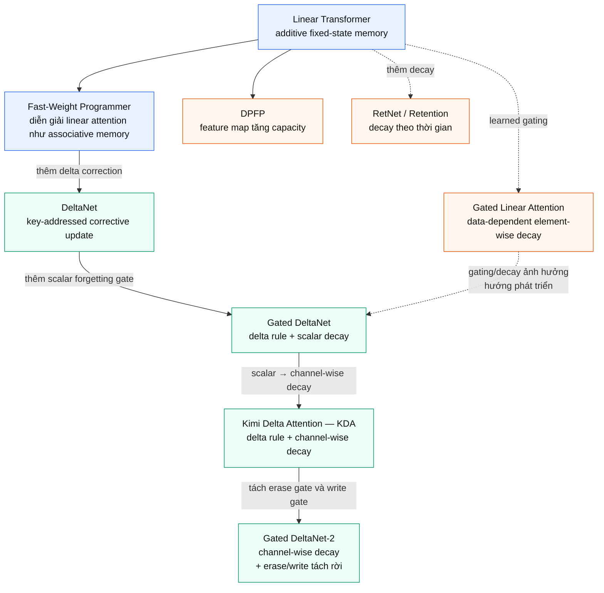

# User-supplied linear attention evolution map

- **Provenance:** User-provided Mermaid diagram in chat.
- **Captured:** 2026-08-27.
- **Scope:** Conceptual comparison of linear-attention mechanisms from additive fixed-state memory through delta-rule, channel-wise decay, and decoupled erase/write.
- **Evidence boundary:** This artifact preserves the supplied conceptual map. It does not independently establish publication chronology, exact equations, benchmark rankings, or the detailed implementations of RetNet and GLA.

