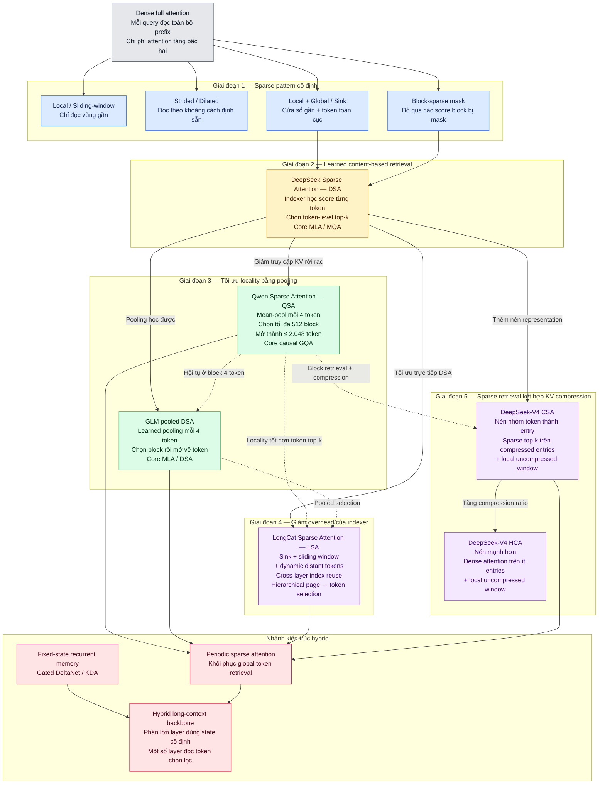

# User-supplied Sparse Attention evolution map

This file preserves the Mermaid architecture map supplied by the user on 2026-08-27. It is a conceptual synthesis, not an independent primary-source record.

