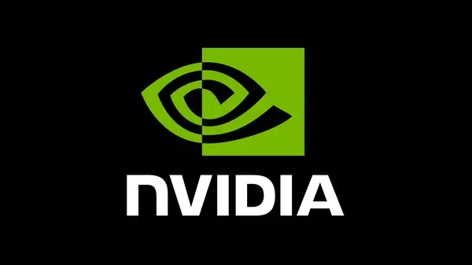
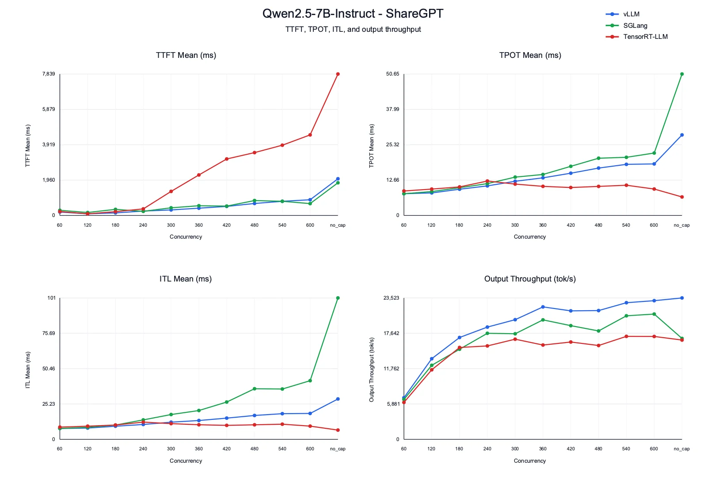
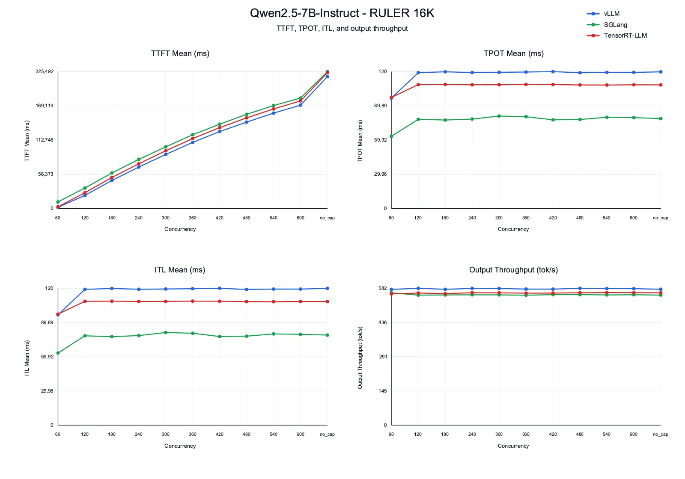
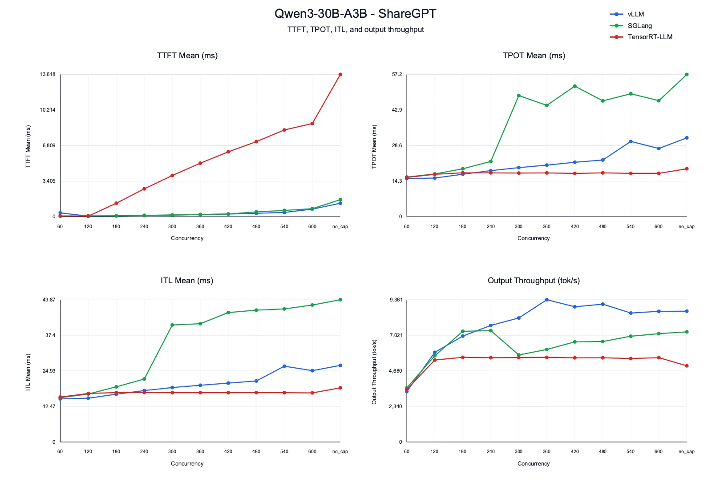
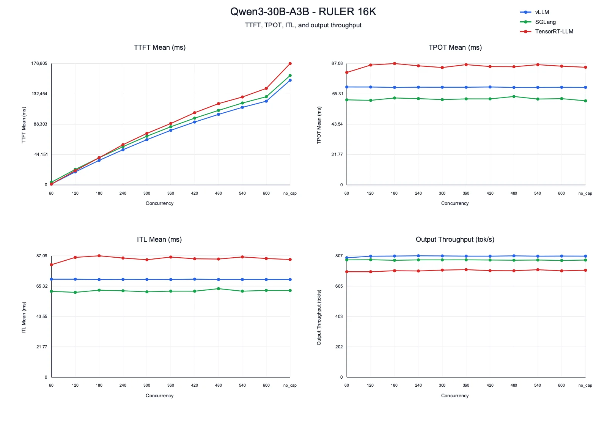
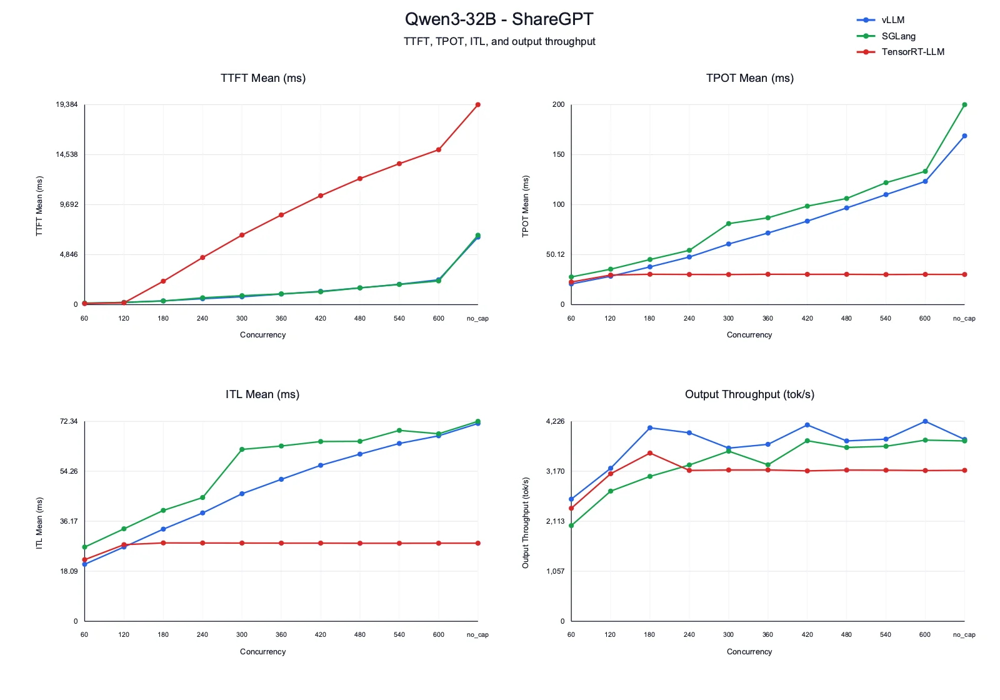
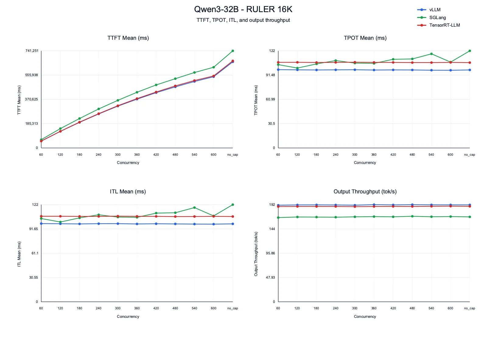

## SGLang vs vLLM: the verdict from our H100 tests

**vLLM was the strongest default in our Qwen serving benchmarks**, balancing output throughput and time to first token across chat-style and long-context workloads. **SGLang had lower decode latency in the Qwen2.5-7B and Qwen3-30B-A3B RULER 16K tests**, but took longer to return the first token. TensorRT-LLM delivered stable decode latency in several chat runs, while first-token latency became a bottleneck as concurrency increased.

These are results from the configurations tested for this May 2026 benchmark, not a universal ranking or a new benchmark run. We used one H100 for Qwen2.5-7B and two H100s for Qwen3-30B-A3B and Qwen3-32B, keeping GPU count the same across frameworks within each model. Your model, prompt lengths, concurrency, software versions, and serving configuration can change the outcome.

### Which framework fits the workload?

| Workload and priority | Choice supported by these tests | Decisive result and trade-off | Detailed results |
| --- | --- | --- | --- |
| Qwen2.5-7B chat: throughput as concurrency increases | vLLM | Highest output throughput across the sweep; SGLang's decode latency rises at high concurrency. | [Qwen2.5-7B](#qwen25-7b-instruct) |
| Qwen2.5-7B or Qwen3-30B-A3B, 16K prompts: decode latency | SGLang, if slower first-token delivery is acceptable | Lower time per output token and inter-token latency; vLLM returns the first token sooner. | [7B](#qwen25-7b-instruct) / [30B MoE](#qwen3-30b-a3b) |
| Qwen3-30B-A3B chat: throughput under load | vLLM | Highest peak output throughput; TensorRT-LLM's stable decode latency comes with much higher first-token latency at high concurrency. | [Qwen3-30B-A3B](#qwen3-30b-a3b) |
| Qwen3-32B, 16K prompts: throughput and decode latency | vLLM | Highest output throughput and lowest decode latency; TensorRT-LLM is close on throughput. | [Qwen3-32B](#qwen3-32b) |

**Check the methodology:** [hardware and models](#benchmarking-setup), [datasets](#datasets), [concurrency sweep](#concurrency-sweep), and [benchmark methodology](#benchmark-methodology). Each model section includes the server and client commands alongside the measurements. Exact framework versions are not recorded in this article, so use these results as a starting point and validate with your deployed versions.

Read time to first token (TTFT), time per output token (TPOT), inter-token latency (ITL), and output throughput together. A faster decode phase does not necessarily mean a faster response from the user's perspective.

### Why This Comparison Matters for Engineers?

Running an LLM locally and serving an LLM in production are very different problems.

For a single request, the flow is simple: tokenize the prompt, run prefill, decode tokens one by one, and return the response. But under real traffic, many requests arrive together. Each request can have a different prompt length, output length, and memory requirement. This creates multiple engineering challenges around batching, GPU memory usage, KV cache management, long-prompt handling, prefix reuse, and stable latency under high concurrency.

These challenges matter because LLM inference has two very different phases. During **prefill**, the model processes the input prompt. This phase is usually compute-heavy because many prompt tokens can be processed in parallel. During **decode**, the model generates one token at a time. This phase is often memory-bandwidth-bound because every new token requires reading model weights and attending over the existing KV cache.

So a good inference framework is not only about fast kernels. It also needs a strong scheduler, efficient KV cache management, good batching behavior, prefix caching, and stable memory usage. This is why comparing vLLM, SGLang, and TensorRT-LLM is useful. These frameworks make different design choices, and those choices directly affect real metrics like **TTFT**, **TPOT**, **ITL**, and **throughput**.

For engineers, the practical question is: which framework gives the best latency-throughput tradeoff for a given model, dataset, hardware setup, and serving workload? That is the main question this benchmark tries to answer.

## vLLM


vLLM is one of the most widely used open-source frameworks for LLM inference and serving. It is designed to make LLM serving fast, memory-efficient, and easy to use. The main idea behind vLLM is that serving performance is not only limited by model execution. It is also heavily affected by how requests are scheduled and how KV cache memory is managed during generation, every request needs KV cache memory to store key and value tensors from previous tokens. If this memory is managed poorly, GPU memory gets wasted, fragmentation increases, and the system can serve fewer concurrent requests.

vLLM addresses this problem with [**PagedAttention**](https://docs.vllm.ai/en/latest/design/paged_attention/). Instead of storing KV cache as one large contiguous memory region per request, vLLM divides KV cache into smaller blocks. This makes memory allocation more flexible and allows the runtime to serve many requests with different sequence lengths more efficiently.

Another important feature is [**continuous batching**](https://huggingface.co/blog/continuous_batching). In traditional batching, the system waits for a group of requests, processes them together, and only then moves to the next batch. But LLM requests do not finish at the same time. Some generate short outputs, while others continue decoding for many more tokens.

With continuous batching, vLLM can add new requests into the running batch as older requests finish. This helps keep the GPU busy and improves throughput under concurrent workloads.

vLLM provides:

- PagedAttention for efficient KV cache memory management
- Continuous batching for better GPU utilization
- Prefix caching to reuse shared prompt prefixes
- Chunked prefill to avoid long prompts blocking decode
- [CUDA graph](https://pytorch.org/blog/accelerating-pytorch-with-cuda-graphs/) support for reducing decode overhead
- Quantization support such as [GPTQ](https://arxiv.org/abs/2210.17323), [AWQ](https://arxiv.org/abs/2306.00978), INT8, and FP8
- Distributed inference using tensor, pipeline, data, and expert parallelism
- [OpenAI-compatible API server](https://docs.vllm.ai/en/latest/serving/openai_compatible_server.html) for easy deployment

We have already covered many of these vLLM techniques in detail in previous blogs, including speculative decoding, quantization, distributed inference, expert parallelism, and practical optimization methods.

For engineers, vLLM is usually the easiest framework to start with. It has strong [Hugging Face](https://huggingface.co/models) model support, simple serving commands, good production features, and a large community around it. In this benchmark, vLLM acts as a strong general-purpose baseline. It represents the serving-first approach: easy deployment, efficient memory management, and strong performance across a wide range of workloads.

## SGLang


SGLang is a high-performance framework for serving large language models and [vision-language models](https://huggingface.co/blog/vlms). Like vLLM, it is designed for fast inference, high throughput, and production-style serving. But SGLang puts a lot of focus on runtime efficiency, prefix reuse, and structured generation.

One of the most important ideas in SGLang is [**RadixAttention**](https://arxiv.org/pdf/2312.07104). In many real workloads, requests often share common prefixes. For example, multiple requests may use the same system prompt, same few-shot examples, same RAG template, or same long instruction prefix.

Instead of recomputing the KV cache for the same prefix again and again, SGLang stores and reuses shared prefixes using a radix-tree-based cache. This can reduce prefill cost when many requests have overlapping prompt prefixes.

SGLang provides:

- RadixAttention for efficient prefix caching
- Continuous batching for high-throughput serving
- Chunked prefill for better scheduling of long prompts
- [Speculative decoding](https://jarvislabs.ai/blog/speculative-decoding-vllm-faster-llm-inference) support
- Quantization support
- Tensor parallelism and other distributed inference options
- [Structured generation](https://docs.sglang.ai/advanced_features/structured_outputs.html) and constrained decoding support
- OpenAI-compatible serving API

The key difference is that SGLang is not only trying to run model forward passes faster. It also tries to optimize the full serving runtime around how requests are structured and how much computation can be reused.

This makes SGLang especially interesting for workloads where prompts share common structure. Examples include chat templates, RAG pipelines, agent workflows, code assistants, and workloads with large repeated system prompts. In this benchmark, SGLang is compared against vLLM and TensorRT-LLM to understand how its runtime design performs across general chat-style workloads and long-context workloads.

## TensorRT-LLM



TensorRT-LLM is NVIDIAs framework for optimizing and serving large language models on NVIDIA GPUs. Compared to vLLM and SGLang, TensorRT-LLM follows a more engine-centric approach. With vLLM and SGLang, we can usually start serving a [Hugging Face](https://huggingface.co/models) model directly with fewer steps. TensorRT-LLM is different. For best performance, the model is usually converted and built into an optimized TensorRT engine before serving.

A simplified workflow looks like this:

```
Hugging Face model
    |
Checkpoint conversion
    |
TensorRT-LLM engine build
    |
TensorRT-LLM runtime / trtllm-serve
    |
Optimized inference on NVIDIA GPUs
```

This engine-building step allows TensorRT-LLM to apply NVIDIA-specific optimizations around kernels, memory layout, attention, batching, and execution planning. It can optimize the model for a specific dtype, maximum batch size, maximum input length, maximum sequence length, tensor parallel size, and target GPU architecture.

TensorRT-LLM provides:

- [TensorRT](https://developer.nvidia.com/tensorrt) engine-based inference
- Optimized NVIDIA GPU kernels
- In-flight batching
- KV cache management
- Quantization support such as FP8, INT8, and weight-only quantization
- Tensor parallelism and pipeline parallelism
- Speculative decoding support
- Multi-GPU and multi-node deployment options
- Python and C++ runtime support
- [`trtllm-serve`](https://nvidia.github.io/TensorRT-LLM/commands/trtllm-serve.html) for OpenAI-compatible serving

The main advantage of TensorRT-LLM is that it is deeply optimized for NVIDIA hardware. When the model, engine configuration, and workload shape are well aligned, it can deliver strong performance.

The tradeoff is operational complexity. TensorRT-LLM usually requires more setup than vLLM or SGLang. Engine build parameters matter a lot. If `max_input_len`, `max_seq_len`, `max_batch_size`, or `max_num_tokens` are not selected carefully, the engine may not support the target workload efficiently.

This is especially important for benchmarking. TensorRT-LLM should not be treated as a simple drop-in replacement where default settings always give the best result. It needs careful engine building, correct runtime configuration, and workload-aware tuning.

In this benchmark, TensorRT-LLM represents the NVIDIA-optimized path. The goal is to compare how much benefit we get from this engine-based approach against the simpler serving-first approach of vLLM and SGLang.

## Difference Between vLLM, SGLang, and TensorRT-LLM

vLLM, SGLang, and TensorRT-LLM are all built for high-performance LLM inference, but they make different design choices.

vLLM is a serving-first framework. It focuses on making LLM serving easy, scalable, and memory-efficient. Its biggest strengths are PagedAttention, continuous batching, broad model support, and simple OpenAI-compatible deployment.

SGLang is also serving-first, but it puts stronger focus on runtime-level optimizations such as RadixAttention and efficient prefix reuse. This makes it especially interesting for workloads where many requests share common prefixes, such as chat templates, RAG pipelines, and agent workflows.

TensorRT-LLM follows an engine-first approach. Instead of directly serving a Hugging Face model, the model is usually converted and compiled into an optimized TensorRT engine. This gives more room for NVIDIA-specific optimizations, but also makes setup and tuning more complex.

| Area | vLLM | SGLang | TensorRT-LLM |
| --- | --- | --- | --- |
| Main focus | Easy and efficient LLM serving | Fast runtime with efficient prefix reuse | NVIDIA-optimized engine-based inference |
| Setup complexity | Low | Low to medium | Medium to high |
| Serving style | Direct model serving | Direct model serving | Engine build + runtime serving |
| KV cache design | PagedAttention | RadixAttention and paged KV cache | Optimized KV cache management |
| Prefix reuse | Prefix caching | Radix-tree-based prefix caching | Prefix caching support depends on runtime/config |
| Batching | Continuous batching | Continuous batching | In-flight batching |
| Long prompt handling | Chunked prefill | Chunked prefill | Depends on engine configuration |
| Kernel optimization | CUDA graphs, FlashAttention/FlashInfer, custom kernels | Optimized attention/runtime kernels | TensorRT engines and NVIDIA kernels |
| Distributed inference | TP, PP, DP, EP | TP, PP, DP, EP | TP, PP and multi-GPU execution |
| Ease of experimentation | Very good | Good | More involved |
| Best fit | General-purpose production serving | Prefix-heavy and structured workloads | Stable NVIDIA deployments with tuned configs |

vLLM is usually the easiest strong baseline, SGLang is very interesting when prefix reuse and runtime flexibility matter, and TensorRT-LLM is useful when we want deeper NVIDIA-specific optimization and are ready to spend more time on engine building and tuning.

## Benchmarking Setup

To compare vLLM, SGLang, and TensorRT-LLM, we benchmarked all three frameworks using the same models, datasets, hardware, and concurrency sweep.

The goal of this benchmark is not only to check peak throughput. We also want to understand how each framework behaves as concurrency increases and how stable the latency-throughput curve looks under pressure.

### Hardware

To run the experiments in this blog post you can rent a GPU at [JarvisLabs](https://jarvislabs.ai/).

Here's how to set up your own instance:

1. Log in: JarvisLabs and navigate to the dashboard.
2. Create an instance: click Create and select your desired GPU configuration.
3. Select your GPU: choose [H100 80GB](https://www.nvidia.com/en-us/data-center/h100/) to match the hardware used in this article.
4. Choose the framework: select [PyTorch](https://pytorch.org/) from the available frameworks.
5. Launch: click Launch. Your instance will be ready in a few minutes.

For [`Qwen/Qwen2.5-7B-Instruct`](https://huggingface.co/Qwen/Qwen2.5-7B-Instruct), we used 1xH100. For the other two models, we used 2xH100 GPUs. Within each model, all frameworks were compared on the same GPU count.

### Models

We selected three Qwen models to cover a small dense model, a larger MoE model, and a larger dense model:

| Model | Why it is useful for this benchmark |
| --- | --- |
| [`Qwen/Qwen2.5-7B-Instruct`](https://huggingface.co/Qwen/Qwen2.5-7B-Instruct) | Smaller dense model, useful for checking high-concurrency behavior |
| [`Qwen/Qwen3-30B-A3B`](https://huggingface.co/Qwen/Qwen3-30B-A3B) | MoE model, useful for testing expert routing, sparse activation, and framework scheduling behavior |
| [`Qwen/Qwen3-32B`](https://huggingface.co/Qwen/Qwen3-32B) | Larger dense model, useful for testing memory pressure, long-context prefill, and multi-GPU serving behavior |

### Datasets

We used two datasets:

| Dataset | Purpose |
| --- | --- |
| [ShareGPT](https://huggingface.co/datasets/anon8231489123/ShareGPT_Vicuna_unfiltered) | General chat-style workload with mixed prompt and output lengths |
| [RULER 16K](https://huggingface.co/datasets/lighteval/RULER-16384-Qwen2.5-Instruct) | Long-context workload to stress prefill, KV cache usage, and memory behavior |

ShareGPT helps measure normal serving behavior, while RULER 16K puts more pressure on long prompt processing and KV cache management.

### Dataset Preparation

Download the ShareGPT file used by the benchmark client commands:

```
wget https://huggingface.co/datasets/anon8231489123/ShareGPT_Vicuna_unfiltered/resolve/main/ShareGPT_V3_unfiltered_cleaned_split.json
```

For the long-context benchmark, we used [lighteval/RULER-16384-Qwen2.5-Instruct](https://huggingface.co/datasets/lighteval/RULER-16384-Qwen2.5-Instruct), a RULER 16K dataset variant. In the rest of the blog, this workload is referred to as **RULER 16K**. We converted it into the custom JSONL format expected by [`vllm bench serve`](https://docs.vllm.ai/en/latest/cli/bench/serve.html):

```
from datasets import load_dataset, concatenate_datasets
from transformers import AutoTokenizer
import json
from pathlib import Path

DATASET = "lighteval/RULER-16384-Qwen2.5-Instruct"
MODEL = "Qwen/Qwen2.5-7B-Instruct"  # Replace the respective model or keep it as is. all the models in this benchmarks are from same family

OUT = Path("ruler_16384_1000_vllm.jsonl")
N_SAMPLES = 1000

tokenizer = AutoTokenizer.from_pretrained(MODEL, trust_remote_code=True)

splits = [
    "vt",
    "cwe",
    "fwe",
    "niah_single_1",
    "niah_single_2",
    "niah_single_3",
    "niah_multikey_1",
    "niah_multikey_2",
    "niah_multivalue",
    "niah_multiquery",
    "qa_1",
    "qa_2",
]

datasets = []

for split in splits:
    ds = load_dataset(DATASET, split=split)
    datasets.append(ds)

full_ds = concatenate_datasets(datasets)
full_ds = full_ds.shuffle(seed=42)
subset = full_ds.select(range(N_SAMPLES))

with OUT.open("w", encoding="utf-8") as f:
    for row in subset:
        answer = row["outputs"]

        # outputs may be string or list depending on task
        if isinstance(answer, list):
            answer_text = " ".join(map(str, answer))
        else:
            answer_text = str(answer)

        output_tokens = len(
            tokenizer.encode(answer_text, add_special_tokens=False)
        )

        item = {
            "prompt": row["input"],
            "output_tokens": max(output_tokens, 1),
        }

        f.write(json.dumps(item, ensure_ascii=False) + "\n")

print(f"Saved {len(subset)} samples to {OUT}")
```

### Concurrency Sweep

For each model and framework, we used the following concurrency sweep pattern:

```
60, 120, 180, 240, 300, 360, 420, 480, 540, 600, no_cap
```

In the tables, `no_cap` means the benchmark client sends requests as fast as possible and lets each server queue and schedule them in its own way. This shows how each framework behaves when it is pushed to saturation.

### Benchmark Methodology

For **ShareGPT**, all runs used `--ignore-eos --output-len 256` to fix the output length at 256 tokens per request. This removes output-length variance as a variable and isolates scheduling, prefill, and decode behavior across frameworks.

For **RULER 16K**, the benchmark used the dataset's long-context prompts (~16K input tokens) with the default output length (256 tokens). This tests long-context prefill and scheduling behavior with a uniform decode phase across all frameworks.

We start with Qwen2.5-7B-Instruct.

## Qwen2.5-7B-Instruct

### ShareGPT

#### Server Commands

**vLLM**

```
vllm serve Qwen/Qwen2.5-7B-Instruct \
  --host 0.0.0.0 \
  --port 8000 \
  --dtype bfloat16 \
  --gpu-memory-utilization 0.90
```

**SGLang**

```
python -m sglang.launch_server \
  --model-path Qwen/Qwen2.5-7B-Instruct \
  --host 0.0.0.0 \
  --port 30000 \
  --dtype bfloat16
```

**TensorRT-LLM**

Step 1: create the BF16 config.

```
cat > trtllm_bf16_config.yaml <<EOF
dtype: bfloat16
EOF
```

Step 2: convert the Hugging Face checkpoint.

```
python /home/TensorRT-LLM/examples/models/core/qwen/convert_checkpoint.py \
  --model_dir /home/Qwen/Qwen2.5-7B-Instruct \
  --output_dir /home/qwen25_7b_checkpoint \
  --dtype bfloat16 \
  --tp_size 1
```

Step 3: build the ShareGPT engine.

```
trtllm-build \
  --checkpoint_dir ./qwen25_7b_checkpoint \
  --output_dir ./qwen25_7b_trt_engine_sharegpt \
  --gemm_plugin bfloat16 \
  --gpt_attention_plugin bfloat16 \
  --max_batch_size 256 \
  --max_input_len 4096 \
  --max_seq_len 8192 \
  --max_num_tokens 32768
```

Step 4: serve the ShareGPT engine.

```
trtllm-serve serve ./qwen25_7b_trt_engine_sharegpt \
  --backend tensorrt \
  --tokenizer /home/Qwen/Qwen2.5-7B-Instruct \
  --max_batch_size 256 \
  --host 0.0.0.0 \
  --port 8000
```

#### Benchmark Client Command

> **Note:** For SGLang, use `--base-url http://127.0.0.1:30000`. Adjust `--max-concurrency` to 120, 180, 240, 300, 360, 420, 480, 540, 600, or remove it for no cap.

```
vllm bench serve \
  --model Qwen/Qwen2.5-7B-Instruct \
  --base-url http://127.0.0.1:8000 \
  --dataset-name sharegpt \
  --dataset-path ./ShareGPT_V3_unfiltered_cleaned_split.json \
  --num-prompts 1000 \
  --max-concurrency 60 \
  --ignore-eos \
  --output-len 256 \
  --seed 42 \
  --save-result \
  --result-dir ./qwen25_7b_sharegpt \
  --result-filename qwen25_7b_sharegpt_c60.json
```

#### TTFT Mean (ms)

| Framework | 60 | 120 | 180 | 240 | 300 | 360 | 420 | 480 | 540 | 600 | no\_cap |
| --- | --- | --- | --- | --- | --- | --- | --- | --- | --- | --- | --- |
| vLLM | 189.41 | 90.76 | 141.22 | 241.76 | 306.80 | 402.93 | 501.66 | 664.39 | 783.61 | 869.88 | 2033.66 |
| SGLang | 286.09 | 162.96 | 338.03 | 227.93 | 422.02 | 537.31 | 516.96 | 826.15 | 783.38 | 655.11 | 1809.97 |
| TensorRT-LLM | 215.37 | 90.70 | 208.02 | 362.46 | 1333.80 | 2243.42 | 3129.81 | 3483.32 | 3894.28 | 4465.28 | 7838.87 |

#### TPOT Mean (ms)

| Framework | 60 | 120 | 180 | 240 | 300 | 360 | 420 | 480 | 540 | 600 | no\_cap |
| --- | --- | --- | --- | --- | --- | --- | --- | --- | --- | --- | --- |
| vLLM | 7.78 | 8.07 | 9.39 | 10.58 | 12.24 | 13.47 | 15.12 | 16.96 | 18.30 | 18.45 | 28.84 |
| SGLang | 7.78 | 8.54 | 9.95 | 11.40 | 13.73 | 14.67 | 17.59 | 20.49 | 20.82 | 22.36 | 50.65 |
| TensorRT-LLM | 8.76 | 9.43 | 10.22 | 12.32 | 11.23 | 10.42 | 9.99 | 10.40 | 10.82 | 9.45 | 6.62 |

#### ITL Mean (ms)

| Framework | 60 | 120 | 180 | 240 | 300 | 360 | 420 | 480 | 540 | 600 | no\_cap |
| --- | --- | --- | --- | --- | --- | --- | --- | --- | --- | --- | --- |
| vLLM | 7.78 | 8.07 | 9.40 | 10.62 | 12.28 | 13.47 | 15.16 | 17.06 | 18.34 | 18.50 | 28.84 |
| SGLang | 7.79 | 8.62 | 10.23 | 13.90 | 17.72 | 20.58 | 26.65 | 36.12 | 35.92 | 41.88 | 100.92 |
| TensorRT-LLM | 8.76 | 9.43 | 10.22 | 12.32 | 11.23 | 10.42 | 9.99 | 10.40 | 10.82 | 9.45 | 6.62 |

#### Output Throughput (tok/s)

| Framework | 60 | 120 | 180 | 240 | 300 | 360 | 420 | 480 | 540 | 600 | no\_cap |
| --- | --- | --- | --- | --- | --- | --- | --- | --- | --- | --- | --- |
| vLLM | 6927.36 | 13418.20 | 16946.91 | 18678.90 | 19907.83 | 22030.37 | 21374.17 | 21419.73 | 22730.85 | 23068.93 | 23523.06 |
| SGLang | 6638.04 | 12314.42 | 14993.90 | 17644.84 | 17562.26 | 19878.47 | 18914.52 | 18030.96 | 20555.12 | 20844.85 | 16786.79 |
| TensorRT-LLM | 6151.25 | 11569.61 | 15279.42 | 15539.08 | 16661.78 | 15688.67 | 16191.83 | 15613.16 | 17132.74 | 17119.27 | 16517.41 |



#### Insights

- **TTFT:** vLLM keeps first-token latency under control as concurrency increases, while TensorRT-LLM becomes much slower from concurrency 300 onward and reaches 7.8 s in the no-cap run. SGLang sits between the two, with some non-monotonic movement but lower high-concurrency TTFT than TensorRT-LLM.
- **TPOT and ITL:** TensorRT-LLM has the most stable decode latency in the capped runs, staying around 9-12 ms. vLLM decode latency rises gradually with concurrency. SGLang starts close to vLLM, but its ITL grows much faster at high concurrency and reaches 100.92 ms in the no-cap run.
- **Output throughput:** vLLM gives the strongest throughput curve overall, scaling from 6.9K tok/s at concurrency 60 to 23.5K tok/s in the no-cap run. SGLang remains competitive through most capped runs, while TensorRT-LLM stays lower than vLLM across the sweep.
- **Takeaway:** For this chat-style workload, vLLM gives the best latency-throughput balance. SGLang is still competitive on throughput, but decode latency becomes expensive at high concurrency. TensorRT-LLM decodes efficiently, but high TTFT makes it less attractive for interactive serving under pressure.

### RULER 16K

#### Server Commands

**vLLM**

```
vllm serve Qwen/Qwen2.5-7B-Instruct \
  --host 0.0.0.0 \
  --port 8000 \
  --dtype bfloat16 \
  --gpu-memory-utilization 0.90 \
  --max-model-len 131072 \
  --hf-overrides '{"rope_parameters":{"rope_type":"yarn","factor":4.0,"original_max_position_embeddings":32768}}'
```

**SGLang**

```
python -m sglang.launch_server \
  --model-path Qwen/Qwen2.5-7B-Instruct \
  --host 0.0.0.0 \
  --port 30000 \
  --dtype bfloat16
```

**TensorRT-LLM**

Step 1: create the BF16 config.

```
cat > trtllm_bf16_config.yaml <<EOF
dtype: bfloat16
EOF
```

Step 2: convert the Hugging Face checkpoint.

```
python /home/TensorRT-LLM/examples/models/core/qwen/convert_checkpoint.py \
  --model_dir /home/Qwen/Qwen2.5-7B-Instruct \
  --output_dir /home/qwen25_7b_checkpoint \
  --dtype bfloat16 \
  --tp_size 1
```

Step 3: build the RULER 16K engine.

```
trtllm-build \
  --checkpoint_dir ./qwen25_7b_checkpoint \
  --output_dir ./qwen25_7b_trt_engine_ruler_16k \
  --gemm_plugin bfloat16 \
  --gpt_attention_plugin bfloat16 \
  --max_batch_size 64 \
  --max_input_len 16384 \
  --max_seq_len 16896 \
  --max_num_tokens 32768
```

Step 4: serve the RULER 16K engine.

```
trtllm-serve serve ./qwen25_7b_trt_engine_ruler_16k \
  --backend tensorrt \
  --tokenizer /home/Qwen/Qwen2.5-7B-Instruct \
  --max_batch_size 64 \
  --host 0.0.0.0 \
  --port 8000
```

#### Benchmark Client Command

> **Note:** For SGLang, use `--base-url http://127.0.0.1:30000`. Adjust `--max-concurrency` to 120, 180, 240, 300, 360, 420, 480, 540, 600, or remove it for no cap.

```
vllm bench serve \
  --model Qwen/Qwen2.5-7B-Instruct \
  --base-url http://127.0.0.1:8000 \
  --dataset-name custom \
  --dataset-path ./ruler_16384_1000_vllm.jsonl \
  --num-prompts 1000 \
  --max-concurrency 60 \
  --seed 42 \
  --save-result \
  --result-dir ./qwen25_7b_ruler_16k \
  --result-filename qwen25_7b_ruler_16k_c60.json
```

#### TTFT Mean (ms)

| Framework | 60 | 120 | 180 | 240 | 300 | 360 | 420 | 480 | 540 | 600 | no\_cap |
| --- | --- | --- | --- | --- | --- | --- | --- | --- | --- | --- | --- |
| vLLM | 1874.08 | 21670.54 | 46114.76 | 68220.68 | 89167.20 | 108907.93 | 126778.47 | 142264.52 | 157071.53 | 170223.71 | 217212.98 |
| SGLang | 10801.75 | 33753.97 | 58506.11 | 80984.86 | 101564.15 | 121543.02 | 138841.77 | 155151.65 | 169607.32 | 181881.41 | 225492.06 |
| TensorRT-LLM | 2629.85 | 25988.56 | 51030.25 | 73642.33 | 95078.78 | 115211.77 | 133147.95 | 149351.45 | 163995.52 | 177251.58 | 223763.49 |

#### TPOT Mean (ms)

| Framework | 60 | 120 | 180 | 240 | 300 | 360 | 420 | 480 | 540 | 600 | no\_cap |
| --- | --- | --- | --- | --- | --- | --- | --- | --- | --- | --- | --- |
| vLLM | 96.68 | 118.93 | 119.70 | 119.02 | 119.25 | 119.49 | 119.85 | 118.85 | 119.15 | 119.18 | 119.64 |
| SGLang | 63.22 | 78.10 | 77.48 | 78.31 | 80.92 | 80.39 | 77.63 | 77.96 | 79.87 | 79.60 | 78.74 |
| TensorRT-LLM | 97.22 | 108.47 | 108.57 | 108.29 | 108.38 | 108.62 | 108.53 | 108.20 | 108.09 | 108.30 | 108.21 |

#### ITL Mean (ms)

| Framework | 60 | 120 | 180 | 240 | 300 | 360 | 420 | 480 | 540 | 600 | no\_cap |
| --- | --- | --- | --- | --- | --- | --- | --- | --- | --- | --- | --- |
| vLLM | 96.68 | 118.93 | 119.70 | 119.02 | 119.25 | 119.49 | 119.85 | 118.85 | 119.19 | 119.18 | 119.79 |
| SGLang | 63.22 | 78.27 | 77.52 | 78.48 | 81.12 | 80.50 | 77.63 | 77.96 | 79.89 | 79.60 | 78.91 |
| TensorRT-LLM | 97.22 | 108.47 | 108.57 | 108.29 | 108.38 | 108.62 | 108.53 | 108.20 | 108.09 | 108.30 | 108.21 |

#### Output Throughput (tok/s)

| Framework | 60 | 120 | 180 | 240 | 300 | 360 | 420 | 480 | 540 | 600 | no\_cap |
| --- | --- | --- | --- | --- | --- | --- | --- | --- | --- | --- | --- |
| vLLM | 576.90 | 581.58 | 577.32 | 581.27 | 580.74 | 578.33 | 578.21 | 581.64 | 580.42 | 580.17 | 577.66 |
| SGLang | 562.29 | 552.75 | 553.62 | 553.89 | 553.65 | 552.39 | 554.63 | 554.70 | 553.55 | 554.03 | 552.90 |
| TensorRT-LLM | 558.03 | 561.44 | 559.19 | 562.65 | 562.39 | 560.83 | 561.56 | 562.71 | 563.40 | 563.00 | 562.36 |



#### Insights

- **TTFT:** RULER 16K is prefill-heavy, so first-token latency dominates the user experience. vLLM has the lowest TTFT at most concurrency levels. SGLang is consistently higher than vLLM, while TensorRT-LLM is competitive at low concurrency but rises more at medium and high concurrency.
- **TPOT and ITL:** SGLang has the best decode latency, with TPOT and ITL mostly around 77-81 ms after concurrency 120. vLLM stays around 119 ms for most runs, and TensorRT-LLM stays close to 108 ms.
- **Output throughput:** All three frameworks are close because the long-context workload is dominated by prompt processing. vLLM stays around 578-582 tok/s, TensorRT-LLM stays around 558-563 tok/s, and SGLang stays around 553-562 tok/s.
- **Takeaway:** vLLM is the best choice when TTFT matters most. SGLang is strongest for decode latency, but its higher TTFT makes it less attractive for long-prompt interactive workloads. TensorRT-LLM is stable, but does not clearly beat vLLM on this dataset.

## Qwen3-30B-A3B

### ShareGPT

#### Server Commands

**vLLM**

```
vllm serve /home/Qwen/Qwen3-30B-A3B \
  --host 0.0.0.0 \
  --port 8000 \
  --tensor-parallel-size 2 \
  --dtype bfloat16
```

**SGLang**

```
python3 -m sglang.launch_server \
  --model-path /home/Qwen/Qwen3-30B-A3B \
  --host 0.0.0.0 \
  --port 30000 \
  --tp-size 2 \
  --dtype bfloat16
```

**TensorRT-LLM**

Step 1: create the BF16 config and download the model.

```
cat > trtllm_bf16_config.yaml <<EOF
dtype: bfloat16
EOF

hf download Qwen/Qwen3-30B-A3B \
  --local-dir /home/Qwen/Qwen3-30B-A3B
```

Step 2: convert the Hugging Face checkpoint.

```
python /home/TensorRT-LLM/examples/models/core/qwen/convert_checkpoint.py \
  --model_dir /home/Qwen/Qwen3-30B-A3B \
  --output_dir /home/qwen3_30b_checkpoint \
  --dtype bfloat16 \
  --tp_size 2
```

Step 3: build the ShareGPT engine.

```
trtllm-build \
  --checkpoint_dir ./qwen3_30b_checkpoint \
  --output_dir ./qwen3_30b_trt_engine \
  --gemm_plugin bfloat16 \
  --gpt_attention_plugin bfloat16 \
  --max_batch_size 128 \
  --max_input_len 4096 \
  --max_seq_len 8192
```

Step 4: serve the ShareGPT engine.

```
trtllm-serve serve ./qwen3_30b_trt_engine \
  --backend tensorrt \
  --tokenizer /home/Qwen/Qwen3-30B-A3B \
  --max_batch_size 128 \
  --max_input_len 4096 \
  --max_seq_len 8192 \
  --host 0.0.0.0 \
  --port 8000 \
  --tp_size 2
```

#### Benchmark Client Command

> **Note:** For SGLang, use `--base-url http://127.0.0.1:30000`. Adjust `--max-concurrency` to 120, 180, 240, 300, 360, 420, 480, 540, 600, or remove it for no cap.

```
vllm bench serve \
  --model Qwen/Qwen3-30B-A3B \
  --base-url http://127.0.0.1:8000 \
  --dataset-name sharegpt \
  --dataset-path ./ShareGPT_V3_unfiltered_cleaned_split.json \
  --num-prompts 1000 \
  --max-concurrency 60 \
  --ignore-eos \
  --output-len 256 \
  --seed 42 \
  --save-result \
  --result-dir ./qwen3_30b_sharegpt \
  --result-filename qwen3_30b_sharegpt_c60.json
```

#### TTFT Mean (ms)

| Framework | 60 | 120 | 180 | 240 | 300 | 360 | 420 | 480 | 540 | 600 | no\_cap |
| --- | --- | --- | --- | --- | --- | --- | --- | --- | --- | --- | --- |
| vLLM | 368.45 | 60.46 | 88.74 | 133.91 | 158.90 | 208.39 | 260.60 | 330.43 | 415.08 | 731.55 | 1291.80 |
| SGLang | 55.14 | 87.49 | 70.96 | 119.77 | 170.24 | 211.73 | 266.21 | 462.20 | 605.56 | 772.18 | 1635.02 |
| TensorRT-LLM | 76.89 | 59.51 | 1291.91 | 2672.32 | 3947.20 | 5123.26 | 6212.58 | 7189.16 | 8306.82 | 8926.35 | 13618.20 |

#### TPOT Mean (ms)

| Framework | 60 | 120 | 180 | 240 | 300 | 360 | 420 | 480 | 540 | 600 | no\_cap |
| --- | --- | --- | --- | --- | --- | --- | --- | --- | --- | --- | --- |
| vLLM | 15.35 | 15.55 | 17.10 | 18.53 | 19.75 | 20.76 | 21.90 | 22.81 | 30.27 | 27.44 | 31.73 |
| SGLang | 15.95 | 17.19 | 19.30 | 22.26 | 48.71 | 44.77 | 52.51 | 46.60 | 49.44 | 46.65 | 57.20 |
| TensorRT-LLM | 15.79 | 17.09 | 17.65 | 17.63 | 17.56 | 17.62 | 17.40 | 17.63 | 17.45 | 17.44 | 19.29 |

#### ITL Mean (ms)

| Framework | 60 | 120 | 180 | 240 | 300 | 360 | 420 | 480 | 540 | 600 | no\_cap |
| --- | --- | --- | --- | --- | --- | --- | --- | --- | --- | --- | --- |
| vLLM | 15.13 | 15.37 | 16.78 | 18.03 | 19.10 | 19.90 | 20.67 | 21.39 | 26.58 | 25.02 | 26.87 |
| SGLang | 15.53 | 16.84 | 19.35 | 22.10 | 41.02 | 41.48 | 45.39 | 46.23 | 46.65 | 48.03 | 49.87 |
| TensorRT-LLM | 15.76 | 17.03 | 17.33 | 17.35 | 17.29 | 17.29 | 17.28 | 17.31 | 17.28 | 17.22 | 19.00 |

#### Output Throughput (tok/s)

| Framework | 60 | 120 | 180 | 240 | 300 | 360 | 420 | 480 | 540 | 600 | no\_cap |
| --- | --- | --- | --- | --- | --- | --- | --- | --- | --- | --- | --- |
| vLLM | 3315.91 | 5901.29 | 6970.00 | 7672.11 | 8161.55 | 9360.88 | 8900.50 | 9070.07 | 8486.74 | 8599.83 | 8607.39 |
| SGLang | 3558.71 | 5674.43 | 7287.44 | 7329.37 | 5728.35 | 6091.01 | 6589.41 | 6615.25 | 6959.93 | 7128.55 | 7246.89 |
| TensorRT-LLM | 3466.59 | 5395.56 | 5572.59 | 5548.82 | 5555.91 | 5568.63 | 5540.79 | 5544.76 | 5492.32 | 5549.70 | 5014.02 |



#### Insights

- **TTFT:** vLLM and SGLang keep first-token latency much lower than TensorRT-LLM. TensorRT-LLM TTFT under this engine configuration grows aggressively with concurrency, crossing 8.9 s at concurrency 600 and reaching 13.6 s in the no-cap run.
- **TPOT and ITL:** TensorRT-LLM has the most stable decode path, staying near 17 ms TPOT/ITL across capped runs. vLLM increases gradually as concurrency grows. SGLang is competitive at low concurrency, but decode latency jumps after concurrency 240 and moves into the 40-50 ms range.
- **Output throughput:** vLLM gives the strongest throughput profile, peaking around 9.36K tok/s at concurrency 360 and staying above 8.4K tok/s at higher concurrency. SGLang is strong early but dips around concurrency 300-360 before recovering. TensorRT-LLM remains lower and flatter.
- **Takeaway:** For this MoE chat workload, vLLM gives the strongest end-to-end behavior. SGLang is useful at lower concurrency, but its decode latency becomes unstable under pressure. TensorRT-LLM under this engine configuration has efficient decode kernels, but TTFT is the limiting factor.

### RULER 16K

#### Server Commands

**vLLM**

```
vllm serve /home/Qwen/Qwen3-30B-A3B \
  --host 0.0.0.0 \
  --port 8000 \
  --tensor-parallel-size 2 \
  --dtype bfloat16
```

**SGLang**

```
python3 -m sglang.launch_server \
  --model-path /home/Qwen/Qwen3-30B-A3B \
  --host 0.0.0.0 \
  --port 30000 \
  --tp-size 2 \
  --dtype bfloat16
```

**TensorRT-LLM**

Step 1: create the BF16 config and download the model.

```
cat > trtllm_bf16_config.yaml <<EOF
dtype: bfloat16
EOF

hf download Qwen/Qwen3-30B-A3B \
  --local-dir /home/Qwen/Qwen3-30B-A3B
```

Step 2: convert the Hugging Face checkpoint.

```
python /home/TensorRT-LLM/examples/models/core/qwen/convert_checkpoint.py \
  --model_dir /home/Qwen/Qwen3-30B-A3B \
  --output_dir /home/qwen3_30b_checkpoint \
  --dtype bfloat16 \
  --tp_size 2
```

Step 3: build the RULER 16K engine.

```
trtllm-build \
  --checkpoint_dir ./qwen3_30b_checkpoint \
  --output_dir ./qwen3_30b_trt_engine_ruler_16k \
  --gemm_plugin bfloat16 \
  --gpt_attention_plugin bfloat16 \
  --max_batch_size 128 \
  --max_input_len 16384 \
  --max_seq_len 16896 \
  --max_num_tokens 16384
```

Step 4: serve the RULER 16K engine.

```
trtllm-serve serve ./qwen3_30b_trt_engine_ruler_16k \
  --backend tensorrt \
  --tokenizer /home/Qwen/Qwen3-30B-A3B \
  --max_batch_size 124 \
  --max_input_len 16384 \
  --max_num_tokens 16384 \
  --max_seq_len 16896 \
  --host 0.0.0.0 \
  --port 8000
```

#### Benchmark Client Command

> **Note:** For SGLang, use `--base-url http://127.0.0.1:30000`. Adjust `--max-concurrency` to 120, 180, 240, 300, 360, 420, 480, 540, 600, or remove it for no cap.

```
vllm bench serve \
  --model Qwen/Qwen3-30B-A3B \
  --base-url http://127.0.0.1:8000 \
  --dataset-name custom \
  --dataset-path ./ruler_16384_1000_vllm.jsonl \
  --num-prompts 1000 \
  --max-concurrency 60 \
  --seed 42 \
  --save-result \
  --result-dir ./qwen3_30b_ruler_16k \
  --result-filename qwen3_30b_ruler_16k_c60.json
```

#### TTFT Mean (ms)

| Framework | 60 | 120 | 180 | 240 | 300 | 360 | 420 | 480 | 540 | 600 | no\_cap |
| --- | --- | --- | --- | --- | --- | --- | --- | --- | --- | --- | --- |
| vLLM | 1303.60 | 18999.71 | 35790.86 | 51294.22 | 65847.30 | 79493.84 | 91513.96 | 102641.01 | 112888.50 | 121836.58 | 152298.70 |
| SGLang | 3975.81 | 22593.21 | 39616.22 | 55761.48 | 70959.93 | 84632.63 | 97200.38 | 108514.37 | 119200.57 | 128359.14 | 159232.88 |
| TensorRT-LLM | 1208.21 | 20763.28 | 39665.57 | 58654.81 | 75081.17 | 89422.00 | 105072.56 | 118324.90 | 127981.51 | 140455.99 | 176605.38 |

#### TPOT Mean (ms)

| Framework | 60 | 120 | 180 | 240 | 300 | 360 | 420 | 480 | 540 | 600 | no\_cap |
| --- | --- | --- | --- | --- | --- | --- | --- | --- | --- | --- | --- |
| vLLM | 70.27 | 70.25 | 69.98 | 70.12 | 70.11 | 70.09 | 70.27 | 69.99 | 70.01 | 70.06 | 70.02 |
| SGLang | 61.04 | 60.70 | 62.37 | 61.95 | 61.21 | 61.74 | 61.74 | 63.46 | 61.63 | 61.90 | 60.35 |
| TensorRT-LLM | 80.69 | 86.00 | 87.08 | 85.45 | 84.24 | 86.31 | 84.94 | 84.76 | 86.27 | 85.20 | 84.41 |

#### ITL Mean (ms)

| Framework | 60 | 120 | 180 | 240 | 300 | 360 | 420 | 480 | 540 | 600 | no\_cap |
| --- | --- | --- | --- | --- | --- | --- | --- | --- | --- | --- | --- |
| vLLM | 70.32 | 70.30 | 70.05 | 70.19 | 70.18 | 70.11 | 70.35 | 70.10 | 70.10 | 70.10 | 70.11 |
| SGLang | 61.59 | 60.89 | 62.44 | 62.01 | 61.25 | 61.74 | 61.71 | 63.52 | 61.73 | 62.29 | 62.21 |
| TensorRT-LLM | 80.70 | 85.95 | 87.09 | 85.48 | 84.27 | 86.18 | 84.95 | 84.77 | 86.28 | 85.14 | 84.44 |

#### Output Throughput (tok/s)

| Framework | 60 | 120 | 180 | 240 | 300 | 360 | 420 | 480 | 540 | 600 | no\_cap |
| --- | --- | --- | --- | --- | --- | --- | --- | --- | --- | --- | --- |
| vLLM | 793.70 | 804.20 | 805.33 | 806.82 | 805.95 | 804.64 | 804.47 | 806.66 | 804.42 | 805.12 | 804.58 |
| SGLang | 779.56 | 780.82 | 777.04 | 779.67 | 779.56 | 779.97 | 778.79 | 777.54 | 778.90 | 775.76 | 778.49 |
| TensorRT-LLM | 700.91 | 700.94 | 707.83 | 705.88 | 711.83 | 714.74 | 708.17 | 707.47 | 714.42 | 707.15 | 710.88 |



#### Insights

- **TTFT:** vLLM has the lowest TTFT at most concurrency levels, which is important because RULER 16K stresses prefill and long-context scheduling. SGLang is consistently higher, and TensorRT-LLM rises the most at high concurrency.
- **TPOT and ITL:** SGLang has the lowest decode latency, mostly around 61-63 ms. vLLM is steady around 70 ms. TensorRT-LLM is higher, usually in the 84-87 ms range after concurrency 120.
- **Output throughput:** vLLM leads throughput and stays around 804-807 tok/s for most of the sweep. SGLang follows closely around 776-781 tok/s. TensorRT-LLM trails at roughly 701-715 tok/s.
- **Takeaway:** vLLM handles this long-context MoE workload best overall because it combines the best TTFT and highest throughput. SGLang is attractive when decode latency is the main priority. TensorRT-LLM is stable but not the best choice for this run.

## Qwen3-32B

### ShareGPT

#### Server Commands

**vLLM**

```
vllm serve Qwen/Qwen3-32B \
  --host 0.0.0.0 \
  --port 8000 \
  --tensor-parallel-size 2 \
  --dtype bfloat16
```

**SGLang**

```
python3 -m sglang.launch_server \
  --model-path Qwen/Qwen3-32B \
  --host 0.0.0.0 \
  --port 30000 \
  --tp-size 2 \
  --dtype bfloat16
```

**TensorRT-LLM**

Step 1: create the BF16 config and download the model.

```
cat > trtllm_bf16_config.yaml <<EOF
dtype: bfloat16
EOF

hf download Qwen/Qwen3-32B \
  --local-dir /home/Qwen/Qwen3-32B
```

Step 2: convert the Hugging Face checkpoint.

```
python /home/TensorRT-LLM/examples/models/core/qwen/convert_checkpoint.py \
  --model_dir /home/Qwen/Qwen3-32B \
  --output_dir /home/qwen3_32b_checkpoint \
  --dtype bfloat16 \
  --tp_size 2
```

Step 3: build the ShareGPT engine.

```
trtllm-build \
  --checkpoint_dir ./qwen3_32b_checkpoint \
  --output_dir ./qwen3_32b_trt_engine_sharegpt \
  --gemm_plugin bfloat16 \
  --gpt_attention_plugin bfloat16 \
  --max_batch_size 128 \
  --max_input_len 4096 \
  --max_seq_len 8192
```

Step 4: serve the ShareGPT engine.

```
trtllm-serve serve ./qwen3_32b_trt_engine_sharegpt \
  --backend tensorrt \
  --tokenizer /home/Qwen/Qwen3-32B \
  --max_batch_size 128 \
  --max_input_len 4096 \
  --max_seq_len 8192 \
  --host 0.0.0.0 \
  --port 8000 \
  --tp_size 2
```

#### Benchmark Client Command

> **Note:** For SGLang, use `--base-url http://127.0.0.1:30000`. Adjust `--max-concurrency` to 120, 180, 240, 300, 360, 420, 480, 540, 600, or remove it for no cap.

```
vllm bench serve \
  --model Qwen/Qwen3-32B \
  --base-url http://127.0.0.1:8000 \
  --dataset-name sharegpt \
  --dataset-path ./ShareGPT_V3_unfiltered_cleaned_split.json \
  --num-prompts 1000 \
  --max-concurrency 60 \
  --ignore-eos \
  --output-len 256 \
  --seed 42 \
  --save-result \
  --result-dir ./qwen3_32b_sharegpt \
  --result-filename qwen3_32b_sharegpt_c60.json
```

#### TTFT Mean (ms)

| Framework | 60 | 120 | 180 | 240 | 300 | 360 | 420 | 480 | 540 | 600 | no\_cap |
| --- | --- | --- | --- | --- | --- | --- | --- | --- | --- | --- | --- |
| vLLM | 118.85 | 224.14 | 365.43 | 573.60 | 765.37 | 1028.17 | 1295.15 | 1626.55 | 1978.75 | 2407.11 | 6542.37 |
| SGLang | 151.91 | 212.75 | 358.57 | 662.72 | 870.60 | 1049.85 | 1248.34 | 1626.80 | 1957.82 | 2299.92 | 6733.47 |
| TensorRT-LLM | 111.78 | 177.94 | 2276.84 | 4568.84 | 6746.28 | 8695.09 | 10564.47 | 12218.95 | 13669.01 | 15014.63 | 19384.38 |

#### TPOT Mean (ms)

| Framework | 60 | 120 | 180 | 240 | 300 | 360 | 420 | 480 | 540 | 600 | no\_cap |
| --- | --- | --- | --- | --- | --- | --- | --- | --- | --- | --- | --- |
| vLLM | 20.80 | 28.46 | 37.88 | 47.75 | 60.84 | 71.82 | 83.73 | 96.96 | 110.31 | 123.53 | 169.19 |
| SGLang | 27.82 | 35.54 | 45.21 | 54.45 | 81.23 | 87.09 | 98.78 | 106.46 | 122.32 | 133.63 | 200.47 |
| TensorRT-LLM | 22.71 | 29.66 | 30.45 | 30.25 | 30.19 | 30.45 | 30.38 | 30.38 | 30.21 | 30.33 | 30.28 |

#### ITL Mean (ms)

| Framework | 60 | 120 | 180 | 240 | 300 | 360 | 420 | 480 | 540 | 600 | no\_cap |
| --- | --- | --- | --- | --- | --- | --- | --- | --- | --- | --- | --- |
| vLLM | 20.63 | 26.89 | 33.36 | 39.21 | 46.16 | 51.37 | 56.43 | 60.47 | 64.33 | 67.11 | 71.56 |
| SGLang | 26.86 | 33.46 | 40.13 | 44.79 | 62.20 | 63.42 | 65.03 | 65.11 | 69.06 | 67.83 | 72.34 |
| TensorRT-LLM | 22.31 | 27.73 | 28.35 | 28.33 | 28.30 | 28.28 | 28.29 | 28.23 | 28.24 | 28.26 | 28.26 |

#### Output Throughput (tok/s)

| Framework | 60 | 120 | 180 | 240 | 300 | 360 | 420 | 480 | 540 | 600 | no\_cap |
| --- | --- | --- | --- | --- | --- | --- | --- | --- | --- | --- | --- |
| vLLM | 2583.01 | 3234.25 | 4090.08 | 3983.79 | 3660.52 | 3740.70 | 4149.81 | 3812.75 | 3849.92 | 4226.41 | 3842.89 |
| SGLang | 2022.69 | 2751.17 | 3062.86 | 3302.94 | 3594.78 | 3307.83 | 3816.14 | 3674.14 | 3698.82 | 3829.56 | 3812.05 |
| TensorRT-LLM | 2389.57 | 3118.47 | 3556.39 | 3189.61 | 3198.49 | 3198.87 | 3179.16 | 3196.39 | 3193.67 | 3186.86 | 3191.39 |



#### Insights

- **TTFT:** vLLM and SGLang have similar first-token latency patterns, with both increasing gradually as concurrency grows. TensorRT-LLM under this engine configuration starts reasonably at low concurrency, but TTFT becomes much higher from concurrency 180 onward and reaches 19.3 s in the no-cap run.
- **TPOT and ITL:** TensorRT-LLM has the most stable decode latency, with TPOT around 30 ms and ITL around 28 ms across most of the sweep. vLLM and SGLang decode latency both increase with concurrency, with SGLang generally higher than vLLM.
- **Output throughput:** vLLM reaches the highest throughput in several capped runs and peaks above 4.2K tok/s at concurrency 600. SGLang becomes close to vLLM at higher concurrency. TensorRT-LLM is stable but lower, staying around 3.2K tok/s after concurrency 240.
- **Takeaway:** vLLM gives the best throughput profile for this larger dense chat workload. SGLang is competitive, especially at higher concurrency, but has higher decode latency. TensorRT-LLM under this engine configuration is decode-stable, but its high TTFT makes it less suitable for interactive chat serving.

### RULER 16K

#### Server Commands

**vLLM**

```
vllm serve Qwen/Qwen3-32B \
  --host 0.0.0.0 \
  --port 8000 \
  --tensor-parallel-size 2 \
  --dtype bfloat16 \
  --gpu-memory-utilization 0.90
```

**SGLang**

```
python3 -m sglang.launch_server \
  --model-path Qwen/Qwen3-32B \
  --host 0.0.0.0 \
  --port 30000 \
  --tp-size 2 \
  --dtype bfloat16
```

**TensorRT-LLM**

Step 1: create the BF16 config and download the model.

```
cat > trtllm_bf16_config.yaml <<EOF
dtype: bfloat16
EOF

hf download Qwen/Qwen3-32B \
  --local-dir /home/Qwen/Qwen3-32B
```

Step 2: convert the Hugging Face checkpoint.

```
python /home/TensorRT-LLM/examples/models/core/qwen/convert_checkpoint.py \
  --model_dir /home/Qwen/Qwen3-32B \
  --output_dir /home/qwen3_32b_checkpoint \
  --dtype bfloat16 \
  --tp_size 2
```

Step 3: build the RULER 16K engine.

```
trtllm-build \
  --checkpoint_dir ./qwen3_32b_checkpoint \
  --output_dir ./qwen3_32b_trt_engine_ruler_16k \
  --gemm_plugin bfloat16 \
  --gpt_attention_plugin bfloat16 \
  --max_batch_size 128 \
  --max_input_len 16384 \
  --max_seq_len 16896 \
  --max_num_tokens 16384
```

Step 4: serve the RULER 16K engine.

```
trtllm-serve serve ./qwen3_32b_trt_engine_ruler_16k \
  --backend tensorrt \
  --tokenizer /home/Qwen/Qwen3-32B \
  --max_batch_size 124 \
  --max_input_len 16384 \
  --max_num_tokens 16384 \
  --max_seq_len 16896 \
  --host 0.0.0.0 \
  --port 8000
```

#### Benchmark Client Command

> **Note:** For SGLang, use `--base-url http://127.0.0.1:30000`. Adjust `--max-concurrency` to 120, 180, 240, 300, 360, 420, 480, 540, 600, or remove it for no cap.

```
vllm bench serve \
  --model Qwen/Qwen3-32B \
  --base-url http://127.0.0.1:8000 \
  --dataset-name custom \
  --dataset-path ./ruler_16384_1000_vllm.jsonl \
  --num-prompts 1000 \
  --max-concurrency 60 \
  --seed 42 \
  --save-result \
  --result-dir ./qwen3_32b_ruler_16k \
  --result-filename qwen3_32b_ruler_16k_c60.json
```

#### TTFT Mean (ms)

| Framework | 60 | 120 | 180 | 240 | 300 | 360 | 420 | 480 | 540 | 600 | no\_cap |
| --- | --- | --- | --- | --- | --- | --- | --- | --- | --- | --- | --- |
| vLLM | 53558.17 | 127086.04 | 195494.04 | 259766.28 | 319419.23 | 372545.54 | 422188.39 | 466452.98 | 507529.26 | 543718.84 | 657264.13 |
| SGLang | 63393.16 | 148025.96 | 224755.44 | 297896.97 | 363468.34 | 425178.99 | 480961.77 | 528766.52 | 575957.13 | 616030.95 | 741250.90 |
| TensorRT-LLM | 52395.75 | 127187.40 | 197533.59 | 262003.74 | 322539.83 | 376684.39 | 426971.41 | 473733.31 | 514778.41 | 549429.98 | 664655.94 |

#### TPOT Mean (ms)

| Framework | 60 | 120 | 180 | 240 | 300 | 360 | 420 | 480 | 540 | 600 | no\_cap |
| --- | --- | --- | --- | --- | --- | --- | --- | --- | --- | --- | --- |
| vLLM | 98.37 | 98.12 | 97.95 | 98.12 | 98.22 | 97.88 | 98.05 | 97.97 | 97.66 | 97.59 | 97.99 |
| SGLang | 104.67 | 100.36 | 105.55 | 109.77 | 106.57 | 106.20 | 111.37 | 111.83 | 118.19 | 107.84 | 121.98 |
| TensorRT-LLM | 107.55 | 107.57 | 107.33 | 107.46 | 107.69 | 107.46 | 107.43 | 107.22 | 107.22 | 107.41 | 107.20 |

#### ITL Mean (ms)

| Framework | 60 | 120 | 180 | 240 | 300 | 360 | 420 | 480 | 540 | 600 | no\_cap |
| --- | --- | --- | --- | --- | --- | --- | --- | --- | --- | --- | --- |
| vLLM | 98.39 | 98.16 | 97.96 | 98.24 | 98.29 | 97.92 | 98.17 | 97.97 | 97.76 | 97.66 | 98.03 |
| SGLang | 104.72 | 100.38 | 105.55 | 109.47 | 106.57 | 106.22 | 111.53 | 112.01 | 118.48 | 108.02 | 122.20 |
| TensorRT-LLM | 107.56 | 107.59 | 107.41 | 107.41 | 107.70 | 107.50 | 107.45 | 107.20 | 107.28 | 107.46 | 107.28 |

#### Output Throughput (tok/s)

| Framework | 60 | 120 | 180 | 240 | 300 | 360 | 420 | 480 | 540 | 600 | no\_cap |
| --- | --- | --- | --- | --- | --- | --- | --- | --- | --- | --- | --- |
| vLLM | 190.56 | 191.18 | 191.30 | 191.07 | 190.66 | 191.73 | 191.20 | 191.69 | 191.33 | 191.31 | 191.30 |
| SGLang | 166.17 | 167.39 | 167.20 | 166.91 | 167.71 | 168.14 | 167.76 | 168.76 | 167.90 | 168.24 | 167.55 |
| TensorRT-LLM | 187.93 | 188.18 | 188.12 | 188.18 | 187.78 | 188.08 | 188.26 | 188.18 | 188.48 | 188.70 | 188.43 |



#### Insights

- **TTFT:** All frameworks show very large TTFT because long-context prefill dominates this workload. vLLM and TensorRT-LLM are close through most capped runs, while SGLang has the highest TTFT across the full sweep.
- **TPOT and ITL:** vLLM has the best decode latency, with TPOT and ITL around 98 ms. TensorRT-LLM is stable but higher at around 107 ms. SGLang is more variable and reaches the highest decode latency in several high-concurrency runs.
- **Output throughput:** vLLM leads at about 191 tok/s. TensorRT-LLM is close behind at about 188 tok/s. SGLang trails at around 166-168 tok/s, which is a meaningful gap for this larger long-context workload.
- **Takeaway:** vLLM is the strongest overall for `Qwen/Qwen3-32B` on RULER 16K because it combines the best decode latency and highest throughput. TensorRT-LLM is a close throughput second, while SGLang is less competitive on both TTFT and throughput.

## Verdict

Based on these specific H100 runs, **vLLM is the strongest default choice**. It gives the best overall balance of TTFT, decode latency, and output throughput across both chat-style and long-context workloads. It is especially strong when the workload needs predictable scaling across concurrency levels without heavy framework-specific tuning. These results are workload- and configuration-specific, not a universal ranking of the frameworks.

- **Best general-purpose serving choice: vLLM** vLLM is the most consistent framework across the benchmark. On ShareGPT, it usually gives the best throughput while keeping TTFT reasonable. On RULER 16K, it handles long-context prefill well and often gives the best TTFT or best overall throughput. This makes it the safest baseline for production-style serving where the workload can include both short chat requests and long prompts.
- **Best decode-latency specialist in some RULER 16K runs: SGLang** SGLang performs well when decode latency is the main focus. For example, on `Qwen/Qwen2.5-7B-Instruct` and `Qwen/Qwen3-30B-A3B` RULER 16K runs, SGLang has the lowest TPOT and ITL. However, this does not always translate into the best end-to-end serving behavior because TTFT is often higher and throughput is not always the best. SGLang looks most attractive when the application can benefit from runtime-level optimizations such as prefix reuse or when decode latency matters more than first-token latency.
- **Best decode stability but not best interactive latency: TensorRT-LLM** TensorRT-LLM under this engine configuration often shows very stable TPOT and ITL, especially on ShareGPT. This suggests that once decoding starts, the optimized TensorRT engine can produce tokens very consistently. The main issue is TTFT. In several ShareGPT runs, TensorRT-LLM first-token latency increases sharply as concurrency grows, partly because several engine builds use `max_batch_size` values lower than the tested concurrency sweep, making high-concurrency TTFT configuration-sensitive. This makes it less attractive for interactive chat workloads unless the engine and runtime configuration are tuned specifically for the target workload.
- **For ShareGPT like workloads** ShareGPT behaves more like normal chat serving, where both TTFT and throughput matter. vLLM is usually the best fit because it combines high output throughput with manageable first-token latency. SGLang is competitive, but can show higher decode latency at high concurrency. TensorRT-LLM has stable decode behavior, but TTFT can become the bottleneck.
- **For RULER 16K like workloads** RULER 16K is dominated by long-context prefill and KV cache pressure. In this setting, throughput differences are often smaller, and TTFT becomes very important. vLLM handles this balance best overall. SGLang can win on decode latency, but its higher TTFT reduces the benefit for interactive long-context use cases. TensorRT-LLM can be close to vLLM on throughput for larger models, but it does not consistently beat vLLM end to end.

## Conclusion

The learning from this benchmark is that LLM serving performance cannot be judged from a single throughput number. A framework can have strong decode latency but poor TTFT, or high throughput but unstable latency under concurrency. TTFT, TPOT, ITL, and output throughput need to be read together.

For these Qwen workloads, **vLLM is the best overall baseline**. It is easy to run, scales well across concurrency levels, and gives strong results on both ShareGPT and RULER 16K. **SGLang is promising when prefix reuse and decode latency are important**, but its advantage depends more on workload shape. **TensorRT-LLM is powerful but tuning-sensitive**. It can provide stable decode performance, but the engine configuration and serving setup need to be carefully matched to the workload to avoid high first-token latency.

For practical deployment, we recommend starting with vLLM as the baseline, testing SGLang if the workload has repeated prefixes or structured generation patterns, and using TensorRT-LLM when the deployment is NVIDIA-specific and there is enough time to tune engine parameters for the exact model, prompt length, batch size, and concurrency target.

Get Started

## Build & Deploy Your AI in Minutes

Cloud GPU infrastructure designed specifically for AI development. Start training and deploying models today.

[View Pricing](https://jarvislabs.ai/pricing)
