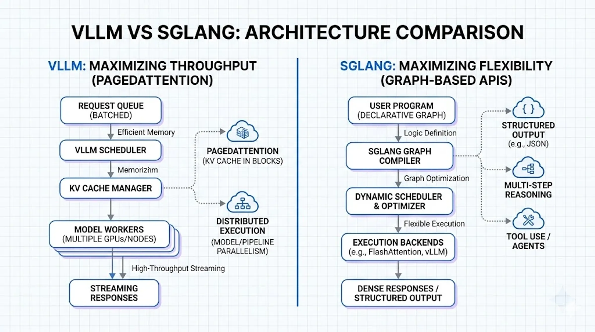

Compare vLLM and SGLang for enterprise AI deployment.

## Key Takeaways

Choosing between vLLM and SGLang depends on your specific workload requirements and performance priorities in 2026.

**• vLLM excels at high-concurrency API serving** with 100+ concurrent requests per GPU and 2-4x higher throughput than traditional systems **• SGLang dominates structured generation tasks** achieving 4.7x speedup in multi-turn conversations and 99.8% validity in JSON generation **• Memory efficiency favors SGLang** using 47% less GPU memory (40GB vs 75GB) while maintaining superior throughput in agent workflows **• Installation complexity differs significantly** with vLLM offering simpler pip installation versus SGLang requiring specialized dependencies **• Cost considerations vary by use case** with self-hosted vLLM costing $0.50-1.00 per million tokens compared to SGLang’s 9-10x reduction for quantized models

For production deployments, choose vLLM for predictable latency in high-volume scenarios, or SGLang for complex multi-step generation workflows where prefix caching and structured output generation provide substantial performance gains.

## Introduction

When deploying large language models, choosing between **vLLM** and **SGLang** can significantly impact your application’s performance. **vLLM** excels at high-throughput scenarios, supporting 100+ concurrent requests per GPU, while **SGLang** achieves 5x higher throughput in multi-turn dialog tasks. The decision between these frameworks depends on your specific workload. Whether you need raw throughput for API serving or structured generation for complex workflows, understanding the differences matters. In this guide, we’ll break down what is **vLLM** and **SGLang**, compare their performance benchmarks, and walk through **vLLM install** processes, **vLLM docker** setup, and **vLLM serve** configuration. We’ll also examine **sglang vs vllm** in detail to help you determine which engine fits your needs in 2026.

## What is vLLM and What is SGLang?

### vLLM: High-Throughput Inference Engine

vLLM is an open-source inference engine built around PagedAttention, which treats GPU memory like operating system virtual memory. The framework achieves 2-4x higher throughput compared to systems like FasterTransformer and Orca while maintaining the same latency levels. Traditional inference systems waste 60-80% of KV cache memory through fragmentation, whereas vLLM reduces this waste to under 4%. The engine provides an OpenAI-compatible API, continuous batching, and tensor parallelism for multi-GPU serving. Organizations like LMSYS cut their GPU fleet by 50% while serving 2-3x more requests per second after adopting vLLM.

### SGLang: Structured Generation Framework

SGLang approaches inference from a different angle by focusing on complex, multi-step generation workflows. Instead of optimizing purely for throughput, it provides a domain-specific language embedded in Python for controlling generation with primitives like tool use, control flow, and conditional reasoning. On the backend, SGLang implements RadixAttention for automatic KV cache reuse across multiple generation calls. The framework achieves up to 6.4x higher throughput on tasks including agent control, logical reasoning, and multi-turn chat compared to state-of-the-art systems.

### Core Architecture Differences

The fundamental difference lies in optimization targets. vLLM prioritizes serving as many requests as possible per GPU while keeping latency predictable. SGLang co-designs the programming interface and runtime to optimize structured generation workflows with automatic optimization. Where vLLM excels at stateless, high-concurrency scenarios, SGLang simplifies architecture for agent-based systems by reducing the need for heavy orchestration layers.

### PagedAttention vs RadixAttention

PagedAttention splits the KV cache into fixed-size pages, typically 16-256 tokens, allocated on demand. Physical pages can be placed anywhere in GPU memory, with a block table mapping logical indices to physical block IDs. In contrast, RadixAttention organizes the KV cache as a radix tree where common prefixes are stored once and shared. When requests share system prompts or conversation history, RadixAttention automatically detects this overlap without manual configuration. This gives SGLang a 10% throughput advantage in multi-turn conversations with cache involvement.

### Foundational Concepts: PagedAttention vs. RadixAttention

To understand the **vLLM vs SGLang** debate, we must look at how they manage the KV (Key-Value) cache. The KV cache is the memory consumed by the model to “remember” the context of a conversation during generation.

### vLLM and PagedAttention

vLLM revolutionized inference with **PagedAttention**. Traditional engines allocated contiguous memory for KV caches, leading to “internal fragmentation” where 60-80% of memory was wasted. PagedAttention treats memory like a virtual OS, breaking KV caches into non-contiguous blocks. This allows vLLM to fit more sequences into a single GPU, dramatically increasing throughput.

### SGLang and RadixAttention

SGLang takes this further with **RadixAttention**. While PagedAttention manages memory efficiently, it often discards the cache after a request finishes. In complex workflows—like multi-turn chats or many-shot prompting—the same prefix is often reused. RadixAttention treats the KV cache as a tree structure (a Radix Tree), allowing the engine to instantly reuse cached prefixes across different requests.

## Performance Benchmarks: Throughput and Latency

### Time to First Token (TTFT) Comparison

Real-world benchmarks reveal divergent TTFT patterns. On H100 GPUs with batch size 1, vLLM achieved 123ms compared to SGLang’s 340ms. Contrarily, tests on the same hardware at low concurrency showed SGLang delivering 583ms versus vLLM’s 2,141ms at c=1. The critical difference emerges at scale: SGLang’s TTFT jumps dramatically from 583ms to 2,525ms when concurrency increases from 1 to 10, while vLLM maintains consistency at 2,171ms. On H200 hardware running Qwen3-Coder-30B, SGLang registered 2,333ms TTFT versus vLLM’s 2,669ms, marking a 12.6% speed advantage.

### Tokens Per Second at Different Concurrency Levels

Throughput scaling behaviors differ substantially. At c=1, SGLang produced 220 tokens/s while vLLM managed only 61 tokens/s. As concurrency climbed to c=100, the frameworks converged: SGLang reached 4,587 tokens/s versus vLLM’s 4,432 tokens/s. A separate benchmark on A100 hardware showed SGLang achieving 1,532 tokens/s overall throughput compared to vLLM’s 661 tokens/s. Particularly for high-batch scenarios, SGLang delivered 460 tokens/s at batch size 64 on H100.

### GPU Memory Utilization Efficiency

Memory footprint analysis shows SGLang consuming approximately 40GB per GPU with tensor parallelism, while vLLM required around 75GB, representing 47% lower memory usage. Testing on A10 GPUs confirmed this pattern: SGLang used 7GB versus vLLM’s 21GB allocation.

### Batch Processing Performance

vLLM demonstrated near-linear throughput scaling up to c=50, achieving approximately 40x improvement before plateauing at c=100+. Meanwhile, SGLang exhibited strong initial throughput but slower scaling characteristics at higher concurrency levels.

## Use Cases and When to Choose Each Framework

### vLLM: Best for High-Concurrency API Serving

Choose vLLM when serving batch content generation, real-time Q&A with predictable patterns, or deploying across heterogeneous GPU clusters. The framework handles encoder-decoder models like T5 and BART while supporting TPU, AWS Trainium, and Intel Gaudi hardware. Memory-constrained environments benefit from PagedAttention efficiency, enabling 100+ concurrent requests per GPU.

### SGLang: Optimal for Multi-Agent Workflows

SGLang excels in AI agents with iterative reasoning and planning workflows. Multi-turn chat performance shows 4.7x speedup over vLLM, while DeepSeek models gain additional optimization through MLA-specific kernels. The framework maintains a 29% throughput advantage on H100 GPUs even against fully optimized vLLM configurations.

### Chat Applications and Conversational AI

Multi-turn conversations favor SGLang due to RadixAttention delivering approximately 10% performance boost from prefix caching. Cache hit rates exceed 50% in production chatbot deployments, reducing first-token latency meaningfully.

### Tool Calling and Structured Output Generation

JSON generation reveals stark differences. SGLang with xGrammar produces 4,200 tokens/second at 99.8% validity versus vLLM with Guidance at 820 tokens/second and 85% validity. Structured extraction and code generation see 3-5x throughput improvements with SGLang.

### Cost Per Token Considerations

Self-hosted vLLM costs USD 0.50-1.00 per million tokens compared to USD 20-60 for API services. SGLang’s quantized SLM deployments achieve 9-10x cost reduction versus FP16 models.

## Installation and Deployment Setup

### vLLM Install Process and Requirements

**vLLM** requires Linux, Python 3.9-3.12, and GPUs with compute capability 7.0 or higher (V100, T4, A100, H100). Install via pip after creating a fresh conda environment: `conda create -n myenv python=3.12 -y && conda activate myenv && pip install vllm`. Alternatively, use `uv venv myenv --python 3.12 --seed && source myenv/bin/activate && uv pip install vllm`. **vLLM** binaries compile with CUDA 12.1 by default.

### Setting Up vLLM Docker Containers

Run `docker run --gpus all --ipc=host -p 8000:8000 vllm/vllm-openai:latest --model meta-llama/Meta-Llama-3.1-8B-Instruct`. The `--ipc=host` flag enables shared memory for inter-process communication, preventing CUDA errors under load.

### SGLang Installation and Dependencies

Install **SGLang** with `pip install "sglang[all]" --find-links https://flashinfer.ai/whl/cu124/torch2.4/flashinfer/`. For Docker: `docker run --gpus all --shm-size 32g -p 30000:30000 lmsysorg/sglang:latest python3 -m sglang.launch_server --model-path meta-llama/Llama-3.1-8B-Instruct`.

### vLLM Serve Configuration Options

Launch servers with `vllm serve <model> --tensor-parallel-size 4 --gpu-memory-utilization 0.90 --max-model-len 8192`. Configuration files accept YAML format where command line arguments override file values.

### Multi-GPU Deployment Strategies

Set **tensor\_parallel\_size** to GPUs per node and **pipeline\_parallel\_size** to node count. For 16 GPUs across 2 nodes: `--tensor-parallel-size 8 --pipeline-parallel-size 2`.

## Comparison Table

| Feature/Attribute | vLLM | SGLang |
| --- | --- | --- |
| Core Technology | PagedAttention | RadixAttention |
| Primary Focus | High-throughput serving with predictable latency | Structured generation workflows and multi-step tasks |
| Memory Management | Fixed-size pages (16-256 tokens) allocated on demand | Radix tree structure with automatic prefix sharing |
| Memory Waste | Under 4% (vs 60-80% in traditional systems) | Not specified |
| Throughput vs Traditional Systems | 2-4x higher than FasterTransformer/Orca | Up to 6.4x higher on agent control and reasoning tasks |
| TTFT (H100, batch size 1) | 123ms | 340ms |
| TTFT (Low concurrency, c=1) | 2,141ms | 583ms |
| TTFT (H200, Qwen3-Coder-30B) | 2,669ms | 2,333ms (12.6% faster) |
| TTFT Stability at Scale | Consistent at 2,171ms (c=1 to c=10) | Jumps from 583ms to 2,525ms (c=1 to c=10) |
| Tokens/s (c=1) | 61 tokens/s | 220 tokens/s |
| Tokens/s (c=100) | 4,432 tokens/s | 4,587 tokens/s |
| Overall Throughput (A100) | 661 tokens/s | 1,532 tokens/s |
| GPU Memory Usage (with tensor parallelism) | ~75GB per GPU | ~40GB per GPU (47% lower) |
| GPU Memory Usage (A10) | 21GB | 7GB |
| Concurrent Requests per GPU | 100+ | Not specified |
| Multi-turn Chat Performance | Baseline | 4.7x-5x speedup over vLLM |
| Multi-turn Conversation Advantage | N/A | 10% throughput boost from prefix caching |
| Structured JSON Generation | 820 tokens/s with 85% validity (using Guidance) | 4,200 tokens/s with 99.8% validity (using xGrammar) |
| Batch Processing Scaling | Near-linear up to c=50, ~40x improvement, plateaus at c=100+ | Strong initial throughput, slower scaling at higher concurrency |
| Best Use Cases | High-concurrency API serving, batch content generation, real-time Q&A, heterogeneous GPU clusters | Multi-agent workflows, iterative reasoning, multi-turn chat, tool calling, structured output |
| Hardware Support | GPUs (V100, T4, A100, H100), TPU, AWS Trainium, Intel Gaudi | GPUs (compute capability 7.0+) |
| Model Support | Encoder-decoder models (T5, BART), decoder-only models | Decoder-only models, optimized for DeepSeek with MLA kernels |
| API Compatibility | OpenAI-compatible API | Not specified |
| Cost per Million Tokens (self-hosted) | USD 0.50-1.00 | 9-10x reduction with quantized SLMs vs FP16 |
| Python Version Requirements | Python 3.9-3.12 | Not specified |
| GPU Requirements | Compute capability 7.0+ (V100, T4, A100, H100) | Not specified |
| Installation Command | pip install vllm | pip install “sglang\[all\]” —find-links [https://flashinfer.ai/whl/cu124/torch2.4/flashinfer/](https://flashinfer.ai/whl/cu124/torch2.4/flashinfer/) |
| Docker Run Command | docker run —gpus all —ipc=host -p 8000:8000 vllm/vllm-openai:latest —model | docker run —gpus all —shm-size 32g -p 30000:30000 lmsysorg/sglang:latest python3 -m sglang.launch\_server —model-path |
| Production Deployment Example | LMSYS: 50% GPU fleet reduction, 2-3x more requests/s | Not specified |

## Conclusion

The **vLLM vs SGLang** decision ultimately depends on your specific workload. For this reason, I’d recommend **vLLM** if you’re running high-concurrency API services where predictable latency matters most. On the other hand, **SGLang** wins for multi-turn conversations, agent workflows, and structured generation tasks where prefix caching delivers measurable gains. Both frameworks offer excellent performance in 2026, so your use case should drive the choice.

## FAQs

**Q1. Which inference engine is faster for multi-turn conversations - vLLM or SGLang?** **SGLang** performs significantly better in multi-turn conversations, achieving 4.7x to 5x speedup compared to **vLLM**. This advantage comes from **RadixAttention** ’s automatic prefix caching, which provides approximately a 10% throughput boost by efficiently reusing shared conversation history and system prompts without manual configuration.

**Q2. How much GPU memory does each framework require for deployment?** **SGLang** is considerably more memory-efficient, consuming around 40GB per GPU with tensor parallelism compared to **vLLM** ’s 75GB requirement - representing 47% lower memory usage. On smaller GPUs like the A10, **SGLang** uses only 7GB versus **vLLM** ’s 21GB allocation, making it more suitable for memory-constrained environments.

**Q3. What are the main architectural differences between vLLM and SGLang?** **vLLM** uses **PagedAttention**, which splits the KV cache into fixed-size pages (16-256 tokens) allocated on demand, similar to operating system virtual memory. **SGLang** employs **RadixAttention**, organizing the KV cache as a radix tree where common prefixes are stored once and automatically shared across requests, making it particularly efficient for workflows with repeated patterns.

**Q4. Which framework should I choose for structured output generation like JSON?** **SGLang** excels at structured output generation, producing 4,200 tokens per second with 99.8% validity when using **xGrammar**, compared to **vLLM** ’s 820 tokens per second with 85% validity using **Guidance**. For tasks involving tool calling, code generation, and structured extraction, **SGLang** typically delivers 3-5x throughput improvements.

**Q5. How do the installation requirements differ between vLLM and SGLang?** **vLLM** requires Linux, Python 3.9-3.12, and GPUs with compute capability 7.0 or higher (V100, T4, A100, H100). Installation is straightforward via pip after creating a conda environment. **SGLang** has similar GPU requirements and can be installed with pip, but requires additional dependencies from flashinfer. Both frameworks offer Docker containers for simplified deployment with GPU passthrough support.

## Related Articles

- [MCP vs Function Calling: AI Tool Integration Guide](https://privocto.com/blog/mcp-fuction-call) — Tool integration patterns for AI systems
- [How to Build Local AI Agents: A Privacy-First Guide](https://privocto.com/blog/build-local-ai-agents) — Deploy local inference with vLLM/SGLang
- [vLLM Official Documentation](https://docs.vllm.ai/) — Complete vLLM setup guide
- [SGLang GitHub Repository](https://github.com/sgl-project/sglang) — Official SGLang implementation
- [PagedAttention Paper](https://arxiv.org/abs/2309.10380) — Technical foundation of vLLM
- [vLLM vs LM Deploy](https://www.benchmark.to/llm-inference) — Additional inference engine comparisons
