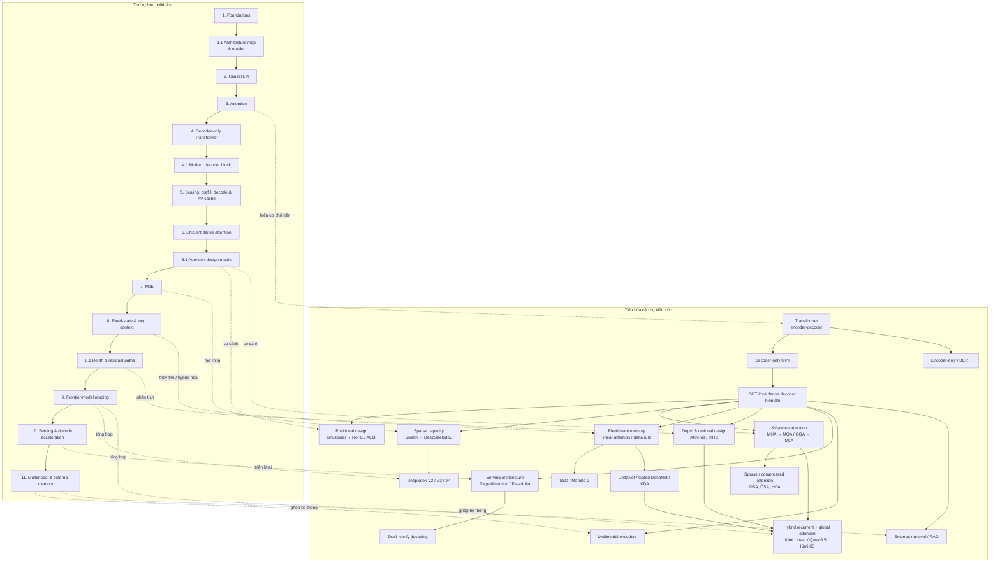
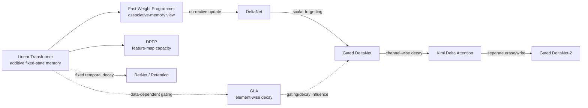

# LLM architecture development and learning map

Sơ đồ này tách **lịch sử/phả hệ kiến trúc** khỏi **thứ tự học**: nhánh trên chỉ các họ cơ chế phát triển từ Transformer, còn nhánh dưới là prerequisite thực hành để đọc và phân tích một hệ LLM hiện đại. Nó là bản đồ tổng hợp, không ngụ ý mọi mũi tên là quan hệ thay thế trực tiếp hoặc mọi hệ thống dùng cùng một backbone.[^vaswani-transformer-2017][^radford-generative-pre-training-2018][^dao-gu-2024][^deepseek-v2-2024][^kimi-linear-2025][^kimi-k3-2026][^pagedattention-2023][^rag-summary]

## Nhánh linear attention: tiến hóa của memory update

Bản đồ chi tiết này refine nhánh `Fixed-state memory` thành ba hướng bổ sung: tăng capacity của feature space, thêm decay/forgetting, và chuyển từ additive write sang key-addressed corrective update. Các mũi tên không phải chronology tuyệt đối: `FWP` là cầu nối diễn giải associative-memory, còn `RetNet` và `GLA` là các nhánh decay liên quan; lineage delta rõ nhất là `DeltaNet → Gated DeltaNet → KDA → Gated DeltaNet-2`.[^user-linear-attention-evolution-map]

- `LA → FWP` changes the explanatory model: the fixed state is treated as a programmable key–value memory, not as a separate full-model family.
- `LA → DPFP` expands the feature/address space; it does not itself add eviction or corrective writing.
- `RetNet/Retention` and `GLA` add forgetting, respectively through temporal decay and data-dependent element-wise decay, but do not by themselves implement DeltaNet's error correction.
- `DeltaNet → GDN → KDA → GDN2` progressively refines memory editing: targeted correction, scalar broad forgetting, channel-wise retention, then independent erase and write controls.

## Cách đọc

1. Đi theo hàng **Thứ tự học** từ trái sang phải; mỗi stage yêu cầu một kiểm chứng hoặc bản cài đặt nhỏ trước stage kế tiếp.
2. Dùng hàng **Tiến hóa** để xác định một cơ chế là backbone, attention/context mechanism, capacity mechanism, hay architecture hệ thống.
3. Khi đọc một model mới, tách nó thành: token mixer, positional/KV design, FFN/capacity, residual/depth path, training objective và serving/system components. Không suy ra ưu thế toàn mô hình chỉ từ một nhánh cơ chế.

## Evidence limits

Nguồn user-provided này là một conceptual map, không phải primary source cho RetNet hoặc GLA. Wiki hiện có primary-source-backed pages cho additive linear memory, DPFP, DeltaNet, Gated DeltaNet, KDA và Gated DeltaNet-2; vì vậy không dùng riêng sơ đồ này để suy ra ngày công bố, ranking chất lượng hoặc chi tiết implementation của RetNet/GLA.

## Relationships

- **Extends:** [LLM architecture learning roadmap](llm-architecture-learning-roadmap.md) bằng một biểu diễn trực quan; roadmap là thứ tự học chuẩn tắc chi tiết.
- **Uses:** [Sequence-model architecture taxonomy](sequence-model-architecture-taxonomy.md) để phân biệt backbone, cơ chế capacity/context và architecture hệ thống.
- **Uses:** [DeepSeek-V4 and Kimi K3 architecture comparison](deepseek-v4-and-kimi-k3-architecture-comparison.md) như hai ví dụ về trade-off giữa token-addressable compression và hybrid fixed-state retrieval.
- **Refines:** [Linear attention as fixed-state memory](linear-attention-as-fixed-state-memory.md) và [Delta-rule and gated associative memory](delta-rule-and-gated-associative-memory.md) bằng một lineage tập trung vào memory update.

[^user-linear-attention-evolution-map]: User-provided Mermaid diagram, [preserved source](../raw/user-supplied-linear-attention-evolution.md); conceptual map only, without independent chronology or benchmark evidence.

[^vaswani-transformer-2017]: Vaswani et al., “Attention Is All You Need,” [source](../raw/arXiv-1706.03762v7/ms.tex).
[^radford-generative-pre-training-2018]: Radford et al., “Improving Language Understanding by Generative Pre-Training,” [source](../raw/gpt.pdf).
[^dao-gu-2024]: Dao and Gu, “Transformers are SSMs,” [source](../raw/arXiv-2405.21060v1/structure.tex).
[^deepseek-v2-2024]: DeepSeek-AI, “DeepSeek-V2,” [source](../raw/arXiv-2405.04434v5/main.tex).
[^kimi-linear-2025]: Kimi Team, “Kimi Linear,” [source](../raw/arXiv-2510.26692v2/main.tex).
[^kimi-k3-2026]: Kimi Team, “Kimi K3,” [source](../raw/arXiv-2607.24653v1/main.tex).
[^pagedattention-2023]: Kwon et al., “Efficient Memory Management for Large Language Model Serving with PagedAttention,” [source](../raw/arXiv-2309.06180v1/main.tex).
[^rag-summary]: “RAG overview,” [source](../raw/RAG.md). Secondary-source evidence.
