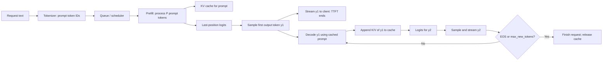

# LLM inference lifecycle: training, prefill, decode, and latency

Một `decoder-only LLM` học trong **training**, nhưng khi phục vụ một request nó không học nữa: nó chạy **inference** trên weights đã cố định. Inference của một request có hai pha model execution khác bản chất: **prefill** đọc toàn bộ `prompt` để tạo `KV cache` và chọn output token đầu tiên; **decode** lặp từng token, đọc cache đã có rồi mở rộng nó. Vì vậy **TTFT** (*time to first token*) đo trải nghiệm chờ ban đầu, còn **TPOT** (*time per output token*, cũng thường gọi `inter-token latency`) đo nhịp stream sau đó. Đây là synthesis mang tính sư phạm dựa trên các nguồn và concept được liên kết; số đo cụ thể luôn phụ thuộc model, prompt, hardware, server và tải hệ thống.[^kv-caching-explained][^clyburn-inference-explainer][^flashattention-summary]

```text
training: dataset + labels ──► update weights một lần qua rất nhiều steps
inference: prompt + frozen weights ──► prefill ──► first token ──► decode ──► next tokens
```

> [!success] Sau bài này
> Bạn có thể vẽ đúng đường đi `prompt → prefill → first token → decode loop`, giải thích vì sao prompt dài thường tăng `TTFT`, vì sao context dài có thể làm mỗi token sau đó chậm hơn, và không dùng một con số “latency” để lẫn hai vấn đề khác nhau.

## 1. Ba từ dễ nhầm: `training`, `inference`, và `generation`

- **`training`**: tối ưu weights $\theta$ từ data. Model dự đoán next token, tính `loss`, chạy `backward`, rồi `optimizer.step()` thay đổi weights.
- **`inference`**: dùng weights đã có để chạy `forward pass`; không có `backward` hay cập nhật weights. Một inference server còn phải xếp hàng request, batch chúng và quản lý memory.
- **`generation`**: trường hợp inference mà model autoregressively tạo token mới. Classification cũng là inference, nhưng thường không có vòng lặp tạo token.

### So sánh trực tiếp

| Thuộc tính | `training` | `prefill` | `decode` |
|---|---|---|---|
| Mục tiêu | học/chỉnh weights | xử lý `prompt`, khởi tạo request state | tạo tiếp output token |
| Weights | được update | frozen | frozen |
| Input trong một `forward pass` | nhiều sequence, nhiều position | toàn bộ prompt của một request/chunk | thường một token mới mỗi active sequence |
| Tokens có thể tính song song theo chiều sequence | có, nhờ `teacher forcing` + `causal mask` | có, vì toàn bộ prompt đã biết | không giữa các bước kế tiếp của **cùng** sequence |
| `backward` / optimizer | có | không | không |
| State quan trọng | activations, gradients, optimizer state | ghi `KV cache` cho prompt | đọc cache cũ, ghi thêm K/V của token mới |
| Bottleneck thường gặp | compute + training memory | attention compute / kernel efficiency | đọc `KV cache` và memory bandwidth |

`Prefill` và `decode` đều là inference; chúng không phải hai model hay hai cách model “suy nghĩ”. Chúng chỉ là hai cách chạy cùng causal model khi lượng input mới ở mỗi `forward pass` khác nhau.

> [!note] `training` không phải “prefill rất lâu”  
> Cả hai có thể xử lý nhiều token song song, nhưng training phải giữ activations cho `backward`, tính gradients và update weights. Prefill chỉ chạy forward trên weights frozen để phục vụ một request. Nó không giữ training graph hay optimizer state.

Để hiểu objective `next-token prediction`, `teacher forcing`, và `causal mask`, xem [Causal language modeling: training and sampling](causal-language-modeling-training-and-sampling.md). Các phần dưới đây tập trung vào lifecycle lúc serving.

## 2. Request đi qua hệ thống như thế nào?

Giả sử user gửi prompt: **“Thủ đô của Việt Nam là”**. Tokenizer biến text thành token IDs; số token không bằng số từ hoặc số ký tự. Gọi số prompt tokens là $P$, số generated output tokens là $G$.



Sơ đồ cố ý tách **sampling `y1`** khỏi decode. `Prefill(prompt)` tạo logits ở final prompt position; sample từ logits này đã cho ra first output token. Ở forward pass decode kế tiếp, `y1` mới được đưa vào model, K/V của nó được append, và logits để chọn `y2` được tạo ra.

Một số framework dùng từ **decode** rộng hơn để chỉ toàn bộ generation, bao gồm cả việc chọn first token. Trong bài này, `decode` nghĩa hẹp là các incremental forward pass **sau prefill**. Khi đọc benchmark hoặc API documentation, hãy kiểm tra convention đó trước khi so sánh số liệu.

### Pseudocode tối giản

```python
# weights đã frozen; cache là state riêng của request.
cache = None
logits, cache = model(prompt_ids, kv_cache=cache)  # prefill, P tokens
next_id = sample(logits[:, -1, :])                 # first output token
stream(next_id)

while next_id != eos_id and generated < max_new_tokens:
    logits, cache = model(next_id[:, None], kv_cache=cache)  # decode, 1 token
    next_id = sample(logits[:, -1, :])
    stream(next_id)
```

Code thực tế còn xử lý batch, `EOS`, stopping criteria, tool calls, safety checks, network streaming và memory allocation. Nhưng dependency cốt lõi không đổi: phải chọn `y_t` trước khi có thể đưa nó vào model để tính distribution của `y_{t+1}`.

## 3. `prefill`: đọc prompt và xây `KV cache`

Với causal attention, mỗi token cần `query` (Q) của nó và `key`/`value` (K/V) của left context. Trong prefill, prompt đã hoàn chỉnh nên model có thể xử lý tất cả $P$ positions trong một forward pass, vẫn bảo đảm mỗi position chỉ nhìn bên trái bằng `causal mask`. Mỗi layer tạo K/V cho từng prompt token và lưu chúng vào `KV cache`.[^kv-caching-explained]

```text
prompt tokens: [x1, x2, x3, x4]

prefill in one causal forward pass:
  x1, x2, x3, x4 ──► K/V cache for x1..x4 ──► logits at x4 ──► sample y1
```

`KV cache` không lưu nguyên văn prompt hay hidden states một cách khái quát; trong standard Transformer serving nó lưu K và V theo token, layer và KV head. Cache này là state **per request**. Cache không còn cần thiết khi request kết thúc, trừ khi server có thể tái sử dụng prefix chung cho request khác.[^clyburn-inference-explainer]

### Vì sao prompt dài làm `TTFT` tăng?

Prompt dài có nhiều token cần embedding, projection, attention và ghi K/V hơn trước khi model có logits để sample first token. Với full attention, prefill còn có attention giữa nhiều query positions và key positions; `FlashAttention` đặc biệt phù hợp với pha này vì nó xử lý sequence dài theo tile và tránh materialize ma trận attention lớn.[^flashattention-summary]

Điều này không có nghĩa `TTFT = prefill time` trong mọi dashboard. `TTFT` end-to-end còn có thể gồm:

```text
request arrival → queueing → tokenize / route → prefill → sample y1
                → serialize / network → client sees first streamed token
```

Vì thế hai request cùng prompt có thể có `prefill latency` gần nhau nhưng `TTFT` rất khác khi server đang bận. Ngược lại, `TTFT` thấp nhờ prefix cache không chứng minh raw prefill kernel nhanh: server có thể đã tái sử dụng K/V cho shared prefix.

## 4. `decode`: một token mới, history ngày càng dài

Sau `prefill`, model đã có K/V của prompt. Để tạo token tiếp theo, nó không cần tính lại K/V của prompt: model chỉ tính Q/K/V cho token mới, append K/V mới vào cache, rồi query này attention tới toàn bộ cache. Đây là lợi ích của [KV caching](kv-caching.md): K/V của token cũ được tính một lần thay vì tính lại ở mọi step.[^kv-caching-explained]

```text
cache after prefill:  K/V(x1), K/V(x2), K/V(x3), K/V(x4)
input to decode:      y1

compute:              Q(y1), K(y1), V(y1)
append:               K/V(y1)
attention:            Q(y1) against K/V(x1..x4, y1)
result:               logits → sample y2
```

`KV cache` loại bỏ việc recompute prefix nhưng không làm decode thành $O(1)$ theo context length: query mới vẫn phải đọc/attention tới K/V history. Khi context đã có $S$ tokens, cache size và lượng K/V đọc cho mỗi decode step thường tăng theo $S$.[^kv-caching-explained]

Đó là lý do two requests có cùng số output tokens nhưng khác history length có thể có `TPOT` khác nhau. `MQA`/`GQA`, KV-cache compression và PagedAttention nhắm tới cache bandwidth, cache size hoặc allocation; chúng không xóa dependency autoregressive giữa `y_t` và `y_{t+1}`.

## 5. Đọc đúng `TTFT`, `TPOT`, và total latency

Không có một metric “latency” duy nhất mô tả tốt cả chat request. Dưới đây là các định nghĩa vận hành hữu ích; hệ thống phải công bố timestamp boundary và cách average cụ thể.

| Metric | Một định nghĩa thực dụng | Câu hỏi nó trả lời | Bị ảnh hưởng mạnh bởi |
|---|---|---|---|
| `TTFT` | từ khi server nhận request đến khi client/server phát output token đầu tiên | User chờ bao lâu để thấy phản hồi bắt đầu? | queueing, tokenization, prefill, prefix cache, sampling, network |
| `prefill latency` | từ lúc prefill bắt đầu đến khi logits first token sẵn sàng | Model/server xử lý prompt nhanh đến đâu? | prompt length, attention kernel, batch/scheduling, accelerator |
| `TPOT` / `inter-token latency` | thời gian trung bình giữa các output tokens sau token đầu tiên | Stream sau khi bắt đầu có đều/nhanh không? | decode kernel, cache length, memory bandwidth, batching, scheduling |
| `E2E latency` | từ request arrival đến request hoàn tất | User chờ tổng cộng bao lâu? | mọi pha, plus output length và network |

Nếu $t_0$ là thời điểm request đến, $t_1$ là lúc first output token được phát, và $t_G$ là lúc token thứ $G$ được phát, một quy ước phổ biến là:

$$
\operatorname{TTFT}=t_1-t_0,
\qquad
\operatorname{TPOT}=\frac{t_G-t_1}{G-1}\quad(G>1),
\qquad
\operatorname{E2E}=t_G-t_0.
$$

Nếu decode cadence gần ổn định và bỏ qua startup/finish overhead:

$$
\operatorname{E2E}\approx\operatorname{TTFT}+(G-1)\operatorname{TPOT}.
$$

Đây là approximation để lập luận, không phải identity bắt buộc. Continuous batching có thể làm từng khoảng giữa token dao động; network buffering hoặc client rendering cũng có thể làm timestamp ở client không đều.

> [!example] Hai request đều trả 100 tokens
> - Request A có prompt ngắn: `TTFT = 0.3 s`, `TPOT = 30 ms` → `E2E ≈ 3.27 s`.
> - Request B có prompt dài: `TTFT = 3.0 s`, `TPOT = 30 ms` → `E2E ≈ 5.97 s`.
>
> Tối ưu decode nhưng không tối ưu prefill có thể không cải thiện cảm nhận đầu tiên của B. Ngược lại, chỉ tối ưu TTFT không giúp stream 99 tokens còn lại nhanh hơn.

### `tokens/s` không thay thế `TTFT`

Trong một stream đơn lẻ sau token đầu, `decode tokens/s ≈ 1 / TPOT`. Ví dụ `TPOT = 25 ms` tương đương khoảng 40 output tokens/s. Nhưng báo cáo chỉ `tokens/s` có thể che mất initial wait; báo cáo chỉ `TTFT` có thể che mất stream chậm. Hơn nữa, `throughput` của server (tổng tokens/s qua nhiều request) không đồng nghĩa với latency của một request đơn lẻ.

## 6. Tại sao tối ưu `prefill` và `decode` khác nhau?

| Pha | Hình dạng điển hình | Điều cần tối ưu | Các hướng thường gặp |
|---|---|---|---|
| `prefill` | nhiều prompt tokens cùng lúc | tận dụng compute / attention kernels, giảm prompt work | efficient attention kernels, chunked prefill, prefix caching, prompt shortening |
| `decode` | một new token trên mỗi active request mỗi step | đọc cache hiệu quả, giữ nhiều request active | KV-cache layout/quantization, MQA/GQA, PagedAttention, continuous batching, speculative decoding |

`FlashAttention` không đổi attention semantics, nhưng giảm intermediate-memory IO và hợp với long-prompt prefill. Trong one-token decode, query length thường là 1; việc đọc growing `KV cache` có thể trở thành bottleneck thay vì phép nhân matrix lớn.[^flashattention-summary]

`PagedAttention` cũng không làm model dự đoán nhiều next tokens cùng lúc. Nó quản lý logical KV blocks không liên tục trong physical memory, giúp allocate theo nhu cầu và share prefix blocks để tăng usable concurrency.[^clyburn-inference-explainer]

> [!warning] Đừng suy luận “model chạy X tokens/s” là tính chất bất biến
> Kết quả thay đổi theo prompt length, output length, concurrent load, batching policy, cache hit rate, precision, model architecture, GPU, network và percentile (`p50`, `p95`, `p99`). Một benchmark tốt cần nói rõ workload và metric boundary.

## 7. Một timeline để tự kiểm tra hiểu biết

Với prompt 4 tokens và ba output tokens `y1 y2 y3`:

```text
time ─────────────────────────────────────────────────────────────────────►

request / queue / tokenize
          │
          ├──── prefill(x1 x2 x3 x4) ──── sample y1 ──── stream y1
          │       create cache x1..x4                     ▲
          │                                                │ TTFT
          │
          ├──── decode(y1, cache x1..x4) ─ sample y2 ─ stream y2
          │       cache becomes x1..x4,y1
          │
          └──── decode(y2, cache x1..x4,y1) ─ sample y3 ─ stream y3 / EOS
                  cache becomes x1..x4,y1,y2

                          <------ inter-token intervals / TPOT ------>
```

Lưu ý alignment: K/V của `y3` chỉ được tạo nếu cần chạy một step tiếp theo; khi `y3` là `EOS` hoặc đạt `max_new_tokens`, request có thể kết thúc ngay sau sample/stream và cache được giải phóng. Chi tiết implementation có thể khác, nhưng không được hiểu nhầm rằng “sample `y1`” đòi một prefill thứ hai.

## 8. Checklist khi đo hoặc debug serving

1. **Ghi prompt tokens và output tokens**, không chỉ số words/chars.
2. **Tách timestamp**: arrival, prefill start/end, first-token emitted, last-token emitted. Nếu có network, quyết định đo ở server hay client.
3. **Báo cả `p50` và tail percentile** như `p95`/`p99`; queueing dưới tải thường xuất hiện ở tail.
4. **Giữ workload cố định** khi so hai cấu hình: model/checkpoint, sampling, prompt/output distribution, concurrency, hardware và precision.
5. **Kiểm tra cache policy**: cold/warm prefix cache, cache hit rate, context limit, eviction và memory pressure có thể đổi kết quả.
6. **Đo `TTFT` và `TPOT` riêng** trước khi kết luận optimization nào hiệu quả.

## 9. Những nhầm lẫn phổ biến

1. **“Inference chỉ có một forward pass.”** Sai cho autoregressive generation: có prefill và nhiều decode forward passes, thường gần một pass cho mỗi output token.
2. **“Prefill tạo hết câu trả lời trong parallel.”** Sai. Nó xử lý prompt trong parallel và chỉ trực tiếp cho distribution để chọn first output token; output tokens tiếp theo vẫn phụ thuộc các token đã chọn trước đó.
3. **“KV cache làm decode không phụ thuộc context length.”** Sai. Nó tránh recompute K/V cũ, nhưng query mới vẫn đọc history; cache cũng lớn dần.
4. **“TTFT là pure model speed.”** Sai. Nếu đo end-to-end, nó thường bao gồm queueing, scheduling và có thể network. Hãy nêu boundary.
5. **“Latency mỗi output token là `TTFT / output_tokens`.”** Sai. `TTFT` chủ yếu bao gồm work trước token đầu; `TPOT` đo các khoảng sau token đầu.
6. **“Một output token là một từ.”** Sai. Tokenization có thể tách một từ thành nhiều tokens hoặc gộp punctuation/whitespace theo tokenizer.
7. **“Continuous batching loại bỏ sequential decode.”** Sai. Nó batch nhiều request ở cùng decode iteration; trong từng request, `y_{t+1}` vẫn chờ `y_t`.

## 10. Bước tiếp theo trong roadmap

Bài này mở rộng Stage 5 của [LLM architecture learning roadmap](llm-architecture-learning-roadmap.md). Sau khi vẽ được lifecycle, hãy:

- đọc [KV caching](kv-caching.md) để hiểu K/V được lưu và dùng ra sao;
- đọc [PagedAttention KV-cache serving](pagedattention-kv-cache-serving.md) để hiểu cache layout và prefix sharing ở serving;
- đọc [FlashAttention implementation evolution](flashattention-implementation-evolution.md) để thấy vì sao prefill và decode có kernel bottleneck khác nhau;
- đọc [Multi-query and grouped-query attention](multi-query-and-grouped-query-attention.md) và [KV-cache compression and trade-offs](kv-cache-compression-and-trade-offs.md) để thấy các cách giảm decode state.

## Relationships

- **Elaborates:** Stage 5 của [LLM architecture learning roadmap](llm-architecture-learning-roadmap.md) bằng lifecycle và latency vocabulary cho một autoregressive request.
- **Builds on:** [Causal language modeling: training and sampling](causal-language-modeling-training-and-sampling.md), đặc biệt là causal next-token distribution, sampling và generation loop.
- **Uses:** [KV caching](kv-caching.md) để phân biệt cache-building prefill với cache-consuming decode.[^kv-caching-explained]
- **Contextualized by:** [FlashAttention implementation evolution](flashattention-implementation-evolution.md), [PagedAttention KV-cache serving](pagedattention-kv-cache-serving.md), và [LLM inference serving stack](llm-inference-serving-stack.md), là các optimization/system layer có tác động khác nhau lên hai pha.[^clyburn-inference-explainer][^flashattention-summary]

## Evidence limits

Các raw sources cho `KV cache`, serving stack, và FlashAttention là explainer/summary, không phải một performance study chuẩn hóa cho định nghĩa metric ở mọi server. Các công thức metric, pseudocode, ví dụ timeline, và distinction về timestamp boundary ở đây là **pedagogical synthesis**. Khi đánh giá một deployment cụ thể, hãy dùng instrumentation và documentation của server đó thay vì suy ra throughput hay latency tuyệt đối từ bài này.

[^kv-caching-explained]: “KV Caching in LLMs, Clearly Explained,” [raw source](../raw/KVCachinginLLMsClearlyExplained.md), Parts 1–6 and tl;dr. The article is secondary orientation material and does not cite primary papers for its reported speedup or memory figures.
[^clyburn-inference-explainer]: Cedric Clyburn, “How AI Inference Works, Clearly Explained,” X, [raw source](../raw/HowAIInferenceWorksClearlyExplained.md), sections “Models generate one token at a time,” “Why the KV cache exists,” and “What production inference servers do about it.”
[^flashattention-summary]: “FlashAttention overview” (Vietnamese summary), [raw source](../raw/FlashAttention.md), Sections 12–14. It is secondary-source evidence for the prefill/decode kernel distinction.
