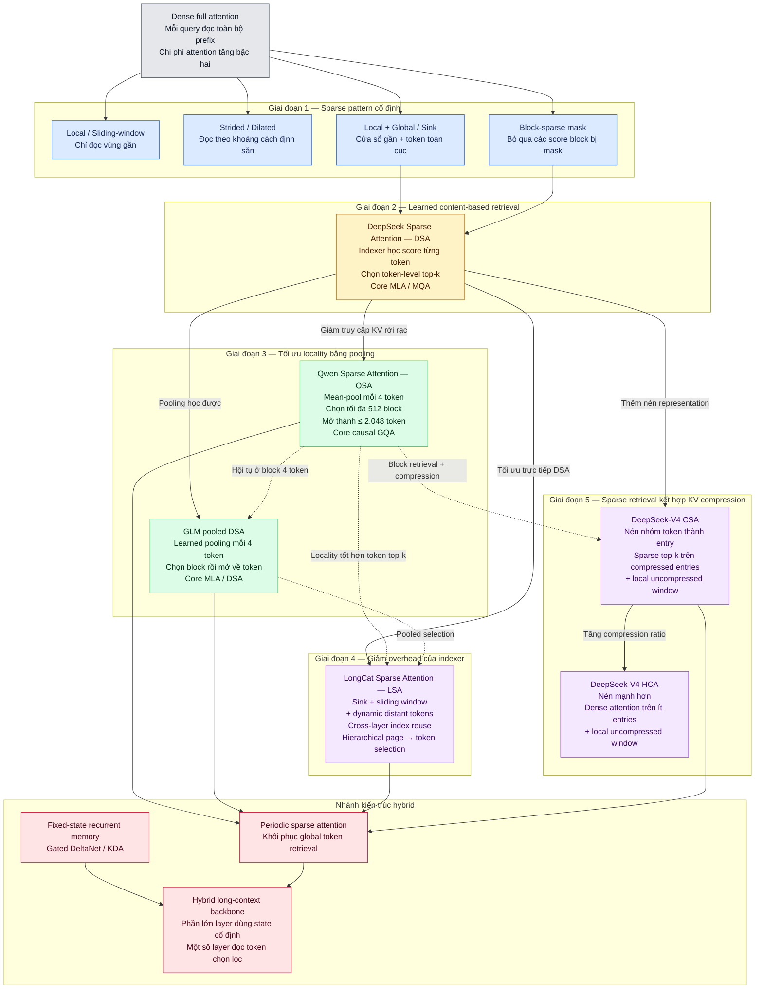

# Sparse Attention evolution and architecture comparison

Sparse Attention evolves by moving the sparsity decision from a fixed positional mask to learned content retrieval, then changing the retrieval unit from individual tokens to local blocks or compressed entries. The later designs also co-design indexing with memory locality, layer reuse, and KV-cache representation. The recurrent–attention hybrid is a related architectural branch rather than a strict final stage: it places fixed-state sequence mixing in most layers and reserves periodic attention for token-addressable retrieval.[^user-map][^deepseek-dsa][^longcat-lsa][^deepseek-v4][^kimi-linear]

## How to read the map

The supplied Mermaid diagram is a conceptual evolution map, not proof of a direct historical genealogy from every node to the next. The architectures should be compared along three independent axes:

1. **Access pattern** — which positions can a query read?
2. **KV representation** — is history stored as per-token KV, latent per-token entries, compressed group entries, or a fixed recurrent state?
3. **Layer allocation** — does every layer use the same mechanism, or do recurrent, sparse, and global-retrieval layers alternate?

`MQA`, `GQA`, and `MLA` primarily change KV sharing or representation. They do not by themselves make an attention pattern sparse. Conversely, a sparse mask or indexer can be combined with several KV representations.[^deepseek-dsa][^qwen-qsa]

## Architecture map



## Unified comparison

| Design | Selection or mask | Unit read by core attention | Core KV/attention path | Retained state | Main bottleneck |
|---|---|---|---|---|---|
| Dense full attention | No selection | Every prior token | MHA/GQA/MLA over full prefix | Per-token state grows with context | Quadratic prefill/training work |
| Local / sliding window | Fixed recent positions | Nearby tokens | Attention inside a window | May still retain more cache depending on implementation | Blind spot for distant evidence |
| Strided / dilated | Fixed positions at predetermined gaps | Spaced tokens | Attention over the fixed pattern | Usually sequence-dependent | Fixed sampling can miss relevant tokens |
| Local + global / sink | Fixed local region plus fixed anchors | Local tokens and designated global/sink tokens | Sparse fixed pattern | Usually sequence-dependent | Anchors are not content-adaptive retrieval |
| Block-sparse mask | Fixed open score blocks | Tokens inside open blocks | Block-sparse attention | Depends on cache policy | Block granularity and boundaries |
| DSA | Learned indexer plus token top-k | Selected individual tokens | MQA over selected MLA entries | Token-level MLA entries still grow with context | Indexer work and scattered KV reads |
| QSA | Mean-pooled four-token block ranking | Selected blocks expanded to tokens | Causal GQA | Main-attention K/V and index keys remain token-growing | Block false positives and indexer work |
| GLM pooled DSA | Learned pooling over four-token groups | Selected pools expanded to tokens | MLA/DSA | Token-growing state in the disclosed implementation | Learned indexer and block-level misses |
| LSA | Sink + local window + dynamic distant selection; reuse and hierarchy | Fixed regions plus selected tokens | Sparse MLA/DSA-style path | Every token still has a KV entry | Kernel/indexing trade-offs; cache not compressed |
| CSA | Compression followed by top-k entry selection | Compressed remote entries plus local raw tokens | Shared-KV MQA over compressed entries | Remote prefix entries are fewer; local/tail state remains | Lossy remote aggregation and indexer cost |
| HCA | Heavy compression, then dense entry retrieval | Compressed remote entries plus local raw tokens | Dense attention over fewer entries | More aggressively compressed remote state | Coarse remote addressability |
| Recurrent–attention hybrid | Fixed-state recurrence in many layers; periodic retrieval in some | Recurrent state plus token/entry retrieval at selected layers | KDA/Gated DeltaNet plus MLA, GQA, or sparse attention | Mixed: fixed recurrent state and growing state in retrieval layers | Recurrent capacity/interference and residual attention cost |

## Stage 0 — Dense full attention

For a query at position $t$, dense causal attention can compare against every prior position. At sequence length $L$, full-sequence training and prefill have approximately quadratic attention work, while one-token decode with a KV cache reads a prefix of length $L$ and is approximately linear in that prefix length. The retained KV state also grows with context.

This is the reference for **exact token-addressable retrieval**: a relevant distant token is available to the core attention without a learned selector. The cost is that every query–key pair is considered at the full-sequence level.

## Stage 1 — Fixed sparse patterns

Local, strided/dilated, local-plus-global/sink, and block-sparse designs reduce the number of allowed query–key edges before content-based scoring. Their common property is a predetermined topology:

- **Local** attention favors recent dependencies and can approach $O(LW)$ work for fixed window $W$ in prefill, but it cannot directly read arbitrary distant tokens.
- **Strided/dilated** attention covers selected distant positions with a fixed spacing, trading local resolution for wider reach.
- **Local + global/sink** combines a contiguous recent region with fixed anchors. This protects some cross-context communication but does not adapt the anchors to the current query.
- **Block-sparse** masks complete score blocks. They are less fine-grained than token masks but can be more regular for accelerator kernels.

Fixed sparsity avoids indexer overhead, but its failure mode is a structural blind spot: if the useful dependency is outside the allowed pattern, the current layer cannot retrieve it directly. It also does not automatically imply a smaller retained KV cache.

## Stage 2 — DSA: learned token-level retrieval

DSA adds a lightweight learned indexer before core attention. The indexer scores prior token-level MLA entries and selects the top-$k$ positions; core attention then operates only on those selected entries. The reported core-attention change is from approximately $O(L^2)$ to $O(Lk)$ in prefill, but the indexer still examines the history and retains a lower-cost quadratic component at full-sequence scale.[^deepseek-dsa]

The design preserves fine retrieval granularity: a selected token remains independently addressable. This is more flexible than a fixed window or stride, but top-k positions can be scattered in memory. Thus DSA shifts the practical bottleneck from only score computation toward **indexing plus indirect KV gathering**.

## Stage 3 — Pooling and block retrieval

QSA and pooled DSA coarsen the *selection unit* to contiguous four-token groups:

```text
raw tokens → index representation per 4-token group
           → rank groups
           → expand selected groups
           → core attention over their raw tokens
```

### QSA

QSA mean-pools index keys for each four-token block, selects at most 512 complete blocks, and expands them to at most 2,048 selected tokens before causal GQA. A visible incomplete tail may be appended by the reference implementation, so an implementation-level count can exceed the complete-block budget by up to the tail length. The main attention path still caches token-level K/V and indexer keys; the pooling is not, by itself, KV-cache compression.[^qwen-qsa]

### GLM pooled DSA

The disclosed GLM-5.3-Flash variant uses learned weighted pooling over four-token groups, selects pools, expands them to raw token positions, and applies its MLA/DSA path. It therefore shares QSA's locality objective while differing in both the pooling function and the core attention implementation.[^glm53-config][^glm53-modeling]

Pooling reduces the number of candidate representations that the indexer scores and makes selected reads more contiguous. The cost is coarser selection: a relevant token brings neighboring tokens with it, while a group rejected at the coarse stage can hide a relevant member.

> [!important] Four-token pooling has two meanings
> QSA and pooled DSA use four-token groups primarily for selection. CSA uses group compression to create the remote KV representation that is actually stored and read. These are not the same operation.

## Stage 4 — LSA: co-design for locality and indexer overhead

LSA extends the DSA family without replacing token-level KV state. Its selected set combines a fixed sink region, a local sliding window, and dynamic distant tokens. In the reported $K=2048$ configuration, the example budget is 16 sink tokens, 1,024 local tokens, and 1,008 dynamically indexed distant positions.[^longcat-lsa]

It then attacks two DSA systems costs:

1. **Cross-layer index reuse** — an owner layer runs the indexer and subsequent layers reuse its selected positions. The reported default group size $N=2$ reduces repeated indexing, while larger reuse groups can create a layer-mismatch quality cost.
2. **Hierarchical page-to-token selection** — long-context inference first ranks pooled pages, then performs fine token scoring only inside recalled pages. The source describes the selection cost as approximately $O(L/P+MP)$ for page size $P$ and $M$ recalled pages, rather than a flat token-level pass.

LSA therefore optimizes the **execution path** of sparse retrieval: it increases contiguous work, avoids rescoring fixed regions, reuses index results, and introduces coarse-to-fine search. It does not compress the aggregate cache: the design retains a KV entry for every token, so its main benefit is lower read/indexing work rather than bounded storage.[^longcat-lsa]

## Stage 5 — CSA and HCA: compression plus retrieval

DeepSeek-V4 changes the representation itself. Groups of remote tokens become learned compressed entries, while a local uncompressed window preserves nearby detail.[^deepseek-v4]

### CSA

CSA uses modest compression, reported at four-token groups, then applies sparse top-k retrieval over compressed entries. The remote query path is therefore:

```text
query → compressed-entry indexer → selected compressed entries
      + local uncompressed token window
```

The remote history has fewer entries and the core attention reads fewer representations, but token identity within a compressed group is lossy. CSA is thus more than QSA block selection: the compression affects the actual KV state.

### HCA

HCA compresses much more aggressively, with reported non-overlapping groups of 128 tokens, and performs dense attention over the resulting compressed entries plus the local uncompressed window. It reduces the number of remote entries sufficiently that dense retrieval over them becomes practical, but remote addressability is much coarser than DSA or QSA.

CSA and HCA are complementary modes in the V4 attention design, not simply two top-k settings. CSA prioritizes sparse selection over moderately compressed entries; HCA prioritizes much stronger representation compression and dense retrieval over the remaining entries. Both retain local/tail state because compressed entries are not available for every incomplete or very recent region.[^deepseek-v4]

## Hybrid branch — fixed-state memory plus periodic retrieval

Gated DeltaNet and KDA do not sparsify a conventional token-to-token score matrix. They update a fixed-size recurrent associative state. This bounds the recurrent state with respect to sequence length, but removes independent token slots and introduces finite-capacity interference or weaker exact retrieval.[^kimi-linear]

A hybrid backbone assigns different roles to different layers:

- recurrent layers provide cheap stateful mixing and recency behavior;
- periodic MLA, GQA, or sparse attention layers restore token-addressable global or selected retrieval;
- the model retains a growing state only in the periodic retrieval layers, not in every sequence-mixing layer.

Kimi Linear illustrates a 3:1 KDA-to-global-NoPE-MLA pattern. Other released hybrid designs use pooled sparse attention instead of fully global MLA. Therefore “periodic sparse attention” in the map should be read as an abstraction for periodic retrieval; the concrete layer can be dense global attention or a sparse/pooled variant.[^kimi-linear][^qwen-qsa][^glm53-modeling]

## Complexity and state-growth ledger

The following orders suppress head dimensions, projection widths, block metadata, kernel launch costs, and implementation-specific tails. They describe where the asymptotic work or state moves; they are not end-to-end latency guarantees.

| Design | Approximate prefill/training profile | One-token decode profile | Retained state versus context |
|---|---|---|---|
| Dense full | $O(L^2)$ attention | Reads $O(L)$ cached history | Per-token KV, $O(L)$ |
| Fixed sparse | Approximately $O(LR)$ if each query reads $R$ fixed positions | Reads $O(R)$ selected positions | May remain $O(L)$ unless old state is discarded |
| DSA | Indexer remains near $O(L^2)$ at full sequence; core is about $O(Lk)$ | Indexer about $O(L)$ plus core about $O(k)$ | Token-level entries, $O(L)$ |
| Pooled selection | Candidate scoring shrinks by pool width $r$; core is about $O(LKr)$ for $K$ selected blocks | Pool scoring over about $L/r$ candidates plus at most $Kr$ core tokens | Usually token-level, $O(L)$ |
| LSA | Same sparse core family, with fewer index passes and hierarchical selection where enabled | Fixed/local regions plus dynamic selection; reuse and partitioning reduce repeated work | Token-level, $O(L)$ aggregate cache |
| CSA | Sparse retrieval over approximately $L/m$ compressed remote entries plus local path | Reads selected compressed entries plus local tokens | Remote compressed state roughly follows number of entries, not raw tokens |
| HCA | Dense over approximately $L/m'$ compressed remote entries plus local path | Reads compressed entries plus local tokens | More strongly compressed remote state |
| Recurrent–attention hybrid | Recurrent layers use fixed-state sequence mixing; periodic attention retains its own retrieval cost | Constant-size recurrent update in recurrent layers plus prefix read in retrieval layers | Mixed: fixed recurrent states and growing state in retrieval layers |

The key distinction is between **attention work**, **indexer work**, and **stored state**. Reducing one does not automatically reduce the other two.

## Failure modes and architectural trade-offs

| Design choice | What it protects | What it can lose |
|---|---|---|
| Fixed local window | Recent/local dependencies and locality | Arbitrary distant retrieval |
| Fixed global/sink tokens | Streaming stability and selected cross-context paths | Content-adaptive global evidence |
| Token-level learned top-k | Fine-grained content retrieval | Indexer cost and scattered reads |
| Block-level learned selection | Coalesced access and fewer candidates | Block false positives/negatives |
| Cross-layer index reuse | Repeated indexer overhead | Layer-specific selection accuracy |
| Hierarchical page selection | Very-long-context indexing cost | Tokens rejected at coarse stage cannot be recovered |
| KV compression | Cache footprint and remote attention work | Exact token identity inside aggregates |
| Fixed-state recurrence | Sequence-growing state and per-token reads | Independent token slots and unlimited associative capacity |
| Periodic retrieval layers | Recovery of global/token-addressable information | Remaining retrieval-layer cache and compute |

## Relationships

- **Synthesizes:** [Attention design matrix — khóa học cho người mới](attention-design-matrix-beginners-course.md), [DeepSeek Sparse Attention](deepseek-sparse-attention.md), [Qwen Sparse Attention](qwen-sparse-attention.md), [LongCat Sparse Attention](longcat-sparse-attention.md), and [Compressed sparse and heavily compressed attention](compressed-sparse-and-heavily-compressed-attention.md).
- **Connects:** [Kimi Linear hybrid attention architecture](kimi-linear-hybrid-attention-architecture.md) and [Kimi K3 hybrid retrieval architecture](kimi-k3-hybrid-retrieval-architecture.md) as the recurrent–periodic-retrieval branch.
- **Distinguishes:** [KV-cache compression and trade-offs](kv-cache-compression-and-trade-offs.md) from sparse read reduction: a smaller selected set does not necessarily mean a smaller stored cache.
- **Relates to:** [Self-attention computational profile](self-attention-computational-profile.md) for the dense and restricted-attention cost baseline.

## Evidence limits

The overall stage ordering and the fixed-pattern taxonomy are a conceptual synthesis from the user-supplied map, not a claim that every method descends directly from the preceding one. DSA, QSA, pooled DSA, LSA, CSA/HCA, and hybrid details are grounded in the cited reports, checkpoint configurations, and implementations, but their speed and quality results remain workload-, kernel-, hardware-, and training-recipe dependent. DSA retains an indexer pass; LSA retains token-level KV state; and compressed entries trade remote token identity for smaller representation. No single cited ablation establishes that the entire five-stage sequence is a universal quality or latency frontier.[^user-map][^deepseek-dsa][^qwen-qsa][^longcat-lsa][^deepseek-v4][^kimi-linear]

[^user-map]: User-supplied “Sparse Attention evolution map,” preserved at [raw/user-supplied-sparse-attention-evolution.md](../raw/user-supplied-sparse-attention-evolution.md). The map is treated as conceptual input rather than an independent technical source.
[^deepseek-dsa]: DeepSeek-AI, “DeepSeek-V3.2: Pushing the Frontier of Open Large Language Models,” [source](../raw/arXiv-2512.02556v1/main.tex), Sections 2.1–2.3.
[^qwen-qsa]: Qwen Team, “On the Design of Qwen3.8-Next Architecture: Evaluation, Efficiency, and Training Stability,” [technical report](../raw/Qwen3.8-Flash-Next-tech_report/qwen3.8-flash-next-tech_report.md), Section 2.1.2 and cited checkpoint artifacts; cross-checked against the [reference implementation](../raw/Qwen3.8-Flash-Next/modeling_qwen4_exp.py).
[^glm53-config]: Z.ai, “GLM-5.3-Flash checkpoint configuration,” [config](../raw/GLM-5.3-Flash/config.json), pooled-index and attention settings.
[^glm53-modeling]: Z.ai and Hugging Face, “GLM-5.3-Flash Transformers modeling implementation,” [source](../raw/GLM-5.3-Flash/modeling_glm5_next.py), `Glm5NextTextIndexer` and `Glm5NextTextAttention`.
[^longcat-lsa]: Wen Zan et al., “LongCat Sparse Attention: Taming the Lightning via Streaming-aware Hierarchical Cross-Layer Indexing,” [source](../raw/2608.01662_LongCatSparseAttention/longcat.tex), Sections 2–4 and 6.
[^deepseek-v4]: DeepSeek-AI, “DeepSeek-V4: Towards Highly Efficient Million-Token Context Intelligence,” [source](../raw/arXiv-2606.19348v1/main.tex), Section 2.3 and Sections 4.5–4.6.
[^kimi-linear]: Kimi Team, “Kimi Linear: An Expressive, Efficient Attention Architecture,” [source](../raw/arXiv-2510.26692v2/main.tex), Sections 1–3 and 6.
